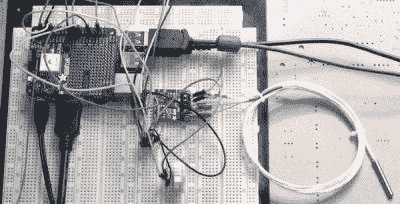
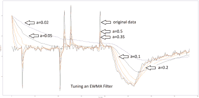
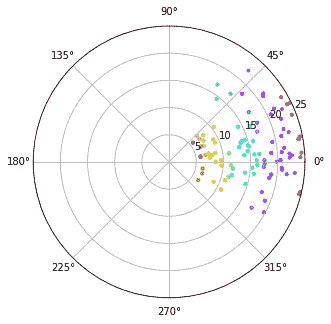

# 编码器的传感器滤波器

> 原文：<https://hackaday.com/2019/09/06/sensor-filters-for-coders/>

任何有兴趣建造自己的机器人、向月球发射宇宙飞船或发射洲际弹道导弹的人，他们的工具包中至少应该有一些基本的过滤器选项，否则机器人可能会无规律地摇摆，导弹会错过目标。

过滤器到底是什么？实际上，滤波器应该以尽可能小的时间滞后或“误差滞后”消除不稳定的传感器数据。就导弹而言，它可以平稳地在空中飞行，但会错过目标，因为位置数据处理得“太晚了”。最简单的过滤器，我们很多人都用过，是暂停我们的代码，从我们的传感器上快速读取 10 次，然后除以 10 计算平均值。只要我们的机器或过程对时间不敏感，就非常简单有效——非常适合气象站温度传感器，尽管风向稍微复杂一些。风向标实际上是一个给出“噪声”读数的好传感器的例子:不是传感器本身有噪声，而是风本身是阵风，并且不断改变方向。



尝试在某种运行将打印出图形的软件的计算机上模拟我们的数据是一个非常好的主意——我选择了 Raspberry Pi 并安装了运行 Python 3 的 Jupyter 笔记本。

左边的照片显示了我的试验台。有一个带 MAX31865 分线板的 PT100 探头、一个 Dallas DS18B20 和一个 DHT22。Pi 上的屏蔽是目前未使用的 GPS 屏蔽。如果你不想设置这些探头的麻烦，有一个 [Jupyter 笔记本文件](https://github.com/paddygoat/Kalman-Filters/blob/master/Filters_For_Coders.ipynb)也可以使用树莓 Pi 中的内部温度传感器。启动和运行起来非常快速和简单。

观察不同传感器的性能非常有趣，但我很快就完全搞乱了 DS18B20 的数据，人为地添加随机产生的噪声和一些非常讨厌的数据尖峰，以尽可能地惩罚滤波器。将一小块冷冻的[bockhurst](https://en.wikipedia.org/wiki/Bockwurst)放在 DS18B20 的顶部，然后再将它移走，就可以实现温度数据的快速变化。

虽然为了方便起见，我从温度传感器获取数据，但机器人等移动机器可能会从加速度计和光学编码器获取数据，并且可以“动态”更新的过滤器是必不可少的。

## 移动平均线

最简单的形式是所谓的“简单移动平均线”(SMA)，它类似于气象站温度示例，只是 10 个最新读数用 1 个最新读数更新。然后，为了给这个新的读数腾出空间，最老的读数被剔除。因为我们是程序员而不是数学家，所以 SMA 可以用代码来最好地理解:

```
# SMA:
n = 10
array_meanA = array('f', []) for h in range(n):
    array_meanA.append(14.0)         # Initialise the array with 10 values of '14'.
for x in range(n):
    getSensorData()                  # Get some data.eg tempPiFloat
    array_meanA[n] = tempPiFloat     # tempPiFloat slots into end of array.
    for h in range(n):
        array_meanA[h] = array_meanA[(h+1)]     # Shift the values in the array to the left
    meanA = 0
    for h in range(n):
        meanA = array_meanA[h] + meanA          # Calculate the mean, no weights.
    meanA = meanA/n
```

可以看出，该代码使用了大量的内存资源，因为它使用了一个浮点数组。尽管如此，通过给数组中的每个值增加权重，使得最新的读数更加突出，可以进一步提高它的效率。随后的代码有点长，可以在 [Jupyter 笔记本文件](https://github.com/paddygoat/Kalman-Filters/blob/master/Filters_For_Coders.ipynb)中看到，但仍然完全可以理解！然后，该滤波器将被称为“加权移动平均”(WMA)，并且根据所选择的权重，给出小得多的误差滞后，只有轻微的平滑度损失。

## EWMA

如果我们感到懒惰，不想用大量的浮点数来堵塞我们的内存，我们可以使用所谓的“指数加权移动平均线”(EWMA)，这听起来很讨厌，但实际上非常简单:

```
# EWMF: a = 0.20                  # Weighting. Lower value is smoother.
previousTemp = 15.0       # Initialise the filter. for x in range(n): 
 getSensorData()       # Get some data, eg tempPiFloat
    EWMF = (1-a)*previousTemp + a*tempPiFloat
    previousTemp = EWMF   # Prepare for next iteration. 
```

同样，我们不必是数学家也能大致看出上面的代码中发生了什么。当权重值“a”设置为 0.2 时，当前读数占 20%的权重，随着时间的推移，每个额外的周期，每个先前的读数实际上会乘以 0.2。如果我们假设“a”是我们的调谐旋钮，那么滤波器可以针对特定应用进行调谐,“a”值越高，误差滞后越小，但波动越大。与 WMA 相比，唯一真正的缺点是我们对重量没有太多的控制。如果你*倾向于*，请看一下[对 EWMA](https://en.wikipedia.org/wiki/Moving_average) 的数学证明。

下图显示了 EMMA 过滤器在 DS18B20 和一块冷冻德国香肠上的应用。我们的调谐旋钮 a 有六个不同的值，应该可以看到滞后与波动之间的权衡。我要说的是，a=0.2 的值在这个相当尖锐的数据上给出了最好的结果。



## ~~更进一步~~

当然，有数百种不同的过滤算法可供选择，它们都有优缺点。简单移动平均线和指数加权移动平均线对大的假值或异常值都很敏感。简单平均值只有在大值处于移动窗口时才会受到影响，但 EWMA 认为这种影响会持续减弱，也许会很慢。

如果你想要一个不受一些异常值影响的滤波器，试试[移动中值](https://en.wikipedia.org/wiki/Moving_average#Moving_median)滤波器。如果你更了解系统的动态，一个[卡尔曼滤波器](https://en.wikipedia.org/wiki/Kalman_filter)或类似的一阶或二阶滤波器可能会有所帮助，但代价是更多的校准。我在我的温度数据上尝试了它们，它们工作得相当好，但经常会产生不可预测的结果，例如当温度突然停止下降时会出现过度拍摄。这也是很难初始化过滤器，有时它会飞向无限远！

我真正想解决的最后一件事是获得一个适用于极坐标的滤波器。度数从 359 回到 0 的事实使得过滤的天真尝试变得困难。如果你简单地把它们平均在一起，你会得到 180 左右。



Naive averaging fails here. (Note: zero degrees is to the right.)

答案是将极度数转换成弧度，然后再转换成复数。我在这个 Jupyter 笔记本中使用高斯噪声模拟了风速和风向，并将数据集中在 10 附近，方差为 20。Python 处理无缝计算平均风向所需的基本数学，也有一些库可供诸如 Arduino 之类的 MCU 做同样的事情。

每当有真实世界的数据输入时，都会有一些噪声。正确处理这种噪音可以极大地改变你的机器人、火箭或气象站的行为。应用多少滤波通常是一个判断问题，因此从简单的滤波器(如 EWMA)开始，绘制出数据，并通过肉眼调整平滑参数是最简单的方法。当这种方法失败时，你就可以开始使用更复杂的方法了。