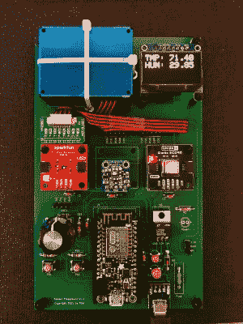

# 传感器操场通过云跟踪室内空气质量

> 原文：<https://hackaday.com/2022/03/19/sensor-playground-keeps-track-of-indoor-air-quality-through-the-cloud/>

当[tdw]有一天感觉不舒服时，他的妻子提出，这可能是因为他们家里的空气质量不好。虽然一个普通人在听到这样的想法后可以简单地打开一扇窗户，但[tdw]却展示了他真正的黑客精神，并着手测量室内空气质量。他开始设计一个简单的 PCB 来测量二氧化碳和挥发性有机化合物(VOC)的水平，但最终扩大了他的范围，以[传感器游乐场结束:一个即插即用的平台，读取各种传感器并将结果存储在云中](https://hackaday.io/project/182619-sensor-playground)。

 传感器操场经过精心设计，以最少的焊接技能轻松组装，由一个大型双层 PCB 组成，各种模块可以插在上面。它支持 ESP32 DevKit 或 Adafruit Feather 模块来提供处理能力，并为一系列传感器提供插座，方便地连接电源和 SPI 或 I2C。它还提供了一个旋转编码器和两个用户输入按钮。所有的源文件都可以在[【tdw】的 GitHub 页面](https://github.com/tdwgithub/sensor-playground)上获得，随时可以应用于任何种类的传感任务。

[tdw]用测量 CO2、VOC、PM2.5(颗粒物)以及温度和相对湿度的传感器建立他的传感器运动场。一个[网络界面](https://io.adafruit.com/tdwpgh_aq/dashboards/air-quality-overview)允许任何人实时跟踪这些测量。开放式和模块化的设计应该可以很容易地将该系统扩展到各种其他类型的传感器:我们可以想象，像太阳辐射、外部温度和风速这样的东西也可以为混合添加有用的数据。或许甚至可以用盖革计数器来记录辐射水平？

就室内空气质量传感器而言，这款绝对全面且易于使用。我们之前已经展示过其他空气质量传感器，其中一些[也将其数据链接到云](https://hackaday.com/2021/12/13/measuring-air-quality-using-mobile-sensors-for-the-masses/)。