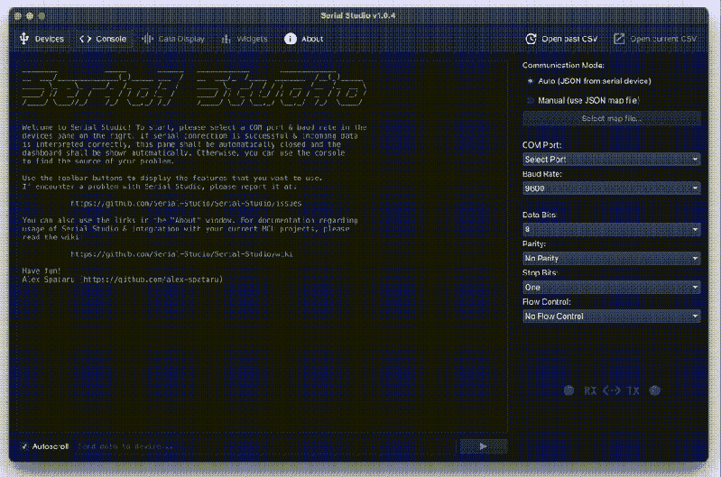

# 串行工作室:轻松可视化和记录串行数据

> 原文：<https://hackaday.com/2021/01/31/serial-studio-easily-visualise-and-log-serial-data/>

通过串行端口从微控制器输出数据既方便又简单，但格式化、可视化和分析数据可能会很繁琐和令人沮丧。[Alex Spataru]太了解这一点了，他花了太多时间来构建和调试定制的仪表板。为了让自己和其他人在未来免受同样的挫折，他创建了 [Serial Studio](https://www.alex-spataru.com/blog/introducing-serial-studio) ，这是一个为串行数据快速构建仪表板的工具。

Serial Studio 创建仪表板所需的唯一输入是一个简单的 JSON 结构，它指定了数据的格式，以及数据应该如何分组和显示。最初，Serial Studio 要求所有的 JSON 数据都通过串行发送，这对于简单的数据来说很好，但是对于更复杂的应用程序来说很快就变得很麻烦。为了解决这个问题，[Alex]添加了一个特性，允许 JSON 文档从计算机加载格式信息，而只有数据通过串行发送。

Serial Studio 包括几个可视化选项，包括原始线图、条形/水平指示器、刻度盘指示器、IMU 数据的人工地平线或地图小部件。它还可以将格式化的数据输出到 CSV 文件，以便在其他软件中进一步分析。还包括一个控制台窗口，用于查看原始数据或调试目的。休息后看使用演示。

我们喜欢 Serial Studio 的易用性和适应性，将来我们可能会在自己的项目中使用它。得益于 [Qt 框架](https://hackaday.com/2019/08/22/qt-arrives-for-small-computers/)，它与 Linux、Windows 和 Mac 兼容，并且代码是开源的，可以在 [GitHub](https://github.com/Serial-Studio/Serial-Studio) 上获得。

如果你曾经看过其中一个电视节目。太空模型火箭发射视频，你会知道数据记录、可视化和分析对【乔·巴纳德】的工作有多重要。Serial Studio 非常适合这种应用，[Alex]在他的大学里广泛用于模拟卫星比赛。

