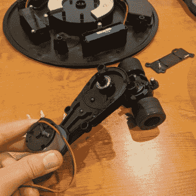

# 说真的，不要买这个拖地机器人

> 原文：<https://hackaday.com/2022/12/20/seriously-dont-buy-this-mopping-robot/>

最初的 Roomba 机器人真空吸尘器多年来导致了大量的克隆和类似产品，其中之一是 ALEE 拖地“机器人”。[Raymond] [撕开它，露出里面的东西](http://167.172.222.165/untitled/)。原来里面包含的大多是后悔！尽管它确实以自己的方式拥有一些设计上的聪明之处。

从技术上讲，ALEE ,[ Raymond]花了整整 85 美元，它不是机器人，因为它没有传感器。除非拖一块被粗糙的滴水池保持湿润的湿布垫也算“拖地”，否则它也不算拖把。

This one-motor unit (and tiny battery) is responsible for both motion and direction control. There are no sensors.

这个东西有一个有趣的方面，它与驱动系统和方向控制有关。整个事情是由一个单一的电机驱动，而不是一个非常强大的。机器人的中心有一对轮子，它们都以相同的速率和速度驱动，轮子组件可以绕其轴旋转。大概就是这样。甚至没有任何类型的碰撞传感器。

那么，这个东西是如何移动的，更不用说改变方向(很差地)模仿原始的 Roomba 式的交叉模式了？控制板似乎只有一个任务:如果马达停转，反转方向。这一点，加上驱动单元可以枢轴转动，外壳拖着一块湿抹布，似乎是将 bonking 变成一堵墙所需的所有混乱，变成一个未定义的方向变化。

这不是很好的性能，但肯定是一些令人印象深刻的成本削减。你可以在一个简短的视频中看到它，嵌入在分页符下面。

需要明确的是，[雷蒙德]非常清楚当他从海外零售商那里获得廉价的技术产品进行拆解时，他会面临什么。ALEE 确实有一些稍微有趣的秘密要分享，但总的来说，这真的不值得。有时廉价技术有黑客潜力，但这里没有。说真的，别买这个东西。

[https://www.youtube.com/embed/kSbuFYhDa2c?feature=oembed](https://www.youtube.com/embed/kSbuFYhDa2c?feature=oembed)