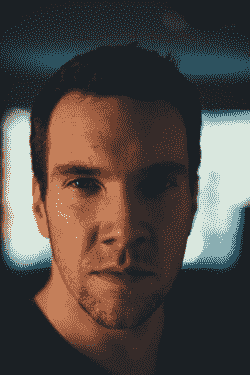
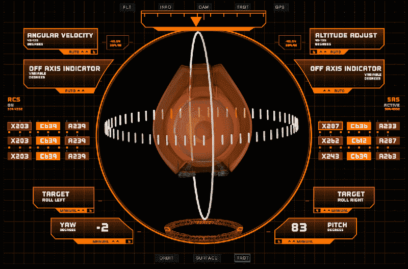
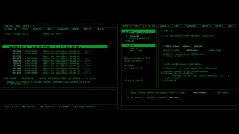
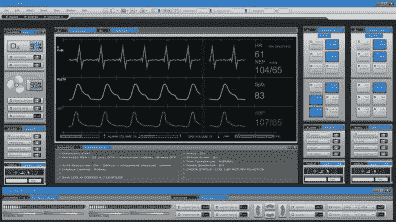

# 塞思·莫尔森正在设计未来，一次一个节目

> 原文：<https://hackaday.com/2018/10/29/seth-molson-is-designing-the-future-one-show-at-a-time/>

从 1927 年的 *Metropolis* 中的一排杠杆和蒸汽表，到最初的 *Star Trek* 中工作人员会有意触碰的彩色珠宝，娱乐业一直在努力制作先进技术的图像。无论是受预算还是想象力的限制，刻画通常会走向两个方向之一:要么过于依赖当代技术，要么走向相反的方向，以至于近乎滑稽。

Seth Molson

但并不总是这样。事实上，当技术在电影中被恰当地展示出来时，它常常会给工程师们带来灵感。《少数派报告》中对面部识别和手势控制的描绘非常出色，在这部电影上映近 20 年后的今天仍被引用。尽管有种种缺点，*《星际迷航》*创造了许多“模仿生活的艺术”；例如早期的移动电话与发给星际舰队人员的翻盖通信器有着明显的相似之处。

所以当我看到 3D 打印在《迷失太空》的网飞版中的特殊应用时，我觉得这是需要指出的事情。从工作人员使用打印部件的方式到打印机的控制界面，一切都感觉非常*真实*。它采用了现有的技术，并以一种令人印象深刻而又可信的方式推动它向前发展。这是现代科技观众应得的科技写照。

它给我们留下了如此深刻的印象，以至于我们决定[联系 Seth Molson](https://sethmolson.com/) ，他是《迷失太空》中*的用户界面背后的艺术家，并试图从一个为媒体技术而战的人那里获得一点洞察力。了解他如何创建他的界面，他导航的陷阱，以及观众的期望是如何改变的，现在我们口袋里都有一台触摸屏超级计算机。*

## 成为一名回放设计师

你可能不认识 Seth 的名字，但如果你在过去十年左右一直在看科幻电视节目，你很可能已经看过他的作品。他的 IMDb 页面读起来像是粉丝最喜欢的当代科幻小说的列表，他的艺术出现在诸如*永恒*、*连续体*和*星际之门宇宙*的展览中。他通常被列为“回放设计师”，如果你不是业内人士，这是很难理解的头衔之一。

简而言之，回放设计者创建在现场播放的动画或视频。如果一个演员正在看一部电视剧或电影中电脑或电视屏幕上显示的东西，用行业术语来说，这叫做“回放”。

Playback on the set of *Lost in Space*

当一个角色需要使用计算机或其他具有可视界面的设备来显示时，回放设计人员将负责创建必要的动画和图形。“我的工作在现场操作员开始的地方结束，”Seth 解释说，“我把我完成的视频循环或互动程序交给操作人员，他装配好布景并相应地控制一切。”

对于 Seth 来说，与其说这是一条有意的职业道路，不如说是他在大学学习设计和动画后偶然发现的东西，“我住在温哥华，在 VFX 的一家公司实习，在那里我意外地陷入了回放设计，真的不知道我在做什么”。但是在他完成了星际之门宇宙的工作后，他开始在这个行业中为自己赢得名声。“最终，我成了为电视节目制作 UI 动画的那个人，从一个工作室跳到另一个工作室，在各个艺术部门从事各种项目。”

## 将设计带入生活

当开始一个新项目时，Seth 喜欢在物理场景中走来走去，不仅是为了获得美学的想法，而且是为了收集技术细节，例如他的界面将在其上显示的显示器的大小和位置。如果是一个特别复杂的配置，例如多个显示器需要协调工作，他将通过在纸上勾画出所有东西来开始他的设计过程，以便更好地概念化它们将如何一起工作。在那里，他在 Adobe Illustrator 中创建了界面的初始版本，并提交审批。一旦他得到许可，他就开始在 After Effects 中制作界面动画。

有时，他的界面会简单地使用绿屏技术在后期添加，但理想情况下，它会显示在真实的显示器上，并为演员提供一些交互性。如果演员们真的能看到和触摸到 Seth 的动画界面，那么表演会更加真实。通常，界面可以简单地循环播放预设的动画，但如果需要更加动态，还需要几个步骤，“如果需要处理脚本特定的故事点，可以在 Flash、Director 或 Resolume 中为交互性制作动画和创作。”

Seth 界面中最引人注目的细节之一是包含了看似合理的数值，而不仅仅是分散的随机数。这有助于更真实的描绘，这也是他在设计时一直牢记在心的。有时，他可以依靠技术顾问来获得这类信息或数据，但由于成本限制，这并不总是可行的。他经常需要自己做研究，或者亲自去找主题专家。“有时我会打电话给在各自领域都是专业人士的朋友，向他们寻求建议，”Seth 说。“我有一个护士朋友，我经常给她打电话，以确保我的心率监测器和医学图像是准确的。”

赛斯作品的这一特点是我在观看《迷失太空》时第一次注意到的。作为一个花了相当多时间使用桌面 3D 打印机的人，我真的对船员的 3D 打印机界面如此熟悉印象深刻。像层高度和挤出机温度这样的细节正是你期望在当代机器上看到的，但界面有一种独特的未来感，仍然传达了一种想法，即你正在看一些超越我们当前技术的东西。所有这些都不需要借助像随机变量或顶级动画这样的“廉价伎俩”。

## 观众期望

在 20 世纪 80 年代，当《星际迷航:下一代》开始时，他们把一堆彩色的形状扔到触摸屏上就逃脱了，观众买了它，因为在他们的生活中没有其他类似的东西。今天，像这样的东西就是飞不起来；设计师和艺术家敏锐地意识到门槛已经提高。但是塞斯说，不仅仅是像《T2》、《火星人》和《T4》、《钢铁侠》这样的高预算作品提高了观众对用户界面的期望。他说，这也是他们日常接触的技术，“像苹果和三星这样的公司雇佣经验丰富的设计师来使他们的软件/硬件达到最先进的水平。你现在可以在任何智能手机上玩 A 级游戏。”

但是观众的期望并不局限于光滑的视觉效果和流畅的动画。当创建一个用户界面时，即使是虚构的，它也必须有意义。观众应该能够看着界面，理解它做什么和它传达的信息，无论是飞船的驾驶舱还是角色智能手机上的应用程序。如果屏幕上显示的技术是当代的，这一点尤其重要。

    

在电影 *AIR* 中，Seth 不得不开发用户界面，模仿观众会认同的 DOS 和 Windows 界面。这看起来似乎比创造未来的东西更容易，但它实际上带来了自己的一系列挑战。“看起来真实的用户界面通常更难创建，因为有界限存在，”Seth 说。“当设计应该看起来真实时，它应该模仿真实生活，观众不应该猜测设计是什么。”

## 避免常见陷阱

不幸的是，电视和电影中糟糕的计算机界面的例子并不难找。除了极少数例外，任何涉及“黑客攻击”的场景通常都有令人呻吟的视觉效果。它们似乎总是有某些共同的元素:无意义的图形和可视化，闪烁的文本，以及毫无疑问的源代码行。不管出于什么原因，屏幕上看似随机的源代码行似乎是一个常见的比喻，向观众显示[一些高级别的黑客正在进行](https://www.youtube.com/watch?v=msX4oAXpvUE)。

这是 Seth 很清楚的事情，他积极地试图在他的设计中避免这些陈词滥调。尽管有时他会受到压力，要他遵从“好莱坞黑客”的风格。“每个导演似乎都想要它，”塞斯承认道。“我想这是一种展示技术娴熟的角色或技术先进的场景的通用方式，观众很容易就能理解。”尽管他并不总是屈服。

有一次，一位导演要求他把自己创建的一个简单明了的界面变成一个矩阵风格的滚动代码和符号显示，观众无法理解。赛斯知道这不符合他们迄今为止在节目中所做的精神，他努力让设计更符合节目的风格。“这个想法没有任何意义，当我问这是否真的是我们应该走的方向时，这个想法最终被节目制作人否决了。”

也就是说，Seth 确实经常在 After Effects 中使用编程表达式来创建他的界面。这使他能够在特定的频率或调制范围内自动生成动画，这使他们看起来“忙碌”，而不会陷入真正随机的陷阱。根据设计需要有多抽象，他偶尔会把这个概念一直用到生成分形上。

当然，根据故事情节的不同，有些情况下，真正随机或“有瑕疵”的图形也有它们的位置。对于这些情况，他开发了一些技巧来产生有趣的视觉效果，而不诉诸做作的效果。“有一个节目有很多瑕疵和瑕疵，”赛斯回忆道。“所以我找到了一个有趣的方法，用文本编辑器分割图像。你可以打开图像的二进制编码，删除其中的一部分，从而产生一种假信号效果。”

## 充满希望的未来

令人鼓舞的是，看到像 Seth Molson 这样的艺术家愿意与我们已经遭受了几十年的技术的低努力表现进行斗争。这不会是一夜之间的改变，但随着观众期望的提高，甚至网络电视节目的预算和制作价值都接近电影水平，感觉潮流终于开始改变了。

虽然这可能不是有意的，但媒体对技术的描绘通常会成为未来现实世界硬件和软件的指南。不管是有意识的还是无意识的，今天的艺术家正在承担起帮助塑造我们将在 10 年或 20 年后使用的设备的巨大责任。对赛斯来说，这种责任是不断推动他前进的一部分。“这有点过头，非常具有挑战性，但我认为这是乐趣的一部分，给了我们在现实世界中努力的方向。”

* * *

我们要感谢 Seth Molson 花时间回答我们的问题，并允许我们使用他作品中的精彩图片。Seth 目前正在努力制作《迷失太空》第二季，并希望将他的作品扩展到现场活动和互动艺术作品的内容中。