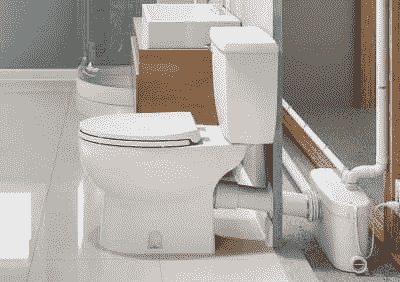
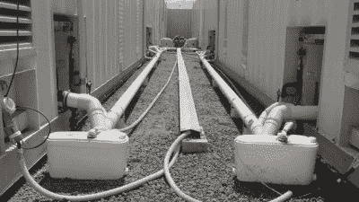
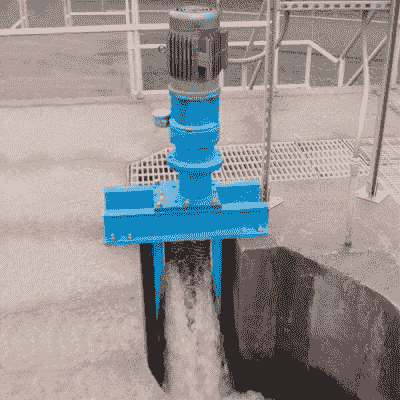

# 污水浸渍就像听起来一样恶心

> 原文：<https://hackaday.com/2021/02/04/sewage-maceration-is-as-gross-as-it-sounds/>

日复一日，当我们使用厕所时，很少有人真正思考在深层次、机械的层面上发生了什么。生意做完了，马桶冲了，我们继续我们的一天。然而，室内卫生的宏伟技术不应该被嗤之以鼻，因为它促进了我们所有人更清洁、更舒适的生活。

绝大多数抽水马桶依靠重力的好处来清除室内的垃圾。这就需要将马桶安装在排出房屋的污水管道上方。对于大多数安装在地面或地面以上的设备来说，这不是问题。然而，有时你可能会遇到地下室或房间在较低楼层的房子，在那里普通的厕所根本不起作用。显然，泵是合适的，但人类的污水是液体和固体的混合物，这不切实际。而是必须变成*可以*泵送的浆液；这一过程被称为*污水浸渍。*扣好安全带！

## 它是如何工作的

A typical macerator unit installed behind a toilet. This unit is installed behind a wall, though many installs simply elect to leave the unit directly behind the cistern.

浸渍器本质上是一个污水搅拌机，和一个泵结合在一起。当需要在主下水道下面安装马桶，或者不需要在地板上钻孔时，通常在家里使用。多亏了这种泵，它们不需要依靠重力，可以用来将污水垂直移动几十英尺，水平移动几百英尺。

也许国内市场最具代表性的浸渍器型号是 Sani flo T1，它使用一个电源驱动的马达来旋转一个钢刀片，将污水切碎成泥浆，然后使用典型的叶轮设计泵送污水。这些通常与在美国市场上不常见的带后出口的特殊马桶结合使用，并且也可以与水槽和淋浴一起使用。当水和废物进入马桶时，压力开关被触发，开启系统，用刀片打碎物质并将其抽走。这种设计的局限性在于浸渍刀片可能被堵塞，特别是在纤维材料如抹布或卫生用品的情况下。[如果发生在其他人身上，这可能会导致只有幽默的结果](http://www.diyfaq.org.uk/humour.html#saniflo)，因为修复堵塞的系统通常需要拆除装置和下水道管线，下水道管线通常充满了你试图清除的可怕废物，通常没有开关阀。存在更高端的型号，其装有重型“研磨”刀片来分解这种材料，但是没有系统是完美的，堵塞仍然是常见的。

Sewage macerators used at temporary accommodation at a mine site. They’re necessary whenever sewage needs to be pumped – even if height isn’t an issue, horizontal distance may be.

污水浸渍的真正问题不在于它有效，而在于它有时会分解，当它分解时，它是一团污秽。由马达、压力开关和阀门组成的系统总是不如地板上的一个简单的洞可靠，而且更容易出故障。由于安装在下水道线以下，任何维护通常都会导致未经处理的污水溢出。这是一个作者在 30 年典型的重力马桶使用中没有经历过的危险；人们一定会怀疑很少有家用浸渍系统如此可靠。不管怎样，这应该会让所有房主仔细考虑在地下室建厕所是否值得。

## 工业浸渍

Industrial-grade machines like these are installed throughout municipal sewage systems to break up those things you really weren’t supposed to flush. Like goldfish.

当然，浸渍不仅仅是家庭游戏玩家的专利。更大的系统用于市政一级，以粉碎废物，并通过处理设施泵送。近年来，这已经成为一个更重要的问题，因为越来越多无知的公民冲走湿巾和其他不能在水中分解的物质。许多城市没有试图教育民众，而是选择用重型机械来解决这个问题。一些制造商甚至在销售重型研磨机来完成这项工作。如果这种趋势持续下去，到 2037 年，应该可以在没有地方当局不适当反应的情况下冲洗一个风火轮。

虽然对管道行业来说已经很熟悉了，但我们希望这篇文章能对如何和为什么泵送污水起到教育作用。这是可以做到的，而且成本相对较低——尽管出错时会带来严重后果。当需要改造你的泳池房时，或者当你的另一半询问楼下的卧室是否应该有套间时，这可以帮助你做决定。祝你好运，管道工程愉快！