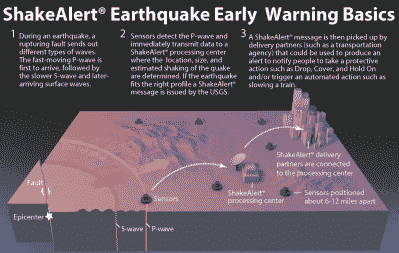
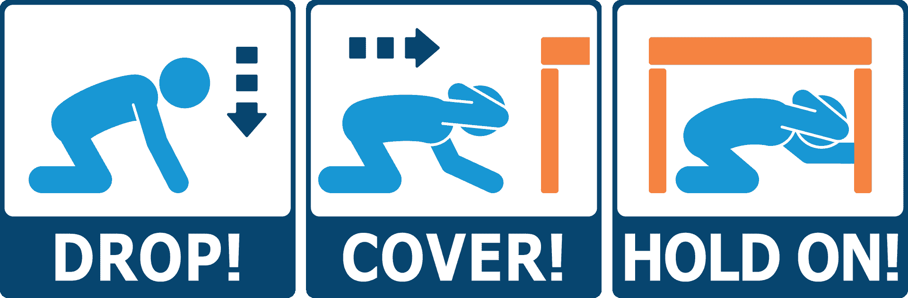
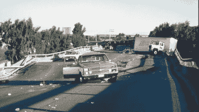

# ShakeAlert 承诺大约 10 秒的地震预警

> 原文：<https://hackaday.com/2021/06/04/shakealert-promises-earthquake-early-warning-of-about-10-seconds/>

地震来袭时破坏力极强，与许多其他自然灾害不同的是，它们往往在毫无预警的情况下来袭。不同于飓风和洪水，甚至在某种程度上不同于火山，地震很难预测。然而，近几十年来，预警网络在世界各地激增，旨在保护受影响的社区在大地震发生时免受最糟糕的后果。

ShakeAlert 是由美国地质调查局运营的地震监测项目的名称，该项目刚刚宣布，它现在为整个美国西海岸提供早期预警服务。让我们来看看地震监测是如何工作的，如何反馈到早期预警中，以及如何在大地震的情况下发挥作用。

## 几秒钟，不是几分钟

当地震从地质断层线开始时，它会产生各种类型的波，称为初级波(P 波)、次级波(S 波)和各种类型的面波。p 波的传播速度大约是每秒 5-8 公里，大约是 S 波的 1.7 倍，很少造成大的伤害。表面波通常又会变慢。因此，通过监测地震仪上特有的 P 波，有可能提前得到更糟糕的地震即将来临的警告。

ShakeAlert works by detecting faster-travelling P-waves from an earthquake, before the more damaging S-waves hit. It can then send out warnings via phone, radio, and TV, and trigger automatic safety shutdowns across affected areas.

根据地震仪到震中的距离，预警时间可能从几秒钟到最多一两分钟不等。以美国西海岸的 ShakeAlert 为例，美国地质调查局估计，如果发生 5 级或更高级别的地震，该系统将向用户的手机提供长达 10 秒的警告。

这个时间是基于城市与断层线本身的接近程度，与震中的距离越短，为 P 波提前发出作为即将到来的 S 波的早期预警提供的时间就越少。这与墨西哥城建立的预警系统形成了鲜明对比；由于人口中心距离典型地震的震中很远，过去的地震中，在更强的 S 波到来之前，市民会得到 20 秒到 2 分钟的警告。

## 几秒钟的空闲时间会有很大的不同

Official authorities recommend the following steps in the event of a quake – drop to the ground, find cover, and hold on. Simple measures like these can prevent huge numbers of injuries across a city affected by a quake.

十秒钟听起来可能不是很长时间，特别是考虑到大多数用户将通过智能手机收到警告。然而，在许多情况下，它仍然足以产生有价值的差异。只需要几秒钟就可以爬下梯子，关掉危险的机器，躲开窗户，或者蹲伏在紧急出口并抓住墙壁。仅这些简单的措施就可以拯救受地震影响的城市中成千上万的伤员。这类似于 20 世纪 50 年代被不公平地诽谤的鸭子和掩护方法，旨在帮助在核爆炸的情况下最小化伤亡。在地震发生时，简单地趴到地面上，避免掉下的物体和打碎的玻璃，可以让你在事件发生后立即感到快乐得多。1989 年旧金山地震的录像显示，当隆隆声响起时，人们的反应是混乱和迟缓。一个十秒钟的警告，加上关于下降、寻找掩护和坚持的知识，对许多人来说会有很大的不同。

Earthquakes have sadly claimed many lives on the West Coast, with the 1989 Loma Prieta quake being one of the worst events in recent memory. It’s hoped that prior warning might save lives in future.

该系统的另一个好处是，它可以设置为在检测到地震时自动采取预防措施。地震会对基础设施造成严重破坏，剧烈的摇晃会使水管和煤气管破裂，甚至会堵塞消防站和其他应急设施的大门。在最好的情况下，这在已经困难的时候增加了挫折感；最坏的情况是，这会危及生命，并成倍增加地震造成的损失。然而，通过适当配置的警告系统，这是可以避免的。自从 21 世纪初第一批系统在美国安装以来，[它们就被用于自动开门和在消防站拉响警报](https://web.archive.org/web/20140223054531/http://members.napanet.net/~chderham/siren.htm)，以及设置关闭煤气和水管路上的阀门以防止泄漏和损坏。事实上，[世界上最早的地震预警系统之一是 UrEDAS](https://spectrum.ieee.org/at-work/innovation/a-brief-history-of-earthquake-warnings) ，即紧急地震探测和警报系统，日本铁路使用该系统在探测到地震时降低高速列车的速度。这是第一个使用 P 波传感对即将发生的地震事件进行早期预警的系统。

ShakeAlert 无法预防未来地震的所有负面影响。检测地震仍然需要时间，所以离震中最近的地方仍然会在没有预警的情况下遭受破坏。然而，它应该作为一个有能力的工具，确实有助于在更大的范围内减少西海岸地震的总体痛苦和苦难。类似的系统已经在日本和墨西哥证明了它们的价值，预计它们将成为世界各地地震多发地区的固定设备。