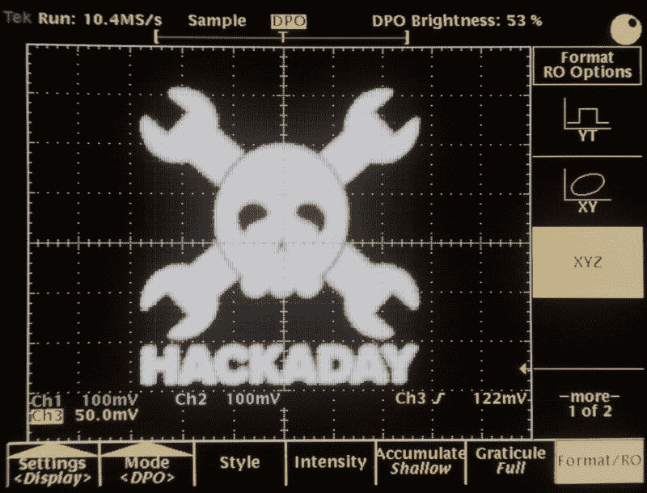
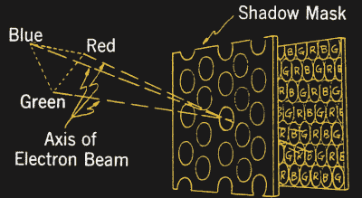
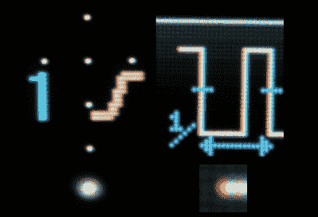
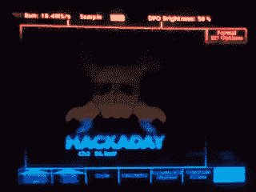
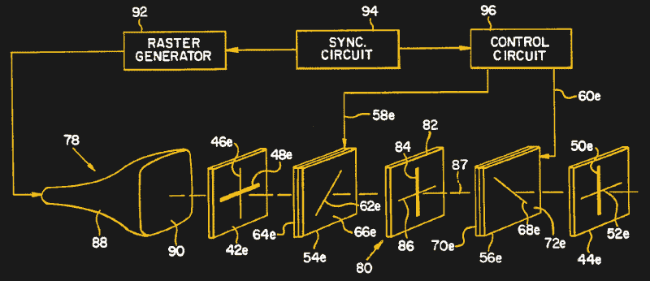

# 最清晰的彩色 CRT 显示器是单色加特技

> 原文：<https://hackaday.com/2019/01/17/sharpest-color-crt-display-is-monochrome-plus-a-trick/>

我最近遇到了制作彩色阴极射线管显示器的最奇特的方法。这些年来，我的工作台上出现了不少示波器，但易贝的一项发现尤其令我印象深刻。快速浏览一下显示屏，会发现一些有点奇怪的东西。清晰度是惊人的:每个像素都是一个完美的，颜色均匀的小点，这一壮举甚至是当今最好的液晶显示器所无法比拟的。设计师们似乎为用户界面选择了一套有点奇怪的色彩，如果你移动你的头，你可以捕捉到纯红色、绿色和蓝色的闪光。原来，这款 Tektronix TDS-754D 采用了一种非常独特的显示技术，称为 NuColor，这是一种进化的死胡同，曾被吹捧为传统彩色 CRT 的高级替代品。

和我一起看一看里面，找出与那些已经过时的又旧又重的电视有什么不同。

## 高端工具，高端硬件

电气工程师依靠示波器来观察电路内部的情况。如果您曾经尝试过不使用它进行调试，您就会知道这是多么困难和令人沮丧的经历。因此，用户希望这些设备能够提供准确的电波形:成为他们眼睛的延伸。如果让你说出一个产品系列中最重要的部分，你会怎么说？衰减器还是放大器？时基？ADC 呢？探测器呢。在当今屏幕无处不在的世界，可能没有多少人会说显示器。但是，对于在模拟示波器环境中成长起来的一代工程师来说，显示屏至关重要。因此，设计师希望显示屏尽可能清晰:任何模糊都应该是由信号引起的(就像我的带宽限制扳手)，而不是仪器。

Testing out the Tektronix TDS-754D, you can see the labels, grid lines, and even the Hackaday waveform are spectacularly sharp (click image to embiggen)

模拟示波器非常清晰，而且是单色的。这与它们最初的功能是一致的:绘制电压(y)对时间(t)的曲线，或者在某些情况下，绘制电压(y)对电压(x)的曲线。颜色不会给这样的显示增加太多，尽管许多观测仪也有一个 z 输入来调节轨迹强度。虽然存在双光束观测仪(用于同时显示单独的通道)，但在三束光束扫过显示器时保持同步以创建实时颜色轨迹会增加大量的复杂性和成本，而收效甚微。

当数字存储示波器出现时，显示器从简单的图形演变为完整的用户界面，颜色有了新的重要性。不同的颜色可以用来消除痕迹的歧义，直观地将它们与自动化测量联系起来，并区分文本和 UI 元素。后来，随着数字荧光示波器(DPOs)的出现，它对实时模拟示波器进行了奇特的数字模拟，颜色可以用来揭示波形本身的细微特征。所以，增加彩色显示器是有意义的。

但是，如果你在 20 世纪 90 年代早期建造高端示波器，你对彩色显示器的选择是有限的:彩色 CRT 和 LCD，每一种都在示波器的使用中出现问题。

## 彩色 CRT 问题

在 CRT 上显示彩色图像的传统方法是使用三束电子束撞击原色磷光体点阵列(或在某些系统中为条纹)。多年来开发了几种技术，但它们都有一个共同的机制:在电子枪簇和屏幕之间插入某种穿孔掩模，产生三束电子束的针孔图像，希望每束都能击中预定的磷光点。实际上，这并不总是发生，所以模糊和不纯的颜色是常见的显示瑕疵。使用不同颜色的点也意味着空间分辨率的损失:最小的可能像素是一串红色、绿色和蓝色的点。

Shadow-mask color CRT system.

将单束电子束聚焦成一个紧密的点不成问题；扫描电子显微镜的光束宽度可以小于 1 纳米，尽管不可否认的是，相对于它们的尺寸来说，它们扫描的区域要小得多。真正的困难是保持三束光束相互对准，并与荧光镶嵌对准。因此，单色 CRT 的图像质量问题较少。

不仅彩色 CRT 显示器质量有问题，而且设备本身体积大、重量重，对振动和冲击敏感，这可能会使它们无法对准。虽然有些示波器是用传统的彩色阴极射线管制造的，但这项技术并不理想。

## 为什么不是 LCD？

NuColor display (left) renders pixels of any color as uniform dots (enlarged below). In contrast, even modern LCDs (right) use red, green, and blue sub-pixels which cause color fringing at the pixel level (also enlarged).

当时的一些竞争示波器是第一个使用液晶屏的。但是，那个时代的彩色液晶显示屏与我们今天享受的优秀显示屏相去甚远。它们的对比度低，色彩质量差，视角差。这些是早期的扭曲向列(TN)显示器，与今天的版本相比很原始，因为面内切换(IPS)显示器仍需几年时间。即使是今天的液晶显示器也没有解决原来的问题:每个显示像素仍然是由原色子像素组成的。虽然这有时会有好处，例如在渲染文本的子像素抗锯齿中，但它也会给单个像素带来模糊。

## Tektronix NuColor 显示器

Tektronix 的工程师们没有使用现有的任何一种技术，而是决定利用他们在单色 CRT 方面的丰富经验来创造一种更好的显示器。他们从传统的带有白色荧光粉的单色 CRT 开始，然后添加了一个可切换彩色滤光片的巧妙系统，以创建场序彩色显示器。在这个系统中，原色分量不是像点画风格那样分布在空间中，而是分布在时间中，连续的帧显示图像的红色、绿色和蓝色分量。对眼睛来说，结果是一样的:每个像素的原色成分混合成不同颜色的感觉。泰克公司的市场部称这项技术为“NuColor”

NuColor display slowed by high-speed video reveals individual color frames being drawn at 180 Hz.

这种系统相对于彩色 CRT，甚至现代 LCD 的最大优势是显而易见的:每个像素仍然是单色 CRT 呈现的同一个微小的单个点，但现在出现在你选择的颜色中。Tektronix 在这些显示器上使用 180 Hz 的帧速率，因此完整的 RGB 显示每 60 Hz 刷新一次。不利的一面是，如果你很快将目光从显示器上移开，偶尔会看到单个的彩色边框。这种效果也可以用高速摄像机捕捉到。

与当时的彩色液晶显示器相比，其他主要优势是亮度和对比度。NuColor 显示器的核心是由单色 CRT 驱动的巨大动态范围，使当代 LCD 非常差的对比度相形见绌。

## 每种颜色的偏振滤光器

为了制造这种新型显示器，泰克公司在阴极射线管正面安装了一个电子控制的彩色快门系统。这些彩色快门是使用一种液晶技术创建的，但它们不是切换单个像素，而是一次切换整个显示器，就像今天的主动 3D 快门眼镜或自动变暗焊接头盔一样。在这些 LCD 应用中，光通过中性偏振滤光器，产生偏振光。这种光然后穿过液晶单元，液晶单元可以根据施加的电压旋转通过的光的偏振。最后，光通过前面的中性偏振滤光器射出。根据液晶单元施加的旋转量，不同量的光透射通过前偏振器。

Frame sequential color CRT system from US Pat. 4,635,051.

在 NuColor 显示器中，Tektronix 没有使用中性偏振滤光器，而是使用了颜色选择性偏振器。例如，全色系统中的第一个偏振器通过垂直偏振光的所有三种红色、绿色和蓝色，而只允许水平偏振光中的绿色。通过组合三个这样的偏振器，每个偏振器具有不同的单轴颜色，他们能够创建一个可以选择性地通过红、绿、蓝或白光的系统。与 DLP 投影仪一样，DLP 投影仪使用红/绿/蓝/白色轮来产生比单独使用红/绿/蓝更亮的图像，这些显示器可以提供更大的动态范围，尽管这种技术似乎没有在示波器上使用。

泰克公司在这项技术上获得了至少 10 项美国专利。这些系统包括只能显示红色和绿色原色的系统。4，582，396 )，到可以显示三种去饱和原色从而产生全彩色输出的显示器([美国专利 4，674，841](https://patents.google.com/patent/US4674841A/en?oq=4674841) )，到具有扩展色域的全色显示器([美国专利)。4635051](https://patents.google.com/patent/US4635051A/en?oq=4635051)。在 20 世纪 90 年代初的专利和随后的媒体报道中，他们吹捧这种新显示技术在更好的分辨率、更低的功耗、更小的尺寸和重量方面的优势。他们还估计这只会给示波器增加 2.5%的成本，而传统的彩色 CRT 会增加 12.5%。

## 显示技术稳步前进

当然，今天的设备不使用场序彩色阴极射线管。NuColor 显示器背后的技术根本无法与 LCD 的尺寸和重量优势相抗衡。一旦 LCD 质量发展到足够的程度，这些显示器就像几乎所有其他屏幕一样主宰了数字示波器市场。虽然，随着今年智能手机中 OLEDs 的目标超过 LCD，这种情况可能会改变。

显然，核彩色显示器已经不再生产了，所以一些有进取心的人已经开始在这些领域为老化的 CRT 提供 [LCD 替代品。幸运的是，这些示波器还带有一个模拟 VGA 输出端口，用于外部显示器。](http://www.simmconnlabs.com/2001/9001.html)

顺便说一句，如果你碰巧拥有一个像这样的 500MHz TDS-754D，请注意，通过改变一些电阻和去除一些电容，它可以现场升级到 1 GHz TDS-784D。如果你仔细研究一下 eevblog 上的线程，你就能知道是怎么回事了。这是可行的，尽管它远不如我们为 [Rigol DS1022C](https://hackaday.com/2013/05/16/rigol-ds1022c-hack-brings-it-up-to-100mhz-speed/) 、 [Rigol DS1052E](https://hackaday.com/2010/03/31/update-50mhz-to-100mhz-scope-conversion/) 、 [Rigol DS1054Z](https://hackaday.com/2014/11/12/how-to-get-50-more-zed-from-your-rigol-ds1054z/) 和 [Rigol MSO5000](https://hackaday.com/2018/12/19/rigol-mso5000-hacked-features-unlocked/) 所做的纯软件升级那么简单。

最后一点。我使用了我们在 4 月份推出的 osmo-fl2k 代码来渲染示波器上我们最喜欢的徽标:最初是一个射频黑客[将某些廉价的 USB 到 VGA 加密狗变成 SDR 发射器](https://hackaday.com/2018/04/23/spoofing-cell-networks-with-a-usb-to-vga-adapter/)，它也可以作为一个价值 5 美元的 3 通道任意波形发生器在实验室中非常方便。