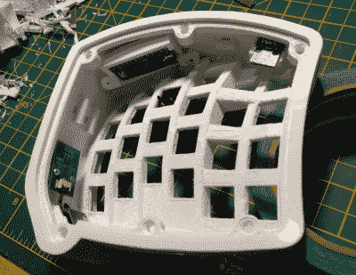

# 冰冻果子露定制游戏垫光滑甜美

> 原文：<https://hackaday.com/2020/02/17/sherbet-custom-game-pad-is-smooth-and-sweet/>

当[Billiam]心爱的 Logitech G13 游戏手柄进入天空中的大客厅时，他决定通过设计一个定制的、更符合人体工程学的桌面替代品来表达敬意。拿起勺子，深入了解[Billiam]走向冰冻果子露的故事，因为这是一段甜蜜的旅程。

 这里是独家新闻:像许多 DIY 游戏垫和键盘一样，Sherbet 基于 Teensy。我们经常看到微型 USB 直接从 Teensy 出来，特别是在透明的丙烯酸材料中，但[Billiam]增加了一个 USB 分线板，所以对 Teensy 本身没有直接的压力。

[Billiam]的设计挑战之一来自游戏手柄的放置——他有一张高桌子，并使用键盘托盘，因此它必须适合空间，并为他的手留出足够的空间。幸运的是，虽然键帽选项非常有限，但现在已经有了低调的机械开关。我们喜欢[Billiam]在其中一个中嵌入一个微小的陶瓷轴承，用作归航凸点，因为这是一个伟大的想法。

如果你想尝试这个项目，[比利安]已经准备好了所有的好东西。[Billiam]想要使用 QMK 固件，但他们还没有操纵杆支持，所以他同时运行了一个 Arduino 草图。

我们喜欢这里的好的定制游戏手柄，[特别是如果他们可以自己重新编程](https://hackaday.com/2019/09/21/custom-game-pad-can-reprogram-itself/)。