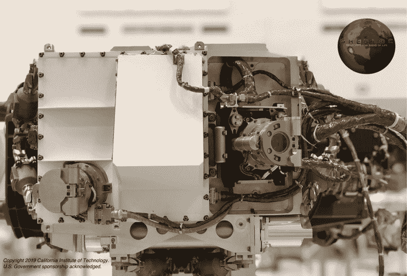
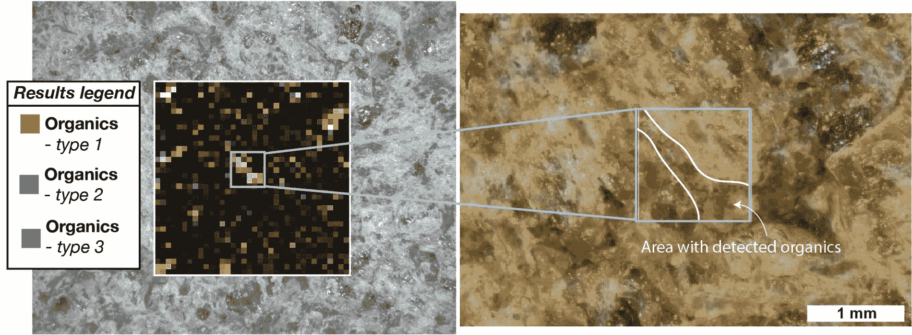

# 谢洛克和火星生命探索

> 原文：<https://hackaday.com/2022/01/27/sherloc-and-the-search-for-life-on-mars/>

长久以来，人类一直想知道在我们这个小小的死水星球之外是否存在生命，以至于我们对如何揭示这个核心问题的答案产生了一种文化偏见。我们大多数人可能会想象美国国家航空航天局(NASA)或其他一些太空机构将安排一场新闻发布会，一个由科学名人组成的小组将宣布这些发现，世界各地的报纸将大声疾呼“我们并不孤独！”头条新闻。我们以前都看过那部电影，所以事情就是这样，对吗？

大概不会。除了像外星飞船着陆这样的不太可能发生的事件，同时谷歌街景汽车驶过或接收到来自恒星的明确智能无线电信息，生命现在或曾经存在于我们特定重力井之外的结论可能会在一个分段的过程中得出，这是一个长期积累的证据，直到平衡，唯一合理的结论是我们并不孤独。这正是[去年年底宣布的“坚持号”火星探测器在 Jezero 陨石坑的岩石中发现了有机分子的证据——这是谜题的另一部分，也是朝着回答生命的独特性这一根本问题迈出的又一步。](https://www.sciencealert.com/perseverance-has-discovered-organic-molecules-in-mars-jezero-crater)

在火星上发现有机分子远不能证明那里曾经存在过生命。但这是前进的一步，也是一个很好的借口来研究使这一发现成为可能的仪器的科学原理和工程——被古怪地命名为舍洛克和沃森。

## 你想要一些 CHNOPS 吗？

定义生物生命的确切构成是困难的，即使当你把生命归结为能量转换或繁殖能力等特征时，也有大量的哲学争论把水搅浑了。但最终，当在其他星球上寻找微观生命时，这种宏观特征没有太大帮助——特别是当你怀疑你只是在寻找古代微生物生命的遗骸时，就像火星上可能存在的情况一样。

为了探索火星曾经有生命存在的可能性，火星 2020 任务的“坚韧”号火星车科学载荷包括一系列旨在寻找过去生命最小遗迹的仪器。这些仪器中最主要的是 SHERLOC，意思是“用拉曼和冷光扫描可居住环境中的有机物和化学物质”——这是一个有点勉强但令人印象深刻的描述性缩写词。

SHERLOC 位于探测器两米机械臂的末端，其核心是紫外激光拉曼光谱仪，旨在识别所谓的 CHNOPS 元素的特定特征——碳、氢、氮、氧、磷和硫。地球上大约 98%的生物量是由这六种元素组成的；在火星上找到它们将是生命曾经存在过的很好的证据。但是仅仅找到 CHNOPS 元素并不能使样本具有生物学相关性。正是这些元素是如何组织的，它们形成的结构决定了一个样本是否可能有古代生命的遗迹，而弄清楚这一点正是拉曼光谱学真正擅长的。

## 分两路

拉曼光谱利用了所谓的非弹性散射或拉曼散射。通常，电磁波通过弹性或瑞利散射与物质粒子相互作用。当入射光子与分子相互作用时，它们将分子从基态激发到更高能量的虚态。在瑞利散射中，激发态迅速崩溃，粒子回到基态，而入射光子的动能没有任何损失。这就像一个移动的台球将其所有动能转移到一个静止的球上，然后当第一个球停止运动时，这个球继续运动。

但是每一亿次散射中大约有一次会导致从激发的虚态下降到与分子开始时不同的状态。延伸之前的类比，这就像移动的台球撞击一个有裂缝的静止的球。破裂的球仍会吸收射入的球的能量，但破裂会削弱一部分能量，使球以不同于射入球的速度射出，甚至可能与纯弹性碰撞的方向不同。

就像速度和方向的差异可以揭示破裂球体的特性，拉曼散射也可以用来探测分子的结构。入射光子和散射光子之间的能量差异取决于分子内化学键的振动和旋转状态。这导致一群具有不同波长的光子，代表分子内不同的化学键。当传播到带有衍射光栅的探测器上时，这些光子会产生一个指纹，这是样品中分子的特征。

 [https://www.youtube.com/embed?version=3&rel=1&showsearch=0&showinfo=1&iv_load_policy=1&fs=1&hl=en-US&autohide=2&wmode=transparent&listType=playlist&list=PLihKGzQDavpupkVROGrZZrUgbXIfEKf04](https://www.youtube.com/embed?version=3&rel=1&showsearch=0&showinfo=1&iv_load_policy=1&fs=1&hl=en-US&autohide=2&wmode=transparent&listType=playlist&list=PLihKGzQDavpupkVROGrZZrUgbXIfEKf04)

虽然拉曼光谱已经在地球上被用于分析各种化学样品几十年了，但舍洛克是这项技术第一次被用于另一个世界。正如你所想象的，需要一些特殊的工程技术来包装所有的光学和电子设备，使其不仅足够坚固，能够经受住太空旅行的严酷考验，而且能够自主操作。

## 专为表演而生

The SHERLOC Turret Assembly, or STA. The ACI/SHERLOC objective lens is at lower left, while WATSON is located middle right. Both cameras have their motorized lens covers in place. For reference, both cameras are about 9 cm across. Note part of the hexapod strut suspension system visible behind the ACI/SHERLOC objective. Source: NASA-JPL/Caltech

为了完成所有这些，舍洛克被分成两个主要组件:舍洛克车体组件(SBA)和舍洛克炮塔组件(STA)。STB 是所有命令和数据处理电路所在的地方，也是电源所在的地方。STA 是 SHERLOC 的业务端，生活在毅力的机械臂端。STA 的核心是深紫外(DUV)激光器，这是一种经过大量改进的现成氖铜金属蒸汽激光器。它提供高度稳定的 248.60 纳米脉冲，预计持续时间足够长，可以提供 300 万个光谱，这大约是火星车设计寿命的 7 倍。

和任何拉曼光谱仪一样，舍洛克的光学系统是一套复杂的透镜、镜子、分光镜和滤光器。然而，与大多数地球上的同类不同，SHERLOC 必须处理其名称中的“S ”:扫描。舍洛克没有依靠对机械臂的精细控制来定位光束，而是拥有一个扫描仪子系统，它非常类似于激光表演中用于光束转向的检流计。该扫描仪使 SHERLOC 能够在 7 mm x 7 mm 的样本区域内控制光束，在两个维度上的步长都小于 1 微米，使其能够从最小的特征中收集数据，而不必依赖于机器人手臂的移动。

SHERLOC 不同于其他拉曼仪器的另一个方面是需要将光谱与样品的空间信息相关联。仅仅获得样品特定部分的光谱指纹是不够的；更确切地说，舍洛克还必须确定样本上那个确切的点在可见光下是什么样子。为了实现这一点，SHERLOC 需要两个相机的帮助:自动对焦和背景成像仪(ACI)，一个共享拉曼分光镜光路的高分辨率灰度相机，以及 WATSON，用于操作和工程相机的广角地形传感器。WATSON 是一款独立的全色高分辨率相机，具有低至 1.78 厘米焦距的微距功能。WATSON 和 ACI 一起基本上相当于地质学家的手持镜头，允许 SHERLOC 在大范围的操作距离上用拉曼数据覆盖可见光图像。

最后，舍洛克的拉曼光谱仪被设计成能够在漫长的火星之旅、高能着陆以及寒冷、多尘世界的恶劣条件下生存。虽然小型企业管理局安全地坐落在坚韧号的外壳内，但是小型企业管理局必须暴露在恶劣的环境中才能完成它的工作。SHERLOC 安装在弹簧支柱的六足排列上，弹簧支柱可以抑制航天和漫游操作中遇到的振动。STA 还配备了一个复杂的热管理系统，包括生存加热元件，使电子设备和光学设备保持足够的温度，以度过火星最寒冷的情况。

## 背景是关键

虽然到目前为止，公众对火星 2020 任务的大部分注意力都被大获成功的独创性直升机吸引了，但自 2021 年 3 月毅力号抵达火星以来，舍洛克一直在忙着收集数据。Jezero 陨石坑中有机物的确认来自于 2021 年 9 月的一系列样本分析，特别是一块被称为“Garde”的岩石。漫游者的臂装工具组件被用来磨掉一些风化的岩石，然后 SHERLOC 被摆到合适的位置来分析样本。

Garde rock, with evidence of organics called out. Note the way SHERLOC can combine the visible light images with Raman data to provide geological context. Source: NASA-JPL/Caltech.

由于 SHERLOC 的力量及其用拉曼数据覆盖可见光图像的能力，行星科学家能够确定 Garde 既包含橄榄石矿物，这表明有火成历史，也包含碳酸盐矿物，这表明过去一段时间水与岩石发生了反应。这与我们已经知道的 Jezero 陨石坑和曾经流入其中的河流三角洲是一致的。在具有这种地质历史的岩石中发现有机物质是一个诱人的数据，也许有一天会成为火星上曾经有大量生命的部分证据。