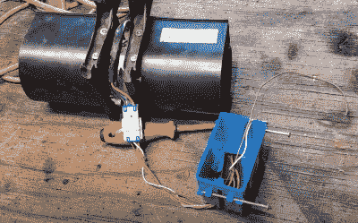

# 从坏掉的微波炉中抢救出来的商店排气扇

> 原文：<https://hackaday.com/2021/05/20/shop-exhaust-fan-salvaged-from-broken-microwave/>

你不用费力就能找到坏掉的微波炉。这些无处不在的厨房电器如此便宜，以至于对大多数消费者来说，修理它们没有经济意义，这使得它们成为垃圾日的常见景象。但是值得拿起其中一个吗？

[管道技工]肯定是这样认为的。在他最新的视频中，他展示了如何简单而廉价地改造废弃微波炉的排气扇，将烟尘排出你的工作间。虽然它显然不会像我们多年来报道的一些大型商店粉丝那样移动那么多空气，但如果你像他一样在一个小空间工作，这肯定足以让讨厌的东西朝着正确的方向移动。另外，作为一个额外的奖励，它是相对安静的。

 正如你可能预料的那样，微波炉的内部组件千差万别，所以不能保证你的路边摊分数会和这个一样。但[DuctTape Mechanic]试图给出一个相对高层次的概述，说明如何解放风扇，解读标签上的电路图，并给它布线，以便你可以将它插到墙上，并用一个简单的开关来控制它。同样，你在店里实际安装风扇的方式可能会有所不同，尽管我们特别喜欢他用一对从磨损的跳线电缆上剪下的鳄鱼夹将风扇固定在窗户上的方式。

得到了一个捐赠的微波炉，但不是在市场上的即兴商店风扇？别担心。我们最近看到一个[无用的微波炉重生为专业外观的紫外线固化室](https://hackaday.com/2021/05/05/modified-microwave-cures-resin-parts-with-style/)，它将是你的树脂 3D 打印机的完美伙伴。或者你更愿意把它变成一个能够熔化铝、铜或青铜的[台式熔炉](https://hackaday.com/2018/06/27/a-different-use-for-microwave-oven-melting-aluminum/)。

 [https://www.youtube.com/embed/nugoW0jMK1A?version=3&rel=1&showsearch=0&showinfo=1&iv_load_policy=1&fs=1&hl=en-US&autohide=2&wmode=transparent](https://www.youtube.com/embed/nugoW0jMK1A?version=3&rel=1&showsearch=0&showinfo=1&iv_load_policy=1&fs=1&hl=en-US&autohide=2&wmode=transparent)

