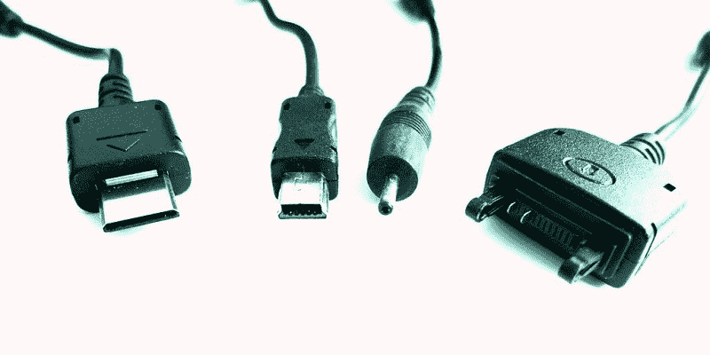

# 欧洲非标准充电器的摊牌时间到了

> 原文：<https://hackaday.com/2021/10/12/showdown-time-for-non-standard-chargers-in-europe/>

似乎很少有消费电子产品的功能会像手机充电器插座一样引发如此多的怨恨。对于我们这些使用 Android 手机的人来说，世界在过去几年中已经慢慢从 micro-USB 转向 USB-C，而 iPhone 用户则认为他们的 Lightning 连接器是连接性的极致。让不同的手机用户聚在一起，这可能会成为一场全面的争斗，因为微型 USB 用户抱怨没有人再有方便的充电线，USB-C 用户变得自鸣得意，苹果用户做他们一直做的事情，假装史蒂夫·乔布斯发明了 USB。欧盟在这种混乱中点燃了火炬，[欧盟提议在其 27 个成员国销售的所有手机上强制使用 USB-C，目的是大幅减少产生的电子垃圾数量。](https://www.theverge.com/2021/9/23/22626723/eu-commission-universal-charger-usb-c-micro-lightning-connector-smartphones)

除了不得不为一个古怪的设备携带额外的微型 USB 电缆的小烦恼之外，我们找不到任何理由不为这一举动鼓掌，因为 USB-C 是 USB 几十年发展的产物，它不仅带来了可逆插头，还带来了增强的功率传输标准，无论你使用谁的 USB-PD 充电器，都可以快速充电。强制 USB-C 将结束不必要的高价专有电缆，并给一个分裂的世界带来最终的统一。

## 对过去糟糕日子的回忆

A variety of proprietary phone charger plugs, from the left: Samsung E900, Motorola V3, Nokia 6101, and Sony Ericsson K750\. Mk2010, [CC BY-SA 3.0](https://commons.wikimedia.org/wiki/File:Mobile_phone_charger_plugs.jpg).

记性好的读者会记得，欧盟以前在 USB 充电方面做过这种事情，这只是因为它采取了与制造商达成谅解备忘录的形式，所以基本上是成功的。但是大多数安卓手机制造商都同意了。这影响到了其他设备。

苹果公司通过包括一根适配器电缆摆脱了微型 USB，将专有插孔留在了手机本身。这一次，很可能欧盟将强制连接器，从而消除任何顽固制造商的回旋余地。

## 什么会出错？

USB-C 端口坚固、方便、功能丰富，那么这个计划的障碍在哪里呢？想象一下，他们是在 1998 年而不是 2021 年做出这一举动的。当时市场上有许多充电器，但最常见的可能是诺基亚 5 V 微型桶形插孔。使用诺基亚连接器本来是有意义的，所以过去几十年为欧盟市场生产的所有手机都会有它。到目前为止，对占用更少空间并具有一些数据传输手段的改进连接器的需求将是震耳欲聋的，因为在诺基亚 5100 成为人们渴望的目标的日子里，移动电话已经在许多方面发生了不可想象的变化。

所以今天，USB-C 连接器拥有我们能想到的 21 世纪 20 年代移动设备的所有功能，并且在未来几年仍然有用，对吗？但是 2030 年或 2040 年呢？当 Galaxy folder 或 iPhone 13 看起来像今天有蛇图案诺基亚一样古怪时，5 GB 的数据传输速率或 100 W 的功率限制就足够了吗？任何强制性标准都必须包含修订条款，以反映技术进步，否则我们将面临倒退的风险。或者推进下一个标准。

因此，我们欢迎所有设备使用真正统一的充电电缆的前景。我们认为 USB-C 是一个很好的工具，我们希望它不会简单地创建标准化的欧盟版本，而让世界其他地方仍然在争论哪种电缆是最好的。我们只是希望，在他们选择的寿命问题上，欧盟能够理智行事。

标题图片:Project Kei， [CC BY-SA 4.0](https://commons.wikimedia.org/wiki/File:Usb_type-c_plug_socket.jpg) 。