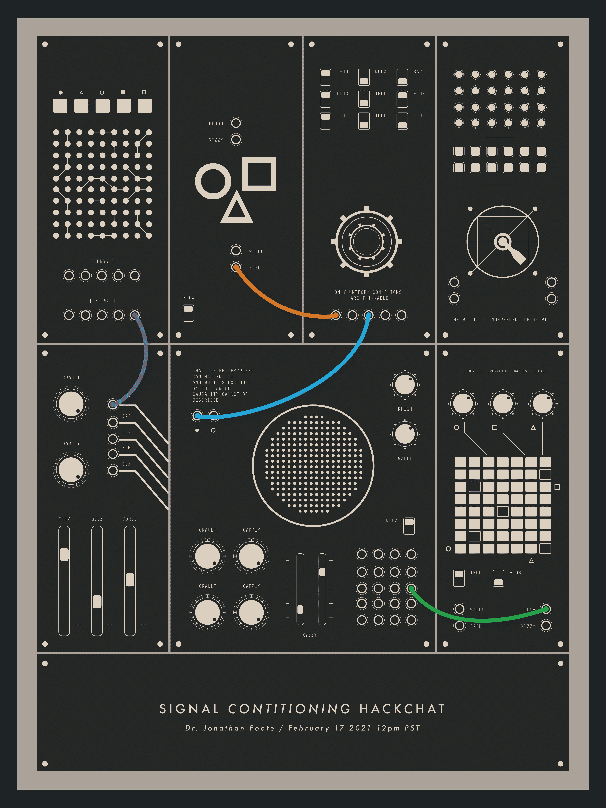

# 信号调节黑客聊天本周三

> 原文：<https://hackaday.com/2021/02/15/signal-conditioning-hack-chat-this-wednesday/>

加入我们太平洋时间 2 月 17 日星期三中午与[乔纳森·富特](https://hackaday.io/hacker/97870-jon-foote)的[信号调节黑客聊天](https://hackaday.io/event/176475-signal-conditioning-hack-chat)！

现实世界是一个混乱的地方，因为很少有东西会长时间处于静止状态。事物总是在运动、振动、升温或降温、加速或减速，甚至以难以描述的方式变化。但这些变化描述了这个世界，理解和控制这些变化需要能够将它们转化为可用信号的传感器——“可用”是关键术语。

让信号为您工作通常需要某种信号处理，可能是一个放大器来增强来自应变仪的微弱信号，或者是一个热电偶驱动器。无论是哪种情况，从周围所有其他信号的背景噪声中提取代表真实世界过程的有用信号都是一项挑战，在有时恶劣的环境中完成这项工作的工程系统也是如此。驱动器、滤波器、放大器和发射机必须协同工作，才能最清楚地了解系统中的情况，以免不良数据导致错误决策。

为了帮助我们了解信号调理的世界，Jonathan Foote 将参加 Hack Chat。你可能记得乔纳森是“康复科学家”，他做了一个关于虚拟模块合成器的伟大的远程演讲。事实证明，对于拥有电子工程博士学位和丰富学术经验的 Foote 博士来说，合成器只是一个副业。当涉及到感兴趣的领域——机器学习、音频分析、机器人技术，当然还有信号处理——时，他有点像一个重生者。他将分享一些关于如何从现实世界中提取信号并将其应用到工作中的见解。

 我们的黑客聊天是 [Hackaday.io 黑客聊天群发消息](https://hackaday.io/messages/room/2369)中的社区直播活动。本周，我们将于太平洋时间 2 月 17 日星期三中午 12:00 坐下来讨论。如果时区束缚了你，我们有[一个方便的时区转换器](https://www.timeanddate.com/countdown/generic?iso=20210217T12&p0=224&msg=Signal+Conditioning+Hack+Chat&font=cursive)。

点击右边的那个发言气泡，你会被直接带到 Hackaday.io 上的黑客聊天群，不用等到周三；随时加入，你可以看到社区在谈论什么。

