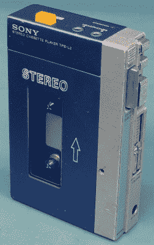
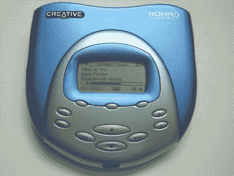
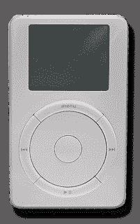
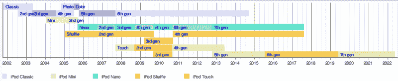
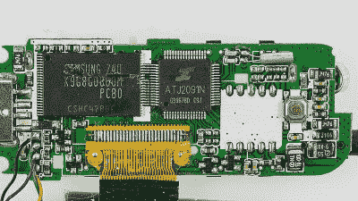

# IPods 的沉默:反思不断变化的个人媒体消费格局

> 原文：<https://hackaday.com/2022/05/16/silence-of-the-ipods-reflecting-on-the-ever-shifting-landscape-of-personal-media-consumption/>

2001 年 10 月 23 日，第一款苹果 iPod 上市。它不是第一个个人媒体播放器(PMP)，但像苹果的许多东西一样，iPod 继续为 PMP 应该做的事情以及他们应该看起来像什么提供了基准。虽然今天很少有人记得像戴蒙德的里约设备这样的 PMP 先驱，但很难找到不知道什么是“iPod”的人。

即使微软、索尼和其他公司试图窃取 PMP 的桂冠，iPod 仍然是无可辩驳的市场领导者，同时获得越来越多的功能，如视频播放和触摸显示屏。然而尽管取得了这一成功，2017 年苹果停止了其纯音频 iPod(Nano 和 Shuffle)，截至 2022 年 5 月 10 日，苹果 iPod Touch 停止生产。这标志着苹果进军 PMP 市场的结束，并让人怀疑 90 年代末的 PMP 市场是否已经一去不复返，或者可能已经转变为其他市场。

毕竟，如今每个人和他们的宠物仓鼠都有了智能手机，还需要一个只能播放音频或者视频的便携设备吗？

## 设置场景

Original Sony Walkman TPS-L2 from 1979.

无论如何想象，便携式媒体播放器都不是一个新概念。从 20 世纪 50 年代的便携式唱机，到 20 世纪 60 年代基于晶体管的小型收音机的兴起，当然还有更方便的媒体格式，如 8 轨磁带、飞利浦 T2 的小型盒式磁带和使媒体更加便携的光盘。

当索尼在 1979 年 7 月推出第一款随身听时，它将开启一个全新的便携式媒体设备市场。一盘磁带上有超过一个小时的音乐，任何人都可以在旅行、在健身房锻炼、在公园或海滩慢跑时以典型的 20 世纪 80 年代的方式听他们喜欢的音乐(和混音带)。即使个人使用随身听——或其众多复制品之一——不那么光彩，也很难否认这些设备的出现带来的文化变革。

自然，技术进步是不可避免的。这就是为什么基于盒式磁带的便携式音频播放器最终让位于基于 CD 的播放器。在防震缓冲等细节被发现(主要)可以防止音频跳过后，每个人都需要在生活中拥有个人 CD 品质的音频。然而，尽管有这些好处，光盘等光学媒体比磁带媒体更不耐用，更容易出现技术问题，更不用说基于光盘的随身听播放器和克隆产品远不如基于磁带的同类产品便于携带。这意味着基于磁带的随身听和 kin 一直存在到 21 世纪初。

在 20 世纪 90 年代，事情变得有趣起来，因为在 1992 年，索尼已经发布了它的[迷你光盘](https://en.wikipedia.org/wiki/MiniDisc)格式。尽管这仍然是光学介质(准确地说是磁光介质)，MD 介质比 CD 要紧凑得多，存储的音频至少和 CD 一样多，并且有保护盒。虽然到 20 世纪 90 年代末，普通消费者已经买得起 MD，但它的商业成功受到了许多因素的阻碍，尤其是 MD 音频所需的索尼专有的 ATRAC 音频格式。

MD 的另一个主要障碍是正在互联网数字信息高速公路上流传的一种新的音频格式，[称为 MP3](https://hackaday.com/2020/07/27/mp3-is-25-years-old/) ，随着 1998 年 [Diamond Rio PMP300](https://en.wikipedia.org/wiki/Rio_PMP300) 基于 Flash 的 MP3 播放器的发布(2016 年 LGR 和 [Ars Technica 也对](https://arstechnica.com/gadgets/2016/10/diamond-rio-pmp300-mp3-player-today/)[进行了审查)，当时的多媒体巨头 Diamond 抓住了这一点。虽然按照 2022 年的标准，它不完全是一个多媒体明星，因为它笨重的、基于并行端口的 PC 连接，对于本来打算与 Windows 98 一起使用的东西来说，它与三年后发布的第一款苹果 iPod 具有基本相同的功能，包括内部存储、媒体控制、附带的软件实用程序和(最终)在线音乐商店。](https://www.youtube.com/watch?v=UEME0IR6-Ts)

## 进入分离舱

The Creative Nomad Jukebox, with its roomy 2.5″ HDD.

正如《连线》【2006 年发表在《T2》上的一篇文章所述，苹果公司创造 iPod 的主要目标是将其时尚感和用户互动融入其中，这篇文章采访了参与 iPod 及其 iTunes 软件开发的人士。后者最初被称为 SoundJam，当时苹果公司收购了它，并雇佣了它的主要程序员杰夫·罗宾斯(Jeff Robbin)。最初，iTunes 旨在为 MacOS 提供一个可靠的音乐播放器，以配合 90 年代末爆发的数字音乐革命，但最终也成为了 iPod 的管理软件。

iPod 的开发是为了寻找适合当时快速发展的多媒体生态系统的新设备。正如苹果 iPod 产品营销副总裁 Greg Joswiak 所说，虽然他们发现数码相机和摄像机等产品相当不错，但当时的用户界面和对 PMP 的处理“很糟糕”。它们要么大而笨重，要么小而无用，由于闪存的限制，通常只有 32 MB 或 64 MB 的内置内存。

First-generation iPod ‘Classic’.

没有人知道是谁提出了创造音乐播放器的想法，但当这个想法出现在首席执行官史蒂夫·乔布斯的脑海中时，他立即抓住了这个机会，导致了第一个原型的开发。因此，下一个问题就变成了这个“iPod”——后来才为人所知——在功能方面会比竞争对手做得更好。存储是一个主要因素，像一些竞争对手的 PMP 一样，iPod 将配备硬盘驱动器(HDD)，但不是其他人正在使用的相当大的 2.5 英寸硬盘驱动器。

第一代 iPod 使用了东芝当时新开发的 1.8 英寸硬盘。这给了它一个宽敞的 5 GB 到 10 GB 的存储空间，而不是竞争对手 PMP 的缓慢的 USB 1.1 连接，它配备了 FireWire。在 400 Mb/s(半双工)时，相对于 USB 1.1 的 12 Mb/s，它是内部存储的更好匹配。这种优势将一直保持到 USB 2.0 和更高版本变得普遍。

iPod 的名字是由姚一奇·基耶科(负责营销这款新设备的团队成员)起的，暗指 2001:太空漫游和著名的“哈尔，打开舱门！”场景，吊舱是在宇宙飞船外面执行任务的小飞船。

也许第一代 iPod 唯一的缺点是缺乏 Windows 兼容性。你需要一个支持 FireWire 的装有 iTunes 的 Mac 系统来管理设备的内容。

## 他们成长得如此之快

iPod 的成功——或第六代时被重新命名的 iPod Classic(T1)——将导致最初型号的另外五个版本。第一版(iPod Classic 第二代)最显著的变化包括 Windows 兼容性，iPod 的硬盘使用 HFS+文件系统格式化，可用于 MAC 和 FAT32 for Windows。Windows 用户使用 [Musicmatch Jukebox](https://en.wikipedia.org/wiki/Musicmatch_Jukebox) 而不是 iTunes 来管理 iPod。

从 2003 年开始的第三代 iPod 增加了 USB 支持，用电容控制环代替了旧的机械滚轮和按钮。这一版本还取消了对 Musicmatch 的支持，将 iTunes 的乐趣释放给了 Windows 用户。第五代 FireWire 的支持只是为了充电，而 USB 接管了内容同步的职责，而彩色显示和视频播放是一个标准功能。

The timeline of iPod models. (Source: Wikipedia)

除了“经典”系列，还有一系列名副其实的新 iPod 型号，包括 Mini(基于 1 英寸[的 Microdrive](https://en.wikipedia.org/wiki/Microdrive) )、Nano(迷你替代品，使用闪存)、无显示屏 Shuffle，以及 2007 年的第一代 iPod Touch。虽然前者都是专用的 PMP，但 Touch 可能最好被视为一部无手机的 iPhone。iPod Touch 的大部分硬件与 iPhone 相同，运行 iOS 系统，可以通过 WiFi 使用苹果应用商店。

## 一个时代的终结？

如果我们认为随身听和类似设备的兴起是对购买音乐(作为物理媒体或数字媒体)的渴望的回应，那么过去几年从订阅服务到流媒体音乐的转变似乎是 PMPs 所谓消亡的驱动力，也是苹果停止 iPod 的驱动力。多年来，有一个“MP3 播放器”来拷贝音乐是有意义的，这些音乐要么是以数字方式购买的，要么是从购买/借来的 CD 上翻录的，现在正朝着付费订阅而不是直接购买音乐的方向转变。

这种变化不仅体现在苹果的 iPod 播放器上，还体现在它从 iTunes 商店到流媒体音乐业务的重新定位上。这一想法与网飞和其他流媒体视频服务没有什么不同，即点播该服务上的任何内容，而不是购买或借用专辑、电影和连续剧。

在这个勇敢的新世界中，没有人拥有他们所听的音乐，可以说 PMP 的角色已经结束，因为任何支持互联网的设备都可以立即访问大规模的内容库。所有这些都不需要建立您自己的个人媒体库。只需在您的智能手机、智能电视、智能手表或智能冰箱上安装该应用程序，并注册订阅。触手可及的便利。

然而，这一观点并没有得到统计数据的完全支持，来自美国的数据显示，在过去几年里，音乐 CD 的销量有所上升。目前，音乐流媒体服务创造了音乐行业收入的一半以上，其中 CD 和黑胶唱片的销售额约占 11%。这告诉我们，宣布个人媒体库的死亡可能还为时过早。

## 不仅仅是怀旧

自蜡质音乐筒时代以来，音乐市场发生了很大的变化，但有一点是不变的，那就是有不同类型的人，每个人在欣赏音乐的方式上都有自己的偏好。仅仅基于这一概念，就认为每个人都将把他们的媒体内容从在线服务传输到他们的 iPhones、Android 手机和一堆“智能”设备上，这似乎令人愤慨。

物理媒体的优势应该是显而易见的:你不局限于流媒体服务的媒体库，你至少可以获得 CD 质量的音频，并且没有每月费用来保存媒体。它也永远不会因为出版商的一时兴起而从你的图书馆消失，你可以带着它自由地去山里的小木屋，那里的手机信号绝对为零。把它复制到 PMP 上，你就能得到所有这些，但格式更紧凑。非常适合长途徒步旅行，并防止假期期间令人毛骨悚然的漫游数据费用。

PCB of a generic MP3 player. (Credit: Raimond Spekking)

使用专用 PMP 代替智能手机的额外优势是节省电池电量，同时增加了物理控制按钮，允许触觉交互。凭借当今的技术，现代 PMP 除了大的 NAND 闪存芯片(和/或 SD 卡扩展)存储之外，不需要超过一个处理器芯片，所有这些都占用很少的空间，并且可以在一次电池充电后持续很长时间。此外，不必拿出昂贵、脆弱的智能手机来摆弄触摸屏上的媒体控制，也不必冒着摔落或被盗的风险

即便如此，当像 [RockBox](https://en.wikipedia.org/wiki/Rockbox) 这样的开源项目将提供各种各样的新旧 PMP—[包括 iPod](https://www.rockbox.org/wiki/IpodPort)—以及更新的固件，甚至增加了原始固件中没有的功能时，在仍然存在的现代 PMP(或仍被通俗地称为“MP3 播放器”)上挥霍金钱是没有必要的。

我们之前也报道过修改和修理 iPod(和其他 PMP)，包括升级 iPod Video 和 T2 iPod Nano 第三代的存储，以及更换第六代 iPod 的 T4 电池和存储。与普通的智能手机不同，这些 PMP 很容易维修和升级，这为潜在的好处增加了一项。

## 良好的氛围

廉价的便携式磁带播放器是 90 年代的主要产品，和许多人一样，我最终也买了一台。即使他们有廉价的磁带机制，你不会想浪费任何比 I 型磁带更好的东西，以及廉价的泡沫耳机，保证会分解，它仍然是一个可怕的设备。有了它，我可以在屋外听音乐，这在当时是罕见的。

当 MP3 革命到来时，它改变了这一切。感觉好像在几年内，东西从便携式 CD 播放器——如果你碰到小心放置它的桌子，它就会跳过——到基于闪存和硬盘的播放器，它们每年都会以更花哨的风格出现，并且在更小的外壳中封装了更多的功能。

即使我从来都不是 iPod 风格的“铝/塑料平板”美学的粉丝，我也必须承认，就其操作和生态系统而言，它是有吸引力的设备，尤其是与 iPod Nano 和 Shuffle 一起使用。在使用了一款较新的 iPod Touch 设备(作为 iOS 开发设备)之后，我明白了为什么苹果继续销售它没有意义。

尽管苹果已经告别了 PMP 市场，但这并不意味着这个市场已经不复存在。正如我们所见，仍然有充分的理由继续使用这些专用播放设备中的一种，即使忽略今天全新“MP3 播放器”的多样化产品，修理和升级旧播放器将确保那些想继续使用这些设备的人可以这样做。

谁知道呢，随着变幻无常的音乐市场再次改变潮流，也许有一天苹果会回来。