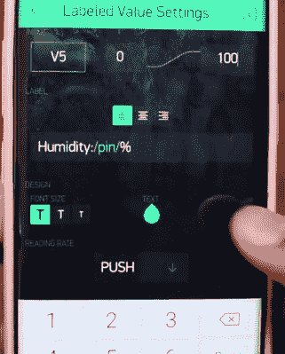

# 使用 Blynk 的简单 ESP8266 气象站

> 原文：<https://hackaday.com/2018/08/20/simple-esp8266-weather-station-using-blynk/>

今天的黑客发现自己处于一个非常有趣的时刻。强大的微控制器和标准化的传感器模块的可用性使得为联网的环境监视器这样的东西组装硬件就像用乐高积木一样复杂。在许多情况下，硬件已经成为基础，软件成为薄弱环节。构建传感器节点来收集数据很容易，但是如何以一种有用且吸引人的方式显示它呢？

 这个由【希亚姆·拉维】组装的简单的[室内温度和湿度传感器展示了一个使用 Blynk 解决问题的可能方案。在休息后的视频中，他首先引导您完成演示硬件的布线，然后继续创建 Blynk 接口。虽然它可能不是所有应用的理想解决方案，但它确实向您展示了如何快速地从工作台上的几个组件转变为显示有用的数据。](https://github.com/theTechnowright/DIY-Weather-Station)

除了 NodeMCU 板，[Shyam]还增加了 DHT11 传感器和 SSD1306 有机发光二极管显示器。他在存储库中提供了电路图以及用于 ESP8266 的 Arduino 代码，但是这次演示的硬件部分并不重要。如果你愿意，你可以省略有机发光二极管或者切换到 BME280 传感器之类的东西。真正的诀窍在于软件。

对于以前没有玩过它的读者来说，Blynk 是一种允许你创建 GUI 来与世界上任何地方的微控制器交互的服务。[Shyam]提供的代码从 DHT11 传感器读取湿度和温度数据，并将其“写入”Blynk 服务。在应用程序中，您可以使用简单的拖放界面以多种方式可视化该数据。

我们已经看到 Blynk 和 ESP8266 被用来控制从情绪灯到 T2 的所有东西。这是一个强大的组合，下次您需要在短时间内将一些东西组合在一起时要记住这一点。

 [https://www.youtube.com/embed/vPPrww5ekjo?version=3&rel=1&showsearch=0&showinfo=1&iv_load_policy=1&fs=1&hl=en-US&autohide=2&wmode=transparent](https://www.youtube.com/embed/vPPrww5ekjo?version=3&rel=1&showsearch=0&showinfo=1&iv_load_policy=1&fs=1&hl=en-US&autohide=2&wmode=transparent)

