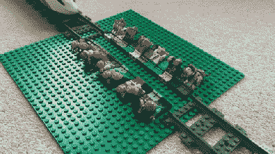

# 用其他材料制作乐高火车轨道的简单方法

> 原文：<https://hackaday.com/2022/08/30/simple-hacks-to-make-lego-train-track-out-of-other-pieces/>

玩乐高火车很有趣，但是和任何模型火车一样，你很少有足够的轨道来实现你最大的愿望。YouTuber [brick_on_the_tracks]想出了自己的一些创意，使用其他技术使轨道与乐高火车兼容。

TRAINED LEGO PROFESSIONALS! DO NOT ATTEMPT IN REAL LIFE!

最直接的方法是[使用 1967 年首次发布的乐高积木](https://www.youtube.com/watch?v=Gb46GMA4pzA)。它们可以分成两排，每排四个桩，它们将作为功能完善的火车轨道。根据乐高官方规定，这也是 100%合法的建筑技术。官方的赛道部件可以通过把它们放在一个一柱高的助推器上连接起来。[brick_on_the_tracks]认为，这比使用官方轨道便宜九倍，但这取决于你如何构建你的布局，你需要考虑基板的需要。

更愚蠢的是，实际上也可以使用迷你人物作为轨迹。再说一次，这是一个 100%合法的技术，尽管火车运行起来没有围栏轨道平稳。不过，这很有趣，可以作为你去参加当地乐高大会时的一个有趣的补充。

如果你真的缺钱，你可以用硬纸板。在乐高世界里，这是不合法的，也是非常基本的，但是你可以只用一把工艺刀和披萨盒就做出一个布局。实际上，我们以前也展示过其他乐高火车黑客，[就像这个整洁的自动解耦器设计](https://hackaday.com/2015/12/13/decoupling-lego-trains-automatically/)。

 [https://www.youtube.com/embed/Gb46GMA4pzA?version=3&rel=1&showsearch=0&showinfo=1&iv_load_policy=1&fs=1&hl=en-US&autohide=2&wmode=transparent](https://www.youtube.com/embed/Gb46GMA4pzA?version=3&rel=1&showsearch=0&showinfo=1&iv_load_policy=1&fs=1&hl=en-US&autohide=2&wmode=transparent)

