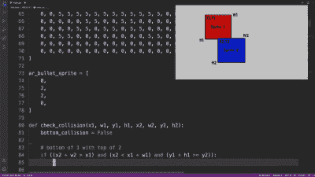

# 简单的 MicroPython 游戏是 30 分钟的游戏开发课程

> 原文：<https://hackaday.com/2021/05/25/simple-micropython-game-is-a-30-minute-game-dev-course/>

有时，观察一个项目的各个部分一次一个地组合在一起真的很有用，这样才能获得对整体的完整理解和心理描述，我们发现[这个来自【ez contents】](https://www.youtube.com/watch?v=IhXfFNgJ7S8)的简单复古的示例游戏就是如此。(视频，嵌在下面。)GitHub 上有[的代码，但是如果你对这样一款游戏的幕后活动感兴趣，不要错过视频。](https://github.com/marekl123/invasion-ardupy-game/)

In the video, each game element and function is illustrated, showing exactly what gets done and why. This part is collision detection (click to enlarge.)

这些基于精灵的游戏主要是关于在屏幕上移动小图形对象(精灵)以响应用户输入，以及管理当检测到玩家的精灵和其他精灵(如敌人、投射物等)之间的碰撞时会发生什么。开发过程在视频中有精彩的记录和演示，因为功能的每个独立部分都是一次一部分地构建和解释的。

这个简单的游戏是使用 Seeed Studios 的 [Wio 终端](https://wiki.seeedstudio.com/Wio-Terminal-Getting-Started/)使用 [ArduPy](https://github.com/Seeed-Studio/ArduPy) (这是 [MicroPython](https://micropython.org/) 结合 Arduino APIs)制作的，这是一个小型微控制器开发板，集成了屏幕、传感器和按钮输入，包括一个小的方向点击器，[ezContents]用作操纵杆。

下面嵌入了全程视频；仔细观察一下，你可能会得到灵感，但是你肯定会对这些类型的游戏是如何开发的有更好的理解，即使你没有使用相同的硬件或开发环境。

 [https://www.youtube.com/embed/IhXfFNgJ7S8?version=3&rel=1&showsearch=0&showinfo=1&iv_load_policy=1&fs=1&hl=en-US&autohide=2&wmode=transparent](https://www.youtube.com/embed/IhXfFNgJ7S8?version=3&rel=1&showsearch=0&showinfo=1&iv_load_policy=1&fs=1&hl=en-US&autohide=2&wmode=transparent)

喜欢你所看到的，但希望比 Wio 终端更小？没问题，[ardu boy Nano 将“微小”推向极限](https://hackaday.com/2021/02/05/arduboy-gets-even-smaller-with-new-nano-edition/)。