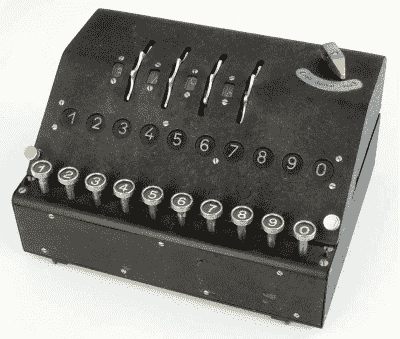

# 模拟英格玛的古怪表亲

> 原文：<https://hackaday.com/2019/06/16/simulating-the-enigmas-oddball-cousin/>

即使你不认为自己是一个历史迷，你也很可能熟悉第二次世界大战中的英格玛机。这种早期的机电加密设备被纳粹德国广泛用于挫败盟军窃听他们通信的企图，艾伦·图灵(Alan Turing)等密码学家在战争结束前为破解它创建的编码信息付出了令人难以置信的努力，这一直是几本书和电影的灵感来源。但是你知道实际上“标准”谜有几个分支吗？

 为了进入 2019 年黑客日大奖，[【Arduino Enigma】正在寻找这些不同寻常的变体之一——Enigma Z30](https://hackaday.io/project/165684-nano-z30-a-numbers-only-enigma-machine-simulator)。这个“婴儿谜”是为只需要对数字数据进行编码的情况而设计的。看起来有点像机械计算器，它放弃了德国 QWERTZ 键盘，取而代之的是十个按钮和十个编号为 0 到 9 的灯。如果你需要做的只是发送数字代码，Z30 是完整的恩尼格玛机的(相对)小而轻的替代品。

创建 Z30 的开源硬件模拟器具有相当独特的挑战。虽然你不能准确地从 Digi-Key 订购标准的 Enigma，但至少有足够多的幸存的例子，它们已经被完整地记录下来。但直到 2004 年，甚至没有人知道 Z30 的存在，即使在那时，直到 2015 年，在斯德哥尔摩才发现一个幸存的单元。

当然，【Arduino Enigma】*在这类事情上的确有些经验。通过修改已经在 Arduino 上完成的全尺寸 Enigma 模拟工作，只需要几个小时就可以设计一个定制的 PCB 来容纳 Arduino Nano、十个带有匹配 led 的按钮，当然还有顶部标志性转子所需的硬件。*

 *Z30 模拟器看起来将成为一个奇妙的桌面玩具，也是一个帮助可视化全尺寸英格玛机如何工作的好方法。随着第一个原型的零件已经订购，我们应该很快就能第一次好好看看这个非常独特的历史娱乐。

The [HackadayPrize2019](https://prize.supplyframe.com) is Sponsored by:     *