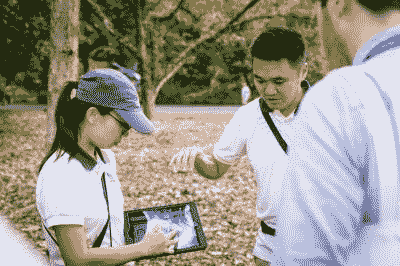
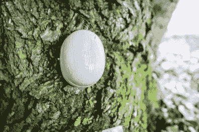

# 新加坡向树木网络延伸

> 原文：<https://hackaday.com/2022/12/08/singapore-branches-out-into-internet-of-trees/>

五年前，一名 38 岁的妇女抱着她的一个双胞胎婴儿，和家人一起欣赏户外音乐会。在之前的一周，一直刮风下雨，但今天，天气很好，音乐会很拥挤。在没有任何警告的情况下，一棵 270 年的 tembusu 树倒在了这位女士身上，在其他音乐会观众无法及时移走它之后，她被压住并最终死亡。尽管每年进行两次检查，但这棵树看不出有问题的迹象，悲剧还是发生了。

新加坡官员希望通过建立一个树木网络来避免这类事件的发生。这个赤道岛国拥有大约 550 万人口，约 700 万棵树——其中约 600 万棵树由新加坡国家公园委员会跟踪，因此可以通过一个应用程序远程管理。(只有当树木长到一定的尺寸时，该板才会跟踪它们，所以我们会假设其他 100 万棵树还太年轻，还不能加入这个乐趣。)

虽然由树木引发的死亡事件非常少，但也有很多其他的“树木事故”可能发生，比如树枝掉落、树干折断或被连根拔起。根据分行的规模，这可能是一个危险的麻烦，因为它可能会阻塞道路，模糊标志，或破坏财产。由于国家公园委员会的努力，这些事件已经从千年之交的每年约 3000 起下降到今天的每年不到 500 起。

## 每棵树都有一个双胞胎

An arborist monitors trees in the field. Image via [The Register](https://www.theregister.com/2022/11/28/automating_tree_management/"")

这听起来像是一个新的尝试，但你可能会惊讶地发现这个项目始于 20 年前，当时树木学家对现存的树木进行了地理标记。从那时起，他们就跟上了技术的进步——通过机器学习进行地理标记开始于大约五年前，现在是自动化的。

新加坡国家公园委员会通过使用激光雷达点云和人工智能进行地理定位，创建每棵树的数字双胞胎来监控这些树。这样，一棵树的健康状况的许多方面都可以在一个有空调的办公室里进行分析——这在一个永远是夏天的地方是一笔宝贵的财富。

然后，董事会对数字双胞胎进行分析，并对其应用有限元模型，以评估树木在不同天气条件下的整体稳定性，包括树木的结构、木材强度和根部的可用空间等因素。尽管新加坡永远是夏天，但这个国家每年都会经历强烈的、扭曲树木的热带风暴。

  A special drill for measuring tree density.  A tilt sensor monitors the angle of a mossy tree.

除了在舒适的空调办公室里检查树木，该组织还使用测量树木密度和检测空洞的特殊钻头在实地对树木进行物理监测。如果这敲响了警钟，很可能是因为【约翰·奥普萨尔】的 [OpenDendrometer](https://hackaday.io/project/185224-opendendrometer) ，它是[2022 年 Hackaday 奖气候弹性社区挑战赛的决赛选手](https://hackaday.com/2022/09/28/2022-hackaday-prize-congratulations-to-the-winners-of-the-climate-resilient-communities-challenge/)。除此之外，OpenDendrometer 可以帮助确定一棵树是否正在经历水分胁迫，或者生长速度是否随着时间的推移而放缓。

鉴于我们依赖树木提供阴凉、氧气、食物和视觉吸引力，即使它们不怎么走动，监测它们也是非常有意义的。希望这能在其他政府心中播下一颗种子。