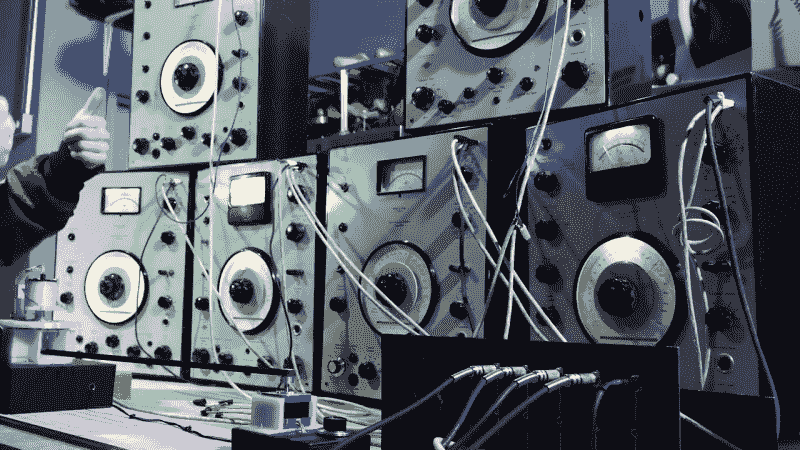

# 十六通道复古旋转式推子

> 原文：<https://hackaday.com/2021/04/01/sixteen-channel-retro-rotary-fader/>

音乐家和电子音乐机器制造商[Sam Battle]在 Look Mum No Computer 上重现了不寻常的[水晶宫音频推子。水晶宫是一个旋转式推子，由工程师戴夫·杨在 20 世纪 60 年代末的](https://www.youtube.com/watch?v=PdVcY0ymyV8) [BBC 广播电台工作室](https://www.soundonsound.com/people/story-bbc-radiophonic-workshop)开发。神秘博士的粉丝们可能会从[“克罗顿一家”系列](https://en.wikipedia.org/wiki/The_Krotons)的主题音乐中认出它。这是一个狂野的机械混音器，通过使用变速旋转拾音器在 16 个不同的输入之间渐变以产生输出。

Dave Young’s Crystal Palace

在扬建造了原型之后，其中的三个被制造出来并被放入从垃圾箱里的废有机玻璃中切割出来的箱子中——因此它们以 1851 年的同名玻璃和铁结构而闻名。

[Sam]决定使用一些感应器和一个旧的磁带头来构建它。在试验板上验证了这个概念后，他在一个 3D 打印的圆形框架上安装了 16 个感应器。旋转拾音器通过顶部的滑环传输信号。输入插孔和电平电位计阵列安装在外壳的面板上，面板上包含一个向量板，里面装满了驱动线圈的运算放大器。严格来说，最初的推子使用的是电容耦合，而不是电感，但这丝毫无损于这个项目。正如他前面所说的，他故意不深挖原作，以便在设计中加入自己的观点。

How Many Wobbulators are in Your Lab?

我们喜欢[Sam]开始测试时用的是固定的马达，不是用胶带，而是用胶带卷*(他后来整理了一下)。在接近尾声时，不要错过他拿出六个(我们可以数出来)20 世纪 60 年代的 B & K [摇摆器](https://djjondent.blogspot.com/2014/06/bruel-kjaer-beat-frequency-oscillator.html)并用它们以适合时期的风格驱动推子——就像一个人做的那样。感谢[锥度]的提示。*

 *[https://www.youtube.com/embed/PdVcY0ymyV8?version=3&rel=1&showsearch=0&showinfo=1&iv_load_policy=1&fs=1&hl=en-US&autohide=2&wmode=transparent](https://www.youtube.com/embed/PdVcY0ymyV8?version=3&rel=1&showsearch=0&showinfo=1&iv_load_policy=1&fs=1&hl=en-US&autohide=2&wmode=transparent)

*