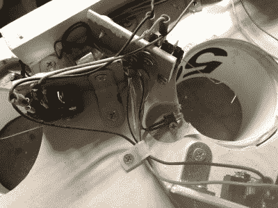

# 用投币口开关得分的飞碟球

> 原文：<https://hackaday.com/2020/07/20/skee-ball-scoring-with-coin-slot-switches/>

保龄球是伟大的，但在滑雪球的小球跳跃的不可预测性更令人兴奋。你可以直接打，或者花一堆时间完善 100 分的投篮。不像保龄球，没有什么要重置的，因为重力会把球还给你。

在[gcall1979]的早期双向飞碟球机中，重力也有助于得分机制:每个球滚回给玩家，落在标有相应分数的球道上，这本身就是一个有趣的工程挑战。他决定在他最新的投球机中安装自动计分系统。

 在每一个圆筒的底部都有一个街机投币门开关，上面有一根长长的金属丝作动器。这些球必须安装在离球洞足够近的地方，但不要挡住球。

每个开关都连接到一个 Arduino Mega，四个大的 7 段用于记录比分，一个巨大的 7 段用于显示比赛的球数。每当游戏被重置，一个伺服下降门释放球，就像一个商业机器。

拱廊开关工作得很好，尤其是当他将电线弯成钩状以覆盖更多区域时。但是他们偶尔也会失败，也许是因为目标是全尺寸的，但是球是标准尺寸的一半。对于下一个目标，[gcall1979]计划使用红外光束中断目标，这应该与任何大小的球。如果你更喜欢保龄球，[你也不会在那里用破梁靶三振出局。](https://hackaday.com/2020/06/21/score-big-against-boredom-with-tabletop-bowling/)