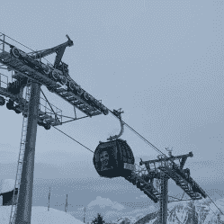

# 滑雪缆车设计实现了不可能

> 原文：<https://hackaday.com/2022/01/01/ski-lift-design-does-the-impossible/>

这是一个季节，对于那些倾向于爬上白雪覆盖的陡峭山顶的人来说，然后快速下山。如果有东西挡了他们的路，就转身。无论他们是在滑雪板上，滑雪板上，还是其他方式，下来通常涉及到利用重力。另一方面，起床通常包括滑雪缆车。休息过后，在由[kalsan15] 制作的[视频中，我们了解到技术是如何介入的，使得即使是最难到达的斜坡也只需乘坐电梯即可到达。](https://www.youtube.com/watch?v=x4Av3jGKee8)

A ski lift that can only turn left.

滑雪缆车最简单的形式是由一根钢缆连接的两个滑轮。山脚下的滑轮是动力，山顶的滑轮充当惰轮。钢索上连接着一些装置，人们可以坐下或抓住把手，然后被吊到山顶。

如果地理条件允许，这种简单的布置很好，但如果有转弯，或者需要多个惰轮来保持电线拉紧但又靠近地面，该怎么办？同样，最基本的滑雪缆车也有局限性。如果缆绳绕着惰轮左转，那么把手或椅子的附件*在右边，使得绕着惰轮右转是不可能的。*

那么，如何解决这个问题呢？我们不会破坏结果，但我们建议查看 [[kalsan15]的视频](https://www.youtube.com/watch?v=x4Av3jGKee8)，它对问题和解决方案进行了精彩的描述，会让你疑惑“我怎么没想到呢！?"

如果你觉得这还不够简单，那就花点时间学习一下，你不仅可以为你在树林中的小屋制作一个气动滑雪缆车，还可以骑着你的 [DIY 滑雪自行车滑下山坡！](https://hackaday.com/2016/02/17/all-this-bike-needs-is-some-snow/)

 [https://www.youtube.com/embed/x4Av3jGKee8?version=3&rel=1&showsearch=0&showinfo=1&iv_load_policy=1&fs=1&hl=en-US&autohide=2&wmode=transparent](https://www.youtube.com/embed/x4Av3jGKee8?version=3&rel=1&showsearch=0&showinfo=1&iv_load_policy=1&fs=1&hl=en-US&autohide=2&wmode=transparent)

