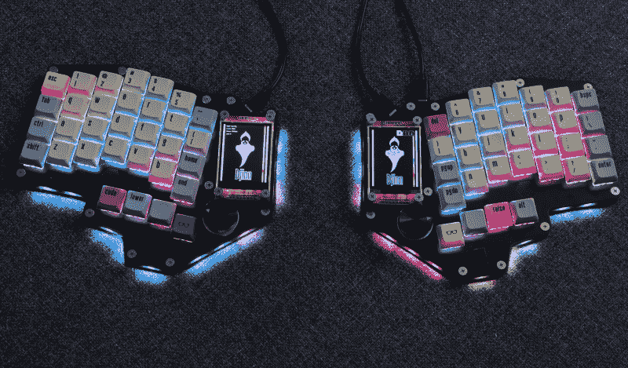

# 用 PCB 魔法打造的光滑键盘

> 原文：<https://hackaday.com/2021/11/21/slick-keyboard-built-with-pcb-magic/>

有时，一次偶然的对话会让你发现一些你以前从未见过的酷东西，在你意识到之前，你已经在为另一个硬件版本订购零件了。这就是前几天这位抄写员在*上和 QMK 维护者【Nick Brassel aka tzarc】聊到 [Djinn，一个华丽的 64 键分离式机械键盘](https://github.com/tzarc/djinn)测试平台时发生的事情。这是一个测试平台，因为它使用最新的 [STM32G4x](https://www.st.com/en/microcontrollers-microprocessors/stm32g4-series.html) 微控制器家族，而 [QMK](https://qmk.fm/) 目前在主线版本中不支持这一点。目前，[Nick]维护一个定制版本，直到它被合并。*

硬件方面，设计非常棒，非常注重细节。我们有单独的每键 RGB LEDs，RGB underglow，一个旋转编码器，一个五向触觉拇指开关，和一个每半部 240×320 LCD*。键盘基于三个 PCB 堆叠，其中两个纯粹是为了结构。这个精巧的设计有足够的功能让我们中的一些人感到高兴。*

 *有趣的是，当你看设计文件(自然是 KiCAD)时，[Nick]选择了 PCB 的镜像方法。这意味着左右两侧实际上是相同的 PCB 布局。这些元件安装在 PCB 的不同面上，具体取决于你看到的是哪一面！通过镜像 PCB 两侧的尺寸，并并行连接所有器件，可以用一个主布局完成所有工作。

这是一个简单但天才的想法，这位抄写员以前没有遇到过(可耻！)其次，它降低了成本，因为典型的中国原型制造公司不会处理数量低于 5 块的 PCB，所以你可以一次订购两个完整的键盘，而不是需要两个订单来制造 5 个。(是的，实际上有三种独特的 PCB，但我们正在简化情况，好吗？)

现在，如果这种讨厌的电子产品短缺能够缓解一点，我们就可以得到建造这种美丽的部件了！

显然，这些年来我们已经讨论了很多很多键盘。这是我们自己的[【克里斯蒂娜的】专栏，内容都是关于](https://hackaday.com/series_of_posts/keebin-with-kristina/)的。如果你需要一点打字技巧的帮助，[这个令人震惊的例子](https://hackaday.com/2021/01/28/this-negative-reinforcement-keyboard-may-shock-you/)可能就是你要的。如果你的口味是[老派的 clackers](https://hackaday.com/2021/10/08/model-f-keyboard-restoration-goes-the-extra-mile/) ，那么每个人都有适合的东西。*