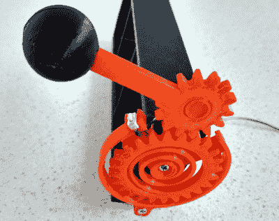

# 吃角子老虎机很有趣

> 原文：<https://hackaday.com/2020/12/05/slot-machine-has-a-handle-on-fun/>

出于某种原因，当老虎机数字化后，它们失去了最好的功能——手柄。不管怎样，谁会想去按老虎机的按钮呢？还不如玩电动扑克。[John Bradnam]似乎同意这一点，并且已经开发了一个带有手柄的开源三色矩阵老虎机。

在这种情况下，你会因为一台 Arduino Pro Mini 而输掉所有的镍币。手柄是对早期吃角子老虎机项目的升级，该项目使用三个 8×8 矩阵和一个自定义驱动板。当弹簧手柄被拉动时，它会触动一个微型开关来旋转卷轴，然后又弹回原位。在每次拉动之间，矩阵中会显示当前得分。甚至还有一个压电蜂鸣器用来发出胜利的叫声。我们只希望把手下面的按钮是更灵活的，只是为了感觉。休息之后，请观看简短的演示视频。

如果你不是赌徒，你可以把你的老虎机变成一个时钟。

 [https://www.youtube.com/embed/uEHuJHhdjF0?version=3&rel=1&showsearch=0&showinfo=1&iv_load_policy=1&fs=1&hl=en-US&autohide=2&wmode=transparent](https://www.youtube.com/embed/uEHuJHhdjF0?version=3&rel=1&showsearch=0&showinfo=1&iv_load_policy=1&fs=1&hl=en-US&autohide=2&wmode=transparent)

