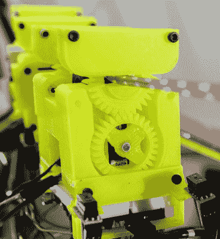

# 树懒机器人名副其实

> 原文：<https://hackaday.com/2020/07/05/slothbot-lives-up-to-its-name/>

为了在现实世界中移动，机器人可以沿着地面爬行或飞向天空。这两种选择都有缺点，地面上的障碍是一个问题，飞行是非常耗能的。我们不常看到的是沿着空中电缆移动的机器人，对于某些用例来说，这可以提供两个世界的最佳选择。受树懒在树林中缓慢而高效的移动的启发，佐治亚理工学院的研究人员创造了一个机器人，它沿着电缆网络缓慢爬行，并监控周围的世界，当然，它被命名为 Slothbot。

The cable switching mechanism

Slothbot 以速度换取效率，让它可以仅依靠太阳能长时间运行。它确实需要建立和维护有线网络，但这带来了无障碍的优势，以及停止和充电的能力。对我们来说，最有趣的功能是电缆开关机制，这使它能够沿着相互连接的电缆网络导航。

移除了一部分的环形齿轮保持滑轮机构的上部，但是可以向左或向右旋转其开口，以允许互连电缆穿过，主体分为两部分，中间有一个驱动铰链，以允许其转向不同的电缆部分。身体的每个部分也有一个动力轮，推动电缆，使机器人缓慢前进。毫不奇怪，研究人员表示，使电缆开关机制可靠是最大的挑战。看起来当前的设计不适合较粗的电缆接头。休息后观看视频，更好地了解该机制

Slothbot 已经被部署到亚特兰大植物园进行测试，尽管从外壳的额外滑轮来看，它不会做任何电缆切换。我们可以想到这种机器人的许多使用案例，比如监控果园或仓库库存。请在下面的评论中留下更多的想法！

我们在[rctestflight]的[太阳能漫游车](https://hackaday.com/2020/03/15/rover-runs-slow-and-steady-on-solar-power/)上看到了类似的缓慢但稳定的方法，但它在障碍方面有更多的麻烦。对于另一种机器树懒，看看这只[酷但有点令人毛骨悚然的攀爬者](https://hackaday.com/2013/11/11/robotic-sloth-haunts-your-dreams/)。

感谢[Qes]的提示！

 [https://www.youtube.com/embed/Sx-WL6BIK3s?version=3&rel=1&showsearch=0&showinfo=1&iv_load_policy=1&fs=1&hl=en-US&autohide=2&wmode=transparent](https://www.youtube.com/embed/Sx-WL6BIK3s?version=3&rel=1&showsearch=0&showinfo=1&iv_load_policy=1&fs=1&hl=en-US&autohide=2&wmode=transparent)

