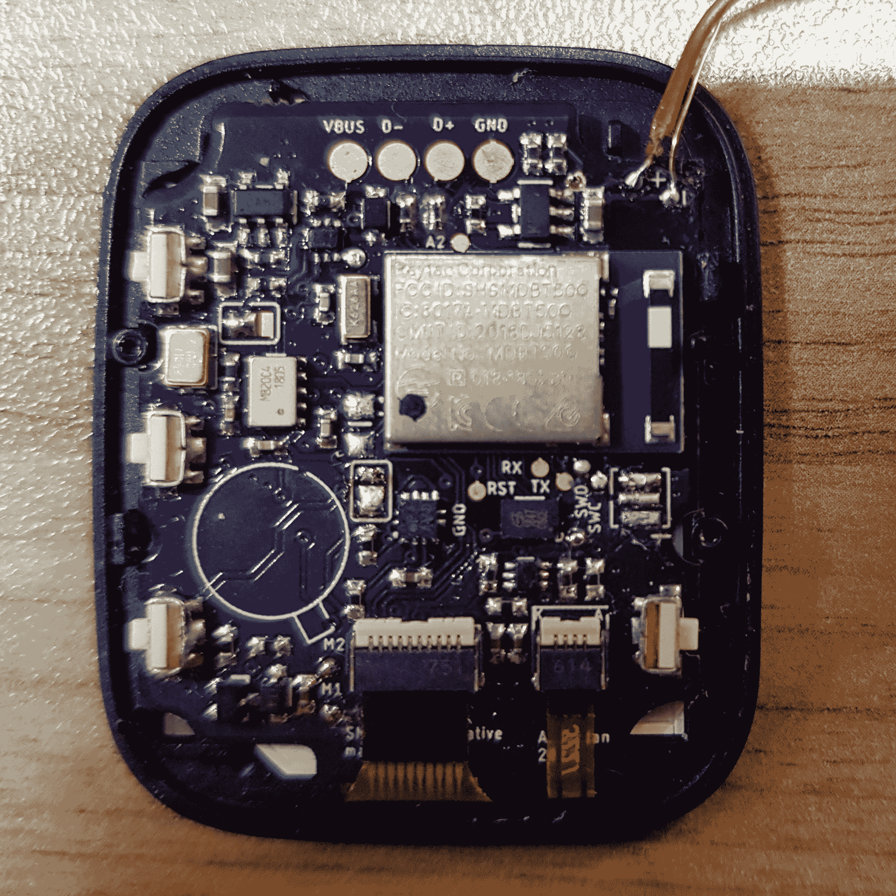

# SMA-Q2 智能手表完全可以被黑客攻击

> 原文：<https://hackaday.com/2020/01/30/sma-q2-smart-watch-is-completely-hackable/>

对终极黑客智能手表的搜索可能不会很快结束。[ emeryth ]以 [SMA-Q2](https://hackaday.io/project/85463-color-open-source-smartwatch) 的形式提名了另一个可能的候选人，并在使其无障碍化方面取得了很大进展。

这款手表也被称为 SMA-TIME，它基于流行的 NRF52832 蓝牙 SoC，背面有一个彩色存储 LCD、加速度计和心率传感器。让它变得如此容易的主要功能是 NRF52832 上的股票引导加载器，它与通用北欧上传工具配合使用，使固件升级通过智能手机变得轻而易举。不幸的是，引导装载程序本身是锁定的，所以必须完全清除它才能获得调试权限。硬件配置也进行了很好的逆向工程，提供了所有可用的细节。

Custom main board with a NRF52840 module

[ emeryth ]拥有与他的[定制固件](https://github.com/Emeryth/sma-q2-oss)一起工作的大部分基本功能，尽管它仍处于早期阶段。他设计了一个新的表盘，包括天气更新和基本的音频控制。通过只刷新必要的部分，3 位显示器的功耗也降低了。心率传感器输出原始波形，经过一点 FFT 和滤波处理后，它非常准确。加速度计上有内置的点击和倾斜检测功能，工作良好，但奇怪的是，似乎没有在股票固件中使用。

不幸的是，最初使用螺钉的外壳设计被胶粘版本所取代。仍然有可能在不破坏任何东西的情况下打开，只是有点困难。 ~~[ emeryth ]~~ 另一个名叫【BigCorvus】的硬件黑客甚至设计了[一个全新的开源主板，在一个小的柔性 PCB 上有一个 NRF52840 模块](https://github.com/BigCorvus/SMA-Q2_replacement_board)和心率传感器，GitHub 上什么都有。

我们真的希望社区喜欢这个手表，并期待看到一些可怕的黑客攻击。这是对[勒温日]已经调查过的[完美黑客智能手表](https://hackaday.com/2019/10/07/ask-hackaday-whats-the-perfect-hacker-smart-watch/)候选名单的一个极好的补充。我们也看到许多 DIY 智能手表，包括一款带有[漂亮的木质 3D 打印外壳](https://hackaday.com/2019/05/01/scratch-built-smartwatch-looks-pretty-darn-sharp-with-3d-printed-case-and-round-lcd/)和另一款带有 [LED 矩阵显示屏](https://hackaday.com/2019/12/04/led-matrix-watch-is-the-smart-watch-we-didnt-know-we-wanted/)。