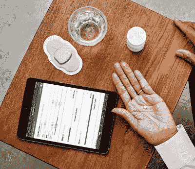
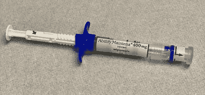

# 智能药丸可以告诉你的医生你已经服用了它们

> 原文：<https://hackaday.com/2022/09/26/smart-pills-can-tell-your-doctor-that-youve-taken-them/>

目前我们有很多种药片可以用来治疗各种不同的疾病。当然，药片的问题是，如果你不吃药，它们就不起作用。更糟糕的是，对于一些药物来说，错过一个剂量会导致各种不良的停药反应，并阻碍患者的治疗。

智能药丸旨在通过一种简单的监测解决方案来解决这一问题，这种方案可以告诉患者何时服药。它们现在已经公开发布并授权使用，所以让我们看看它们是如何工作的。

## 他们现在把微芯片放进药片里了(真的！)

智能药丸的发展在很大程度上是小型化的产物。现代电子技术已经发展到可以在小到足以嵌入单个药丸的尺寸上制造微型传感器的地步。

Proteus Digital Health developed the Abilify MyCite system with Otsaka America Pharmaceutical. Proteus later went bankrupt, though also developed smart pill solutions to treat other diseases like tuberculosis. Credit: Proteus.com via Internet Archive**.**

也许最广为人知的例子是被称为 Abilify MyCite 的药物，[于 2017 年获得 FDA 批准](https://www.fda.gov/news-events/press-announcements/fda-approves-pill-sensor-digitally-tracks-if-patients-have-ingested-their-medication)。这是一种由阿立哌唑片剂组成的治疗方法，该片剂带有内置传感器，可帮助确定患者何时服药。[行动的机制很巧妙。](https://onlinelibrary.wiley.com/doi/full/10.1002/admt.202000757)一个微小的 CMOS 电路被放置在药丸中，还有一个原始的电池。电池由氯化镁和氯化铜组成。当药丸处于胃酸中时，它被激活并释放其能量，为 CMOS 电路供电，该电路以 10 至 30 KHz 的频率发送低功率调制信号，速率约为每秒两包。该信号随后被佩戴在身体上的贴片接收，并通过标准蓝牙向配对的智能手机或平板电脑发送 ping 信号。组成传感器的组件要么被人体无害化处理，要么被当作废物扔掉，传感器本身只有一粒沙子那么大。

该系统允许智能手机记录患者服药的时间，更新患者自己的记录，并与医务人员分享。例如，如果患者忘记了剂量，它还允许发送提醒。通过自动记录，该系统可以帮助那些可能有服药问题的病人。它还可以在病人错过正常剂量的情况下，及早提醒医生。

在 Abilify MyCite 药丸的案例中，涉及的药物是一种商品名为阿立哌唑的抗精神病药物。它主要用于治疗精神分裂症、双相情感障碍和强迫症。这是一种会产生副作用的药物。它旨在治疗的疾病也是那些经常忘记定期服药的问题。因此，在理论上，一个跟踪服用这种药物的患者的系统似乎是避免负面结果的一个很好的工具。

尽管如此，Abilify MyCite 监测系统引起了人们对患者隐私和安全的极大关注。为了缓解这种情况，到目前为止，使用该系统的患者必须签署同意书，允许医生或家庭成员监控该系统。智能手机应用程序还允许患者随意阻止这些数据的共享。

Alternative solutions for those who can’t regularly take pills include long-lasting “depot” injections. These can be uncomfortable, but last for up to a month with a single dose. Credit: WhispyHistory, [CC-BY-SA-4.0](https://commons.wikimedia.org/w/index.php?search=aripiprazole&title=Special:MediaSearch&go=Go&type=image)

然而，有人担心这种技术将使医疗保健系统的侵入性活动增加。理论上，保险公司可以要求要求特定药物治疗的患者使用这种系统，并惩罚那些不遵守治疗方案的患者。同样，从精神病护理中释放的患者可能会因不遵守其处方剂量计划而受到非自愿入院的威胁。这就带来了风险，一个出故障的药丸或传感器贴片可能会不公平地惩罚甚至是“顺从的”病人。更糟糕的是，像精神分裂症这样的情况经常伴随着偏执狂的症状，尤其是在监控和技术方面。在药片中植入微芯片来治疗这种疾病在这方面没有任何帮助。

也有人质疑该系统是否真的有助于患者更规律地服药。一般来说，医疗专业人员谈论的是患者对治疗的“依从性”。然而，传感器并不是解决这个问题的万全之策。一些人注意到，患者可能会在服药后诱发呕吐，以试图欺骗系统。另一种可能是，将一粒药丸放入类似胃酸的东西中，也可能会触发里面的芯片发出积极的信号。值得注意的是，FDA 在 2017 年的报告中承认，该系统尚未被证明能够“改善患者对治疗方案的依从性”。

总的来说，智能药丸是医学工程的一个惊人之举。能够以非侵入性的方式感知药片何时被摄入是一项令人印象深刻的技术成就。然而，正如许多新的发展一样，也有许多伦理问题需要解决。预计在未来几年，智能药丸及其使用将成为医生、患者和保险公司之间的一个不断变化的战场。