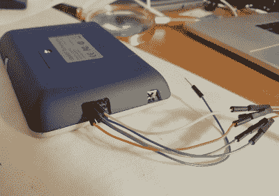

# 智能响应 XE 获得无线引导加载程序

> 原文：<https://hackaday.com/2018/09/08/smart-response-xe-gets-wireless-bootloader/>

几个月前，我们首次报道了 SMART Response XE 的进展，这是一款 ATmega128RFA 驱动的手持电脑，允许教师在所有孩子都有 Chromebooks 之前创建交互式课程。它配备了 2.4 Ghz 无线通信、384×160 LCD 和全 QWERTY 键盘，2010 年，学校为它们支付了大约 100 美元。现在在易贝售价仅为 5 美元，这些 Arduino 兼容设备只需要一点哄骗和一个外部程序员就可以运行你自己的代码。

 上一篇文章[启发了【拉里·班克】尝试破解智能回复 XE](http://bitbanksoftware.blogspot.com/2018/09/my-adventures-in-writing-ota-bootloader.html) ，到目前为止，他已经取得了一些令人印象深刻的进展。他不仅提出了自己的支持库，还创造了一种通过集成的 802.15.4 无线电将 Arduino 代码上传到设备的方法。通过他的设置，您不再需要打开 SMART Response XE 并连接一个程序员，这使得测试和部署软件变得更加容易。

[Larry]写了一份关于他的开发过程的非常详细的描述，并不厌其烦地将他认为*不起作用的观点纳入其中。事实证明，在这两个教室设备之间实现可靠的通信有点棘手，他绕了一圈才找到一个可行的协议。*

诀窍在于，您需要使用一个连接到您的计算机的智能响应 XE 作为“中枢”，将代码上传到其他 XE。但考虑到它们有多便宜，这没什么大不了的，尤其是考虑到生产率的提高会让你受益匪浅。[Larry]在他的“集线器”XE 上添加了一个 5 x 2 的母头，这样他就可以关闭设备备份，还添加了一个物理电源开关。在休息后的视频中，您可以看到一个设置向附近的 XE 发送一个简单程序的演示。

在这个无线引导程序和之前提到的 Arduboy 兼容性之间，我们建议你现在就获得你的智能响应 XE。如果这些东西[的价格开始上涨，就像进出口商品](https://hackaday.com/2011/08/18/project-25-digital-radios-law-enforcemnet-grade-vulnerable-to-the-im-me/)一样，我们不会感到惊讶。

 [https://www.youtube.com/embed/d-ObUCnRmQU?version=3&rel=1&showsearch=0&showinfo=1&iv_load_policy=1&fs=1&hl=en-US&autohide=2&wmode=transparent](https://www.youtube.com/embed/d-ObUCnRmQU?version=3&rel=1&showsearch=0&showinfo=1&iv_load_policy=1&fs=1&hl=en-US&autohide=2&wmode=transparent)

