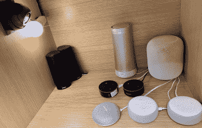
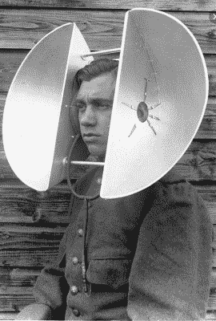

# 智能音箱一天“不小心”听了 19 次

> 原文：<https://hackaday.com/2020/03/11/smart-speakers-accidentally-listen-up-to-19-times-a-day/>

2018 年春天，波特兰的一对夫妇向当地一家新闻站报告说[他们的亚马逊 Echo 在他们不知情的情况下录制了一段对话，然后将这段录音发送给了他们联系人列表中的某个人](https://www.theverge.com/2018/5/24/17391898/amazon-alexa-private-conversation-recording-explanation)。事实证明，Alexa 遵循的命令是由电视对话发出的。整件事需要一系列情景喜剧般的巧合才能发生，但它还是发生了。还好谈话只涉及硬木地板。

当然，这些智能扬声器一直在监听，至少在本地是这样。否则他们怎么知道有人说出了他们的醒语，或者一些足够接近的话？如果我们能把 wake 这个词改成“rutabaga”或“supercalifragilistic”之类的词，那肯定会有很大帮助，但他们可能有专用集成电路来监听一些特定的词。比如在 Echo 上，你唯一的选择就是“Alexa”、“亚马逊”、“Echo”或者“电脑”。

那么智能音箱在不应该听的时候又有多频繁呢？波士顿东北大学的一组研究人员正在进行一项持续的研究，以确定问题到底有多严重。他们已经建立了一个实验来产生意想不到的激活触发器，并从里到外研究它们。

##  隐居智能音箱

该团队将一组主流智能扬声器放入一个代表所有主要参与者的盒子中——四个 Alexas 和她的团队各一个。我们希望看到他们通过包含足够多的每种类型的设备来覆盖所有可能分配的唤醒词，从而最大限度地增加测试对象，但这将非常昂贵。

然后他们从电视节目中播放了 125 个小时的音频，并使用网飞语进行了快速对话。他们选择的节目是电视娱乐节目的健康代表——大部分是较新的东西，但有些可以追溯到十年或更久以前。从喜剧到戏剧的一切。对准扬声器的摄像机将记录任何表示成功激活的光。还有一个麦克风来接收设备对对话流的任何反应，还有一个 WAP 来捕捉进出机器的网络流量。

虽然结果表明这些设备没有持续记录(唷！)，他们确实倾向于在短时间内频繁醒来——在 24 小时内多达 19 次。最糟糕的违规者是苹果和微软的扬声器，这两种扬声器都比其他扬声器激活得更频繁。然而，并非所有的激活都是短暂而甜蜜的——微软 Invoke 和 Echo Dot 都有持续长达 43 秒的意外激活。这有足够的时间来记录和/或向 QVC 运营商分发你深夜的 16 位数话语，或者你岳母蛋饼洛林中的秘密成分。

Listening for aircraft before radar. Image via [Rare Historical Photos](https://rarehistoricalphotos.com/aircraft-detection-radar-1917-1940/)

## 你在和我说话吗

研究人员看到对话中出现了导致激活持续五秒或更长时间的模式，但这些模式并不令人惊讶。基本上，任何以包含“ey/ay”音的单词开头的短语(例如，他们/may/pay/sleigh)后跟一个硬的“g”音(或任何类似的声音)都会唤醒 Google Home mini 设置来收听“嘿 Google”。当其他说话者听到与他们的 wake 单词押韵的字符串时，他们以同样的方式行动。

目前，该小组仍在研究导致记录上传到云的激活。他们还试图确定性别、种族和口音等人为因素是否对意外激活的概率有任何影响。

就像设计它们的人类一样，智能音箱偶尔会听错东西，包括歌词和他们自己的名字。他们是否从错误中吸取教训还有待观察。