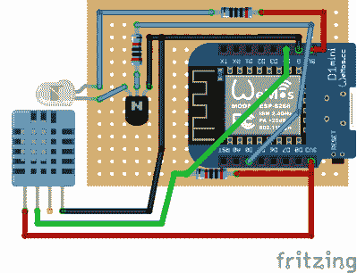

# 使用 ESP8266 改善您的空调

> 原文：<https://hackaday.com/2019/06/11/smarten-up-your-air-conditioning-with-the-esp8266/>

如果你正在寻找“智能”家用电器，市场上并不缺乏选择。这些天来，即使是相对低端的设备也加入了物联网的潮流(不管是好是坏)。但是，如果你现在不打算购买一个全新的主要设备呢？在这种情况下，你可能有兴趣看看[【朱利奥·庞斯】如何在他现有的廉价](https://hackaday.io/project/165554-normal-air-conditioner-becomes-wifi-controlled)空调上增加一些高科技功能。

因为他的空调有一个红外遥控器，所以[Giulio]要做的第一件事就是想出一个模仿它的方法。一个使用 ESP8266 和 IR LED 的简单项目，特别是当他发现有人已经为他的特定品牌 AC 编写了 IR 通信库。从那里，他可以开始跟踪传感器和功能。

 通过添加 DHT11 传感器，【Giulio】可以根据当前的室内温度开启和关闭空调。这也给了他一个简单的方法来验证空调实际上是开着的和运行的。通过检查在发送 IR 命令以启动 AC 后房间是否开始冷却，他的软件可以确定是否应该尝试重新发送代码，或者可能发送通知以提醒他有些事情似乎不太对劲。当然，如果没有一些互联网连接，这就不是一个合适的 ESP8266 项目，所以他还创建了一个智能手机应用程序，让他在离家时控制系统。

诚然，这个项目中没有什么是全新的，我们已经看到很多黑客在这一点上用 ESP8266 打开他们的 AC。但是我们特别喜欢的是对整个过程的深思熟虑和记录。每个决策背后的基本原理都得到了解释，他甚至记录了像他的网络拓扑这样的东西来帮助说明整个系统是如何组合在一起的。即使我们中的许多人都熟知这些技术，这种项目文档也是让新来者能够接触到的。我们向[朱利奥]致敬，感谢他做出的额外努力。

在过去，我们已经看到了类似的项目，让你可以在空闲时控制你的空调，我们自己的[Maya Posch]带我们对她帮助开发的非常令人印象深刻的 ESP8266 供电的环境监测系统[进行了一次旋风式的旅行。](https://hackaday.com/2019/03/20/the-joy-of-properly-designed-embedded-systems/)