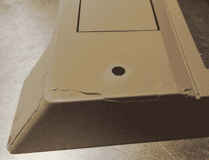
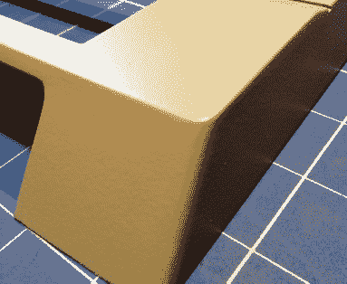
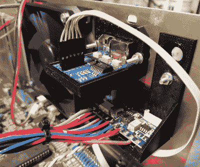

# 破碎的阿米加 2000 获得新生

> 原文：<https://hackaday.com/2021/04/02/smashed-amiga-2000-gets-new-lease-on-life/>

对于大多数人来说，打开包裹，看到你在易贝购买的 Amiga 2000 被快递员撞得粉碎，这将是一个令人心碎的时刻。但不是[Drygol]。如果你像他一样生活和呼吸着老式电脑修复，[发现你最新获得的东西需要比你最初预期的更多的维修和升级](https://retrohax.net/amiga-2000-semi-extreme-refurb-part-one/)实际上是一个奖励。

第一个需要解决的问题是破了的箱子。这辆 Amiga 一定开得很疯狂，因为它的前面板有几处严重的裂缝，整块整块都被折断了。我们以前见过[Drygol]修理坏掉的电脑机箱，但似乎每次他都想出一些新的技巧来让这些被屠杀的塑料碎片恢复到像新的一样的状态。在这种情况下，塑料焊接用于将零件固定在一起并填充间隙，然后在背面添加黄铜网以增加强度。然后打磨接缝，用聚酯腻子填充，最后喷涂定制的颜色匹配的油漆。当他在这个地区的时候，他还填了一个以前的主人为拨动开关挖的洞。

  Before  After

然后[Drygol]移到内部。PCB 上的一些迹线已经被爆裂的电池腐蚀，需要更换插座，正如你可能会想到的这种老式机器，所有的电解电容器都是可疑的，需要拆除。最后，由于系统没有电源，他连接了一个微型电源。这让这台 34 岁的电脑恢复了运行，此时，这台机器几乎像新的一样了。所以很自然，是时候开始升级和修改了。

Case fan, video adapter, and picoPSU.

[Drygol]添加了一个 IDE 接口，并连接了一个 CompactFlash 适配器作为计算机的主驱动器。对于第二个，他安装了一个 GoTek 软盘驱动器模拟器，可以让你用一个装满图像的 USB 闪存驱动器代替堆积如山的物理磁盘。在这两者之间，计算机的所有存储需求都是通过一个移动部件来满足的。

模拟器有自己的 3D 打印前面板，以适应 Amiga 的视觉风格，他还打印出了安装在机器后部的 RGB4ALL S-Video/Composite 适配器的支架。为了帮助保持所有这些新设备的凉爽，他用一个新的机箱风扇完成了这件事。

毫无疑问，有些人会抱怨增加了额外的设备，但对那些人来说，[我们建议你只关注非凡的案件修复工作](https://hackaday.com/2018/07/15/incredible-atari-800xl-case-restoration/)。虽然你可能不同意[Drygol]所做的所有修改，[毫无疑问，通过阅读他的](https://hackaday.com/2019/10/30/amstrad-portable-gets-a-modern-lcd-transplant/)[大量作品](https://hackaday.com/2020/06/30/commodore-sx-64-keyboard-upgraded-from-trash-to-treasure/)，你可以学到一些东西。