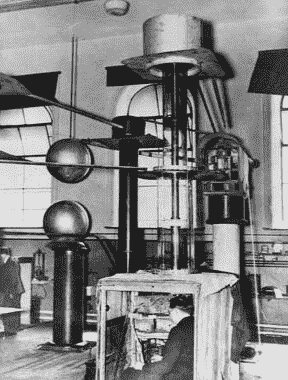
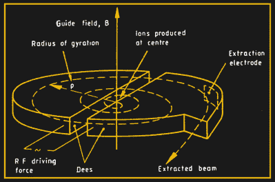
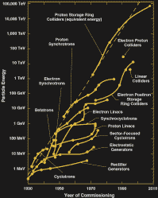

# 粉碎原子:粒子加速器简史

> 原文：<https://hackaday.com/2020/07/29/smashing-the-atom-a-brief-history-of-particle-accelerators/>

说到建造粒子加速器，信条一直是“更大、更坏、更好”。尽管周长 27 公里、€预算 75 亿美元的大型强子对撞机(LHC)仍然是有史以来最大、最昂贵的科学仪器，但它的物理项目正慢慢走向尾声。2027 年，它将接受最后一次重大升级，被称为高亮度 LHC，预计将于 2038 年完成运营。这似乎是一个漫长的过程，但是科学界已经在思考接下来会发生什么。
最近， [CERN 发布了未来欧洲粒子物理战略](https://home.cern/news/news/physics/particle-physicists-update-strategy-future-field-europe)的更新，其中包括 100 公里大型未来环形对撞机(FCC)的可行性研究。让我们稍作休息，回顾一下“原子击碎器”的历史以及它们带来的科学进步。

## 分裂原子的机器

Proton accelerator used by Walton & Cockroft to split the atom. Walton sits in the small observation cabin and watches the produced alpha particles on a fluorescent screen.
Credit: [cambridgephysics.org](http://www.cambridgephysics.org/cockcroftwalton/cockcroftwalton9_1.htm)

建造加速器的主要动机产生于 20 世纪初，当时欧内斯特·卢瑟福在 1919 年发现，他可以用天然放射源的α粒子轰击氮原子来分裂氮原子。为了继续他的研究，他需要一种比天然放射源提供的能量更高、强度更大的“原子射弹”。在卢瑟福的鼓励下，1932 年科克罗夫特和华尔顿使用 400 千伏的发电机加速质子并把它们射到锂靶上，这导致了第一次完全由人工控制的原子分裂。

使用 DC 电压的粒子加速，如 Cockroft-Walton 发生器和后来的 Van de Graaff 发生器，受到机器所能提供的最大电压的限制。为了克服这一限制，瑞典物理学家伊辛提出了共振加速原理，即通过一系列连接到射频发生器的漂移管反复施加相同的电压。这被认为是粒子加速器的真正诞生，事实上，目前这一代的直线对撞机仍然依靠同样的原理。1928 年，德国的罗尔夫·温德勒(Rolf Winderö)第一个建造了这样的加速器，用来产生 50 千电子伏的钾离子。

## 从直线到圆形

Working principle of the cyclotron.
Credit: [P.J. Bryant](http://cds.cern.ch/record/235242/files/CERN-94-01-V1.pdf?version=2)

线性加速器(linac)的一个缺点是，随着速度的增加，漂移管的长度必须增加，使得机器相当大，并且难以为高能量而构造。

1929 年，欧内斯特·劳伦斯想出了更为紧凑的回旋加速器，它通过磁场引导粒子沿着螺旋路径加速。劳伦斯和他的学生 m .斯坦利.利文斯顿一起建造了第一台回旋加速器，它的直径只有 4 英寸，但可以将质子加速到 1.25 兆电子伏。回旋加速器最终使得产生比放射源能量高得多的粒子成为可能，并且它一直是最强大的加速器类型，直到 20 世纪 50 年代另一种技术出现。

## 保持粒子同步

当粒子开始接近光速~~时，它们会由于相对论效应而减速~~一些能量进入相对论物质，因此它们与回旋加速器的射频电场失去同步。这通过改变射频频率和机器来补偿，被称为同步回旋加速器。后来，随着粒子速度的增加，引导磁场也逐渐增加，使得粒子在恒定的轨道上运动。这就是同步加速器的诞生。

A “Livingston plot” showing the evolution of accelerator energy over the years.
Credit: [R. Ruth](https://portal.slac.stanford.edu/sites/ad_public/rfared/PublishingImages/Man_Made_Accelerators_080408_RonRuth.pdf)

最后的进步是从固定靶加速器转向储存环对撞机。由于可用于产生新粒子的能量是在碰撞的质心框架中给出的，因此正面碰撞粒子比向固定目标发射光束要高效得多。

## 过多的新粒子

在上世纪 50 年代之前，新粒子主要是通过宇宙射线发现的，而同步加速器等强大的加速器预示着粒子物理学的“黄金时代”。这些新机器导致了下表所列的许多亚原子粒子的发现。

在更小的尺度上研究原子的结构，并能够产生更大质量的粒子，这推动了能量越来越高的加速器的发展。在同步加速器中，要达到更高的能量，要么需要更大的半径，要么需要更强的磁场。因此，超导磁体的使用，以及在地下建造对撞机的可能性，在不属于运行机器的实验室的财产下面，这使得建造像 LHC 这样的巨型对撞机成为可能。

| 年 | 颗粒 | 加速器名称 | 加速器类型 | 位置 |
| One thousand nine hundred and fifty-five | 反质子 | 质子加速器 | 质子同步加速器 | 美国 LBNL |
| One thousand nine hundred and sixty-two | μ子中微子 | 中断飞行引导系统(abort guidance system) | 质子同步加速器 | 美国 BNL |
| One thousand nine hundred and seventy-four | J/ψ介子 | SLAC | 电子直线加速器 | 美国门洛帕克费米实验室。 |
| One thousand nine hundred and seventy-five | τ轻子 | SLAC | 电子直线加速器 | 美国门洛帕克费米实验室。 |
| 1978/1979 | 胶子 | 多丽丝/佩特拉 | 电子同步加速器 | 德国 DESY |
| One thousand nine hundred and eighty-three | w，Z 玻色子 | 备用能源系统（standby power system 的缩写） | 质子同步加速器 | 瑞士欧洲核子研究中心 |
| One thousand nine hundred and ninety-five | t 夸克 | 泰瓦特龙 | 质子同步加速器 | 美国费米实验室 |
| Two thousand | 中微子 | 泰瓦特龙 | 质子同步加速器 | 美国费米实验室 |
| Two thousand and twelve | 希格斯玻色子 | LHC | 质子同步加速器 | 瑞士欧洲核子研究中心 |

## 下一步是什么？

目前，粒子物理学陷入了一点危机，因为标准模型最后缺失的部分——希格斯玻色子——被 LHC 发现了，但是还没有像[超对称](https://en.wikipedia.org/wiki/Supersymmetry)这样的新物理学的证据。虽然我们知道标准模型无法解释暗物质和暗能量，但像 FCC 这样的新巨型对撞机能否提供任何答案是值得怀疑的，这就是为什么[有些人强烈反对它](https://www.scientificamerican.com/article/the-world-doesnt-need-a-new-gigantic-particle-collider/)。大自然没有理由是好的，所以新粒子的质量可能远远超出了技术上可以实现的范围。

E.O. Lawrence and his 27″ accelerator. Credit: [Lawrence Berkeley Nat’l Lab](https://www.flickr.com/photos/berkeleylab/3522995777/)

也可能是新的物理学隐藏在低能区的某个地方，这需要完全不同的实验。然而，有一些技术发展可能会大大降低新超级对撞机的价格，从而使其更具吸引力。一个是室温超导体的发现，另一个是[尾波场加速](https://en.wikipedia.org/wiki/Plasma_acceleration)，这可能最终导致更加紧凑的加速器，甚至可以放在桌子上(再次)。因此，让我们希望推进能源领域将不断为我们提供自然界最基本问题的答案。