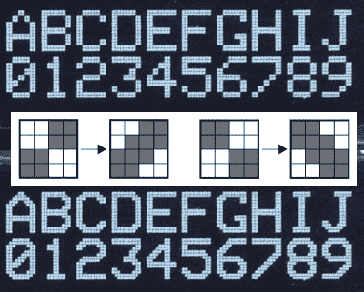

# 平滑图形液晶显示器上的大字体

> 原文：<https://hackaday.com/2020/10/25/smoothing-big-fonts-on-graphic-lcds/>

这里有一个巧妙的小技巧:[动态去除缩放字体中的锯齿](http://www.technoblogy.com/show?3AJ7)！这种技术用于图形显示，您可能想要放大字体。通常情况下，你只需要为每个区域写一个 2×2 的像素块，而这里本来只有一个像素，然后使用更大的字体。问题是，这也增加了每一个空白区域，你最终会在过渡中看到真正吸引你眼球的锯齿状边缘。

[戴维·约翰逊-戴维斯]进入了大脑模式，做了一些比使用多种字体文件更聪明的事情。事实证明，如果你分析平滑的问题，你会意识到这只是有角度的地区是罪魁祸首，水平和垂直缩放很好，很平滑。[David 的] fix 在正在绘制的内容中寻找棋盘格图案，在空白点添加一个像素以非常好地平滑边缘！

这项技术已经被打包成一个简单的函数，这个函数是[David]编写的，可以很好地在 Arduino 生态系统中运行。然而，该例程非常简单，无论使用何种语言或控制器，都可以快速实现。把这个放在你的后口袋里！

现在，如果你手头只有一个 HD44780 字符的液晶显示器，那么使用它可能会更有趣，因为你很难超越硬编码的字体集。我们已经看到了像[使用自定义角色槽玩俄罗斯方块](https://hackaday.com/2016/04/09/tetris-everywhere-character-lcd-edition/)这样令人惊奇的事情。