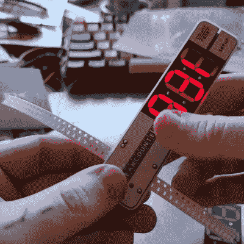

# SMT 零件柜台旨在方便盘点

> 原文：<https://hackaday.com/2022/04/20/smt-part-counter-aims-to-ease-taking-inventory/>

[Nick Poole]对一种新工具有一个有趣的想法，这种工具的简单目标是使 SMT 卷轴的精确零件计数像在设备中拉动磁带一样容易。这个装置就是[计数仪](https://www.crowdsupply.com/great-big-factory/beancounter)，这是他自己设计的一款即将上市的小型手持设备，它可以像人们通过插槽拉胶带一样快速地计数零件。该设备由 CR2032 电池供电，使用 8 毫米宽、2 毫米高的胶带,[Nick]表示，这涵盖了大多数 0805 或更小尺寸的零件，以及 SOT-23 晶体管等产品。

 为什么会有人想让这样的任务变得更容易呢？这种工具的两个令人信服的原因包括:盘点部分卷轴或切割带的零件，并创建包含已知数量零件的段。

出于显而易见的原因，第一种方法很方便，而第二种方法对于创建工具包之类的事情很有用。事实上，对于没有手工制作过的人来说，这个工具对于创建固定长度的磁带片段的用处可能并不明显。当然，人们可以用尺子或参考标记来测量 SMT 带，以产生包含固定数量的部件的片段，但是这涉及到许多处理，并且不能很好地按比例放大。事实上，[精确和重复切割胶带段的麻烦](https://hackaday.com/2020/02/07/automatic-component-tape-cutter-for-when-your-electronics-kit-hits-the-big-time/)是一个常见的痛点，因此让这项工作变得更容易是有价值的。

如果你看了照片，怀疑大的 7 段数字显示屏是通过巧妙的 PCB 制造选项完成的(通过让 led 穿过 PCB 层来制造段，[这是我们一直喜欢看到的技巧](https://hackaday.com/2016/08/23/charliplexed-7-segment-display-takes-advantage-of-pcb-manufacturers/)),你并不孤单。毕竟，[【尼克】在巧妙制作电路板方面经验丰富](https://hackaday.com/2019/12/18/hackaday-superconference-nick-poole-on-boggling-the-boardhouse/)，眼尖的读者甚至会怀疑工具边缘的重置和设置按钮是通过使用柔性 PCB 段作为开关创建的。想知道事实的细节吗？访问[项目](https://github.com/NPoole/BeanCounter)的 GitHub 库，在 CAD 级别上亲自查看。