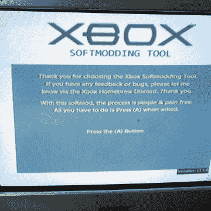

# 软模一个 Xbox，运行你自己的软件

> 原文：<https://hackaday.com/2022/06/05/softmod-an-xbox-and-run-your-own-software/>

最初的 Xbox 可能是旧硬件，但这并不意味着它不值得摆弄。想知道如何软模一个原始的 Xbox？改装本质上是越狱，而*软*改装是使用一个完全由软件驱动的过程来完成的，不需要打开机箱或摆弄电子设备。

 不要让这种想法欺骗你，认为这个过程只需要按一个按钮；这实际上很复杂，但现在更容易理解了，因为[ezContents]已经发布了一个全面的预排来软改造一个原始的 Xbox，包括大量的截图和照片。

这个过程使用了一个软建模工具，但这只是第一步。让奇迹发生的方法来自于将一个精心制作的保存文件安装到控制台，用一个被利用的游戏盘启动，然后通过一个制造商不希望发生的过程，在硬件上安装制造商不想要的软件。考虑到这一点，预计它必须经历一些困难。

现在，你的原始 Xbox 已经摆脱了枷锁，不必打开外壳，也许无论如何都要打开它，并在它因腐蚀而死亡之前[检查它是否有泄漏的盖子和内部 RTC 电池](https://hackaday.com/2020/12/14/save-your-original-xbox-from-a-corrosive-death/)。