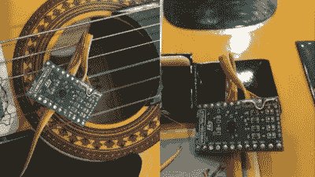

# 软件定义了迈克·奥斯曼和凯特·坦金的一切

> 原文：<https://hackaday.com/2020/02/21/software-defined-everything-with-mike-ossmann-and-kate-temkin/>

软件定义无线电已经成为 RF 修补程序的主要部分，但很可能我们中很少有人将他们的软件定义工具链带到无线电之外。这是 Mike Ossmann 和 Kate Temkin 在他们新出版的 super co talk 中探索的一个领域，因为他们使用 GNU Radio 做一些你可能会发现意想不到的事情。

对于大多数人来说，软件无线电是一种设备。也许是 RTL-SDR 加密狗，或者是 HackRF，一种在射频领域工作的流行的多功能工具。但正如他们所解释的那样，SDR 硬件只能被视为模拟前端，只是与数字化仪耦合的最小模拟电路。正如您所料，真正的软件定义部分来自软件

Kate 和 Mike 介绍了 GNU Radio Companion——GNU Radio 的图形用户界面——作为他们的首选工具，并称赞它是一个通用的数字信号处理系统，不管它是否包括无线电。他们将自己的 Great Scott 小工具 [GreatFET One](https://greatscottgadgets.com/greatfet/one/) USB 黑客工具包外设作为输入设备，通过分析光传感器的输出来展示这一点。他们可以立即在频域图中分析电源频率，以及 led 的脉冲频率。但他们的锦囊妙计更深入，探索多个“非典型用例”，通过创造性的数字信号处理(DSP)打开一个全新的世界。

 [https://www.youtube.com/embed/-5TAfdYpC44?version=3&rel=1&showsearch=0&showinfo=1&iv_load_policy=1&fs=1&hl=en-US&autohide=2&wmode=transparent](https://www.youtube.com/embed/-5TAfdYpC44?version=3&rel=1&showsearch=0&showinfo=1&iv_load_policy=1&fs=1&hl=en-US&autohide=2&wmode=transparent)

## 定义现有传感器新用途的软件

分析基带模拟信号是廉价 SDR 的惯用手段，因为许多读者都知道，计算机声卡可以构成基带前端，插入 RF 下变频器可以构成软件定义的接收器。这个演讲将我们带到一个未知的领域，因为用于输入的设备根本不是模拟的，而是数字的，带有 I ² C 接口。

 主要演示强调了这一点，使用加速度计分线板作为木吉他拾音器。这是 GNU Radio 的 DSP 能力的一个理想演示，因为一系列吉他效果是在软件中模拟的，以获得一些有趣的结果。即使是一个有橡皮筋的纸箱也成为了一个值得摇滚乐队使用的乐器，一个很受观众欢迎的东西。

作为黑客，我们的使命是推动我们使用的任何媒介超越其正常应用，并为现有技术找到令人兴奋的新用途。这次演讲采取了不同寻常的步骤，从一个已经是黑客工具的东西开始，一个用于软件定义无线电的 DSP 平台，并将其转变为一个更通用的 DSP 工具包，其应用远远超出了我们通常与之相关的应用。可用模块的数量和种类使它成为一个非常通用的平台，而 GNU Radio Companion 易于管理的用户界面使它即使是最新手的实验者也能使用。

这是黑客的本质，也是我们都可以尝试的东西，所以我们希望这次演讲能激发一系列我们以前从未见过的 DSP 项目。如果你被诱惑了，找一份 GNU Radio 和 GNU Radio Companion，告诉我们你能做什么！

* * *

##### 凯特·坦金将主持下周的[黑客 USB 聊天](https://hackaday.io/event/169792-hacking-usb-hack-chat)，请听她讲述更多内容。