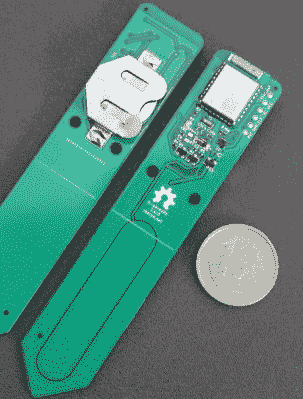

# 土壤湿度传感器，它们是如何工作的？

> 原文：<https://hackaday.com/2021/05/17/soil-moisture-sensors-how-do-they-work/>

在某种程度上，土壤湿度传感器的神奇功能可以归结为一个简单的 RC 电路。但是当然，实际上还不止这些。[rbaron] [简单、清晰、简明地解释了电容式土壤湿度传感器的工作原理](https://rbaron.net/blog/2021/04/05/How-capacitive-soil-moisture-sensors-work.html)。他还通过一个简短的视频展示了它们的输出是如何根据环境变化的，并解释了它是如何影响自己的传感器设计的。

 水分传感器的核心是测量电容通过电阻充电的快慢，但在这些传感器中，电容并不是一个真正的元件，而是由两条相互靠近的 PCB 走线构成。它们的电容——因此它们的充电速率——会随着它们周围有多少水而变化。通过在陷入泥土中的探针上测量这种效应，传感器可以间接测量土壤中的水量。

这与他自己在 b-寄生虫上的工作有关:一种开源的一体化无线土壤湿度传感器(也是 T2 地球日竞赛的亚军)，它在 BLE 广播，甚至包括温度读数。如果你自己制作 PCB 或从工厂订购 PCB，有一点需要注意，在潮湿的环境中，电流通过金属会导致氧化，因此不要将裸露的痕迹暴露在潮湿的土壤中，这一点很重要。一个良好的涂层 PCB 应该避免这个问题，但我们看到有人提出一个替代方案是[使用石墨棒代替金属](https://hackaday.com/2017/11/16/sensing-soil-moisture-youre-doing-it-wrong/)。