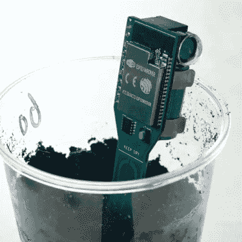

# 土壤传感器显示翻转点不仅仅是标志

> 原文：<https://hackaday.com/2021/10/28/soil-sensor-shows-flip-dots-arent-just-for-signs/>

土壤传感器是很方便的东西，但是虽然它们的功能是检测湿度，但是它们如何处理这些数据才是 T2 有用的原因。确保有用性是【Maakbaas】设计和创造[一个基于 ESP32 的土壤湿度传感器](https://maakbaas.com/esp32-soil-moisture-sensor/)的原因，该传感器具有无线连接、深度睡眠、数据记录和指示宿主植物需要浇水的能力，并向手机发送推送通知。

A small flip-dot indicator makes a nifty one-dot display that requires no power when idle.

视觉通知部分非常漂亮，因为[Maakbaas]使用了由 Alfa-Zeta 制造的小圆点指示器[。这种机电指示器通过两个小线圈在红色或绿色之间翻转彩色圆盘来工作。它在空闲时不使用电源，对于大部分时间都处于省电深度睡眠状态的设备来说，这是一个有用的功能。当一切正常时，指示器是绿色的，但是当植物需要水时，指示器变成红色。](https://flipdots.com/en/products-services/status-indicators/)

传感器本身每小时唤醒一次，进行传感器测量，然后存储在本地缓冲区中，每 24 次测量上传到数据库。这减少了设备需要通电和通过 WiFi 连接的次数，但如果传感器确定植物需要水，就会立即处理。

传感器看起来很棒，3D 打印的外壳有助于保持清洁，同时赋予设备一点个性。有兴趣自己卷传感器吗？该项目还在 Hackaday.io 上有一个页面，我们之前已经报道过关于这些设备如何工作的深入细节。无论你是设计自己的解决方案还是使用现有的硬件，只要记住远离便宜的探头，那些[不值得它们在盆栽土壤中的重量](https://hackaday.com/2017/11/16/sensing-soil-moisture-youre-doing-it-wrong/)。