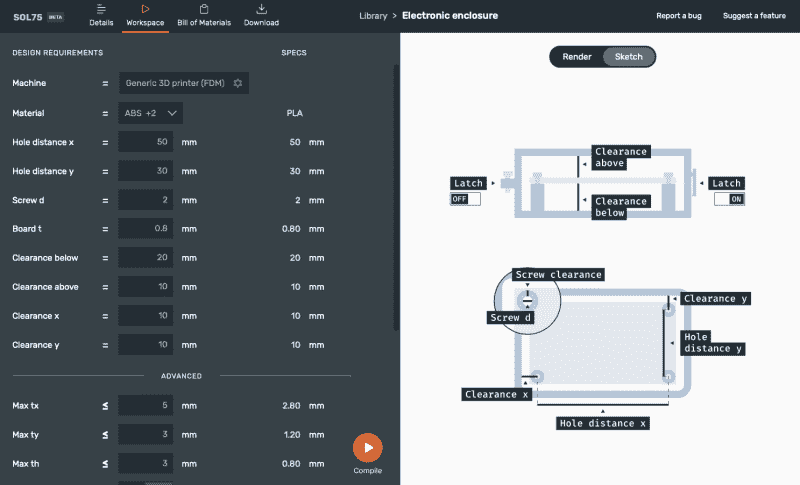

# SOL75 使用人工智能设计标准机械零件

> 原文：<https://hackaday.com/2021/07/19/sol75-uses-ai-to-design-standard-mechanical-parts/>

[Francesco]开发了一个名为 sol 75 的参数化设计工具，旨在将设计项目中使用的基本机械部件的苦差事去除。他知道如何设计齿轮、滑轮、皮带、支架、外壳等。，但觉得重复又无聊。他宁愿把时间花在项目中有趣和有挑战性的部分。

SOL75 的目标是根据用户要求生成零件的 OpenSCAD 和 STL 文件。这些参数超出了简单的尺寸，包括性能特征，如峰值应力、刚度、最高温度等。该程序使用 OpenSCAD 生成几何图形，并使用核心模块评估候选设计。为了克服维数灾难，[Francesco]已经训练了一个人工智能先知来快速接受或拒绝候选解决方案。

在参数化设计辅助领域，您有像 [NopSCADlib](https://hackaday.com/2019/06/15/try-nopscadlib-for-your-next-openscad-project/) 这样的项目，它们仅通过数字(一根 100 厘米长、6.35 毫米直径、1.22 毫米壁厚的黄铜管)或行业标准规格(一个 10 毫米长的 M3 内六角螺钉)对大量常见对象进行尺寸参数化。这种方法没有考虑对象是否能在应用程序中支持，也没有考虑任何 3D 打印问题。在另一个极端，有在[专业软件包中找到的创成式设计和优化工具，如 Fusion 360 和 SolidWorks](https://hackaday.com/2020/03/29/how-to-try-generative-optimization-at-home/) ，它们可以制作看起来很自然的项目，这些项目针对特定条件进行了精确优化。

SOL75 似乎介于两者之间，结合了两种方法的特点。它让您可以自由选择尺寸参数和性能要求，但通过仅提供领域专家提前准备好的对象来限制解决方案空间，如果您要求 L 型支架，您将得到 L 型支架，而不是看起来像蜘蛛网或青蛙腿的东西。

一旦你编译了设计，SOL75 就会生成 OpenSCAD 和/或 STL 文件以及材料清单。但是等等——还有更多——它还制作了一本详尽的设计手册，非常详细地记录了器件，包括各种设计考虑因素和印刷注意事项。这是一个电子外壳的[演示链接，非常有趣。还有一个使用 SOL75 制作滑翔机的例子，你可以在](https://www.sol75.com/component/electronic_enclosure_if)[的 Hackaday.io 项目页面](https://hackaday.io/project/180684-customizable-glider)上读到。

目前，[Francesco]只提供了 SOL75 的在线测试版，可以通过电子邮件注册，因为他还没有决定最终版本的形式。你有关于创成式设计的成功(或失败)故事吗？请在下面的评论中告诉我们。