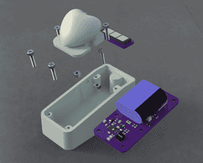

# 几十年来一直跳动的太阳能心脏

> 原文：<https://hackaday.com/2018/12/06/solar-heart-engineered-to-beat-for-decades/>

人们常说，如果一件事值得做，就值得把它做好，甚至值得做得过分。这显然是[安泰人寿]非常重视的一个概念，像[这样的项目充分证明了这一点，他将太阳能“跳动”的心脏作为礼物送给了妻子](https://www.antalife.com/2018/11/project-solar-led-heart-ornament.html)。对于我们大多数人来说，最终会成为垃圾箱的东西在他手中变成了一个相当大的工程项目，其研究和微调水平坦率地说令人震惊。

 但是【ANTALIFE】没有把这么多心思放在这个设备上，只是为了好玩。他希望它能保持功能长达 30 年，并希望他和他的妻子在退休后仍能深情地看着它。让一个电子设备连续运行几十年意味着你需要仔细观察每个组件，并试图避开任何潜在的陷阱。

最大的一个是电池。更确切地说，事实上他不会用。大多数可充电电池的寿命是以数百次循环来衡量的，这对于一个每天都要用太阳能充电的设备来说，意味着电池将在 4 到 5 年内开始显示其年龄。那根本不会解决问题。

[antalive]做了一些研究，发现解决方案是使用超级电容器，特别是 AVX SCMS22C255PRBA0。这并不奇怪，额定为惊人的 50 万次循环，这在理论上意味着，即使每天使用，它仍然应该在 3300 年充电。实际上，当然有很多变量会减少寿命，比如温度波动和地球被猿类征服；但是不管你对这个数字做了什么解释，它应该仍然可以持续 30 年而不流汗。

类似的想法也被用来选择具有适当长寿命的太阳能电池，他对他的充电电路做了大量的测试和实验，包括一些非常好的显示效率随时间变化的图表，以确保它符合标准。最后，他向读者展示了他的光敏环形振荡器电路，一旦光线变暗，这种电路就会给这个装置带来令人愉悦的“呼吸”效果。

我们很乐意在 30 年后为您带来这款设备的更新，以了解[antalive]有多接近，但由于我们仍在努力解决该网站移动版本的问题，我们无法保证 HaD 的直接大脑界面版本会是什么样子。与此同时，你可以阅读超级电容器和传统电池之间的长期斗争。

 [https://www.youtube.com/embed/H-NnwORa2BY?version=3&rel=1&showsearch=0&showinfo=1&iv_load_policy=1&fs=1&hl=en-US&autohide=2&wmode=transparent](https://www.youtube.com/embed/H-NnwORa2BY?version=3&rel=1&showsearch=0&showinfo=1&iv_load_policy=1&fs=1&hl=en-US&autohide=2&wmode=transparent)

