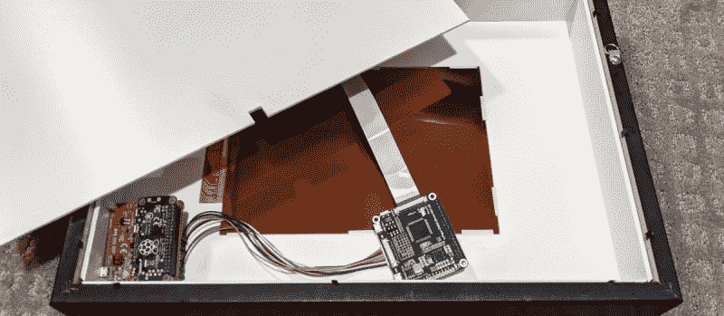

# 太阳能 Pi Zero 电子纸相框等待合适的时机

> 原文：<https://hackaday.com/2020/12/21/solar-pi-zero-e-paper-photo-frame-waits-for-the-right-moment/>

电子纸最大的优点之一就是不需要恒定的电源来显示静态图像。根据应用的不同，与更传统的显示技术相比，这可以节省大量能源。当然，实际驱动显示器的电子设备完全是另一回事。如果你真的想延长电池寿命，你需要降低整个系统的能源需求。

因此，当[【贾科莫·米塞利】想要组装这个太阳能电子纸相框](https://www.jamez.it/blog/2020/12/17/made-epaper-solar-powered-digital-photo-frame-call-solarpunk/)时，他必须想出一些创造性的方法来抑制运行这场秀的树莓派 Zero 的能耗。虽然 10.3 英寸 1872 × 1404 面板只需要偶尔爆发一次电源就可以切换到新图像，但 Pi 会持续消耗内部电池组的电量。考虑到他想用一排小型太阳能电池板从环境光中为框架充电，这根本就不行。

解决方案以 PiJuice 帽子和一些脚本的形式出现，这些脚本根据当前的电池电量决定 Pi 的通电频率。如果有足够的能量，大概每小时一次。但是费用越低，延迟时间越长。当能源形势特别严峻时，Pi 可能每隔几天才打开一次。随着 Pi 的关闭和电子纸不消耗任何电力，太阳能电池板产生的所有能量都可以用于给框架的 1,000 mAh 电池充电。

当 Pi 启动后，它会迅速连接到服务器，下载新的图像并更新显示。之后，它会确定当前的电池电量，并确定 PiJuice 在重新打开之前应该等待多长时间。这些任务完成后，它会自动关闭，直到下一个预定的事件。总的来说，[贾科莫]说每次电子纸上的图像刷新时，Pi 只运行大约一分钟。他说，该系统已经运行了六周，电池电量偶尔会下降到 40%左右，然后才会回升。

诚然，用简单的微控制器取代树莓派[可以大幅削减框架的能耗，但我们欣赏这种创意。此外，Pi 提供的能力和灵活性意味着这个框架可以通过一些更新的软件](https://hackaday.com/2020/10/30/color-e-ink-display-photo-frame-pranks-mom/)教给[一些新的技巧。](https://hackaday.com/2019/02/11/get-organized-with-this-raspberry-pi-e-ink-calendar/)