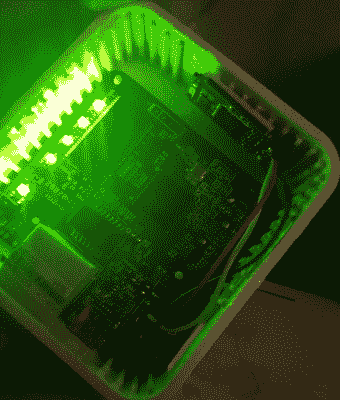

# 太阳能供电的 OpenWRT 路由器实现移动隐私

> 原文：<https://hackaday.com/2019/01/24/solar-powered-openwrt-router-for-mobile-privacy/>

让我们不要假装我们都没有罪:在某个时候，我们都连接到公共 WiFi 网络来检查我们的电子邮件或登录一些网站或服务。我们知道风险，我们更清楚。但是在脆弱的时候，我们可以让公共网络的便利战胜我们。如果您有一个小型安全路由器，可以用作加密的 VPN 端点，允许您连接到那些诱人的公共网络，同时保持您的流量安全，会怎么样？这正是[【大卫】在建造这个小型太阳能 OpenWRT 路由器](http://blog.prototypecreations.net/2017/05/17/tp-link-tl-mr3020-portable-openvpn-router/)时的想法。

 这个小工具的核心是 TP-Link TL-MR3020，这是一款兼容 OpenWRT 的微型路由器，对于 Hackaday 的页面来说并不陌生。它的小尺寸和低成本使它成为各种项目的自然选择，所以[David]被它吸引也就不足为奇了。但是简单地在 MR3020 上安装 OpenWRT 和配置 OpenVPN 并不能完全让你进入黑客天堂，所以显然还有更多事情要做。

首先，[大卫]不喜欢在他的路由器旁边挂一个 u 盘。由于闪存驱动器本质上是路由器的一个永久部分，因为它被用来扩展 MR3020 相当贫乏的内部存储，他决定将闪存驱动器的 USB 端去掉，并直接焊接到路由器的 PCB 上。这给了他一个看起来干净得多的包，但它仍然不像他希望的那样便携。

他决定订购一个太阳能充电的 USB 电源库，作为他被黑的 MR3020 的新家。他保留了原始设备的太阳能电池板和充电控制器，经过一些研究后，决定使用一对 LG-HG2 3000 mAh 电池作为电源。[大卫]经历了几次充电和放电循环，以确保在扣上箱子之前一切都按预期工作。他说，未来他可能会将电子设备移植到 3D 打印的外壳中，但目前他对结果非常满意。

如果你想尝试入侵这些流行的微型路由器，[你需要从 OpenWRT 固件](https://hackaday.com/2013/01/18/tp-link-tl-wr703n-specialized-firmware-generator/)开始。在这个小家伙[身上运行了](https://hackaday.com/2016/05/25/meter-all-the-phases-three-phase-energy-meter-with-openwrt/)[一个成熟的 Linux 发行版](https://hackaday.com/tag/openwrt/)之后，唯一的限制就是你自己的想象力。