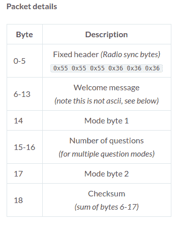

# 解决 IClicker 难题的最后一部分

> 原文：<https://hackaday.com/2019/05/21/solving-the-final-part-of-the-iclicker-puzzle/>

普通的 Hackaday 读者可能还记得我们之前报道的课堂问答设备 iClicker，或者你甚至可能在大学时代就有过使用它的第一手经验。多年来，许多黑客已经对这些设备进行了逆向工程，总的来说，这是一个相当好理解的系统。但在黑客的 iClicker 地图上仍然有一些缺口，对于一些人来说，这是不行的。

[[Ammar Askar]将 iClicker 黑客技术的发展推向了一个新的高度，并在他的博客上做了一个非常详细的描述。虽然大多数努力都集中在记录并最终再现学生遥控器如何将他们的响应发送到教师的基站，但他很想从另一个角度看这个系统。具体来说，他想知道基站是如何将教师提供的欢迎消息发送到学生单元的，以及它是如何通知客户他们的回答已被确认的。](https://blog.ammaraskar.com/iclicker-reverse-engineering/)

 他开始通过查看基站的软件更新工具来找出它是从哪里下载固件文件的，[我们已经看到这种技巧在过去曾经非常有效](https://hackaday.com/2019/04/29/bike-computer-exploration-uncovers-a-hidden-android/)。有了固件，[Ammar]分解了 IDA 中的 AVR 代码，开始拼凑硬件的工作原理。他从之前小组对硬件的探索中了解到，基站的 Semtech XE1203F 无线电通过 SPI 连接到处理器，因此他开始搜索与 SPI 控制寄存器交互的代码。

这条逻辑线揭示了如何通过 SPI 配置无线电，以及最终用于传输的数据存储在存储器中的位置。然后，他转而在 simavr 中运行固件映像。就像 Firmadyne 允许你通过附加的调试器运行 ARM 或 MIPS 固件一样，这个工具允许[Ammar]在内存中打转，并做一些事情，例如当学生的响应通过无线电链路进来时进行模拟。

在这一点上，他所要做的就是捕捉发送出去的字节，并解码它们的真正含义。这个过程有点复杂，因为系统使用自己的定制编码而不是 ASCII 来编码消息，但是到那时，[Ammar]已经很接近了，不会让这样的事情阻止他。在[第一次听说黑客已经开始窥探它们的内部](https://hackaday.com/2011/10/23/snooping-around-in-the-iclicker-hardware-and-firmware/)近十年后，看起来我们终于可以结束 iClicker 的案子了。