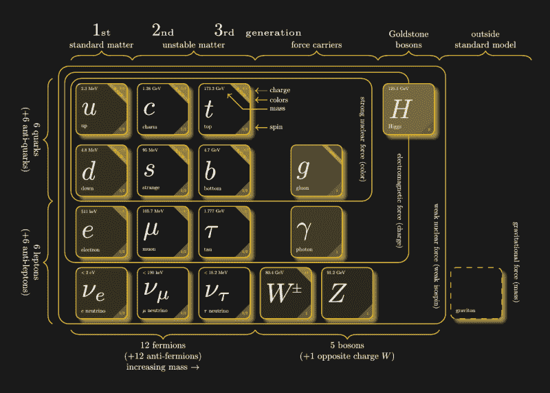

# 瑞士发生了一些事情:解释来自大型强子对撞机的 B 介子新闻

> 原文：<https://hackaday.com/2021/05/13/somethings-up-in-switzerland-explaining-the-b-meson-news-from-the-large-hadron-collider/>

粒子物理学是一个极端的领域。天平总是与 10 个非常大的数字 T1 相关联。大型强子对撞机 Beauty (LHCb)实验的一些结果最近被报道具有统计意义，它们可能对标准模型具有深远的影响，但它也可能只是一个数字异常，我们暂时无法找到答案。让我们深入研究一下量子粒子的基础知识，以防你的小学教育有点生疏。

这一切都始于一个粒子非常爱另一个粒子，他们相互吸引，但随后事情发展得太快，突然他们朝着相反的方向转圈，然后他们灾难性地分手了…

## 标准模型

20 世纪 70 年代，物理学家开始围绕一种叫做标准模型的东西进行联合，这种模型类似于元素周期表，但规模要小得多。它描述了组成质子、中子和电子(反过来组成原子)的粒子，以及作用于它们的力。到目前为止，标准模型已经经受住了大多数实验，但是今年早些时候的一个可能会带来一些麻烦。

标准模型以令人困惑的方式重用了许多预先存在的单词，所以让我们从(相对)大到小稍微分解一下。

*   分子由原子组成。
*   原子是由被电子包围的质子和中子组成的。
*   质子和中子被称为复合粒子，因为它们是由更小的基本粒子组成的。
*   质子和中子是由夸克组合而成的。还有其他复合粒子，一般来说这些由夸克组合而成的粒子被称为强子。
*   有 6 种不同类型的夸克，命名为:上/下，魅力/奇怪，顶部/底部。上下夸克的结合构成了质子和中子。
*   除了夸克，还有另一类粒子叫做轻子。轻子可以像电子一样带电荷，也可以像中微子一样不带电荷。

除了这些微小粒子的分类，标准模型也描述了基本力如何相互作用。有 4 个；电磁学，强核，弱核。引力是第四个，但标准模型不喜欢谈论这种力的害群之马，并有意留下空白，作为读者的一个练习(或一些好心的看门人猎杀它)。有一天，要么引力将被纳入标准模型，要么一个比标准模型更好地解释宇宙并纳入引力的新模型将会出现，但在那之前，一些挥手的动作将会发生。此外，重力的作用范围比其他三个大得多，以至于它对亚原子粒子的影响可以忽略不计。耸耸肩，我只是重复物理学家所说的。

## 跟上玻色子和介子

力是通过携带力的粒子来工作的，这种粒子被称为玻色子。这里有几个子类，因为不同的玻色子负责不同的力。光子和胶子就在其中，最近发现的希格斯玻色子，很久以前就被理论化为标准模型工作的必要条件，所以当它最终被发现时，物理学家们都松了一口气。还有一个理论上的引力子，它将是引力的力载体，但它还没有被发现…还没有(看着你，马特·达蒙)。

标准模型的粒子(点击放大)。还有一种有趣的东西需要了解，那就是介子。它是由夸克和反夸克组成的粒子(这使得介子成为强子的一个子集)，哪一个和多少导致了大量不同的变体。介子非常不稳定，持续时间不到一微秒，衰变为其他类型粒子的各种组合。

清楚了吗？

## 实验

这么小的粒子不可能直接测量，这就是为什么我们有大型强子对撞机。如果有人试图对一个蛋糕进行逆向工程，他可以给它拍照，做光谱分析，甚至品尝它。这些在亚原子水平上不是选项。相反，LHC 让粒子快速运动，然后让它们互相撞击。这些碰撞产生的比特需要消耗大量能量，这导致它们以微小但可测量的方式与电磁场相互作用。从这些碰撞中，我们可以反向工作来找出宇宙的秘密，就像向蛋糕扔手榴弹并分析喷雾模式可以让你确定糖霜是奶油还是软糖一样。

在最近宣布的[实验中(论文 pdf)](https://arxiv.org/pdf/2103.11769.pdf)，在一个特定的变种，B 介子(不是单一变种，而是一整类变种)如何衰变方面存在差异。标准模型认为轻子的行为都是一样的，除了质量之外，其他方面都是一样的。因此，当 LHC 将一大堆粒子(特别是质子对质子)撞在一起，并测量 B 介子衰变时，他们从理论上推断，由此产生的亚原子汤将包含等量的电子和μ子。相反，他们发现μ子比预期的少 15%。

他们不能确切地看营养标签，所以他们怀疑他们发现的是侥幸，还是食谱是错误的。如果是前者，那么它将会以 3 sigma(相当于 1/740 的侥幸几率)击败赔率。在粒子物理学中，这仅仅是令人惊讶的有趣，因为它不是一个足够大的指数来满足他们。如果是后者，对标准型号来说意味着大事。这可能意味着要么修改标准模型，要么可能理解轻子之间是否存在差异(除了它们的质量之外)，从而结束以前所谓的轻子普遍性。

不幸的是，测试机器，很像麦当劳的冰淇淋机，正在进行维修，所以我们必须等到 2022 年升级后的 LHC 才能提供一些霜冻介子，并给我们一个关于标准模型的答案。

## 愚弄我一次，好吧，继续愚弄我

称之为令人惊讶的有趣而不是令人震惊的惊人是一个恰当的回应，因为我们对物理学家的教导并不陌生。在过去的十年里，粒子物理学出现了许多反常现象，随着更多数据的出现，这些反常现象最终都被推翻了。3 sigma 异常和 5 sigma(1:350 万)发现之间有着巨大的差异，我们以前也曾被这种差异所迷惑。也许你还记得 2011 年的[超光速中微子，结果证明是一根连接不当的光缆](https://en.wikipedia.org/wiki/Faster-than-light_neutrino_anomaly)。2015 年有一个显著性为 3.9 的 [750 GeV 凸起](https://en.wikipedia.org/wiki/750_GeV_diphoton_excess)，当第二年再次收集数据时，它最终成为一个统计波动。2016 年，B 介子出现了异常，似乎也已经消退。

这些异常现象中的每一个都会导致数百篇论文、理论和新类型的物理学，直到下一组数据将它们发送到碎纸机，为下一轮论文制作纸浆，机器继续运转，记者们从这些论文中抽取标题，并得出关于曲速和时间旅行的疯狂结论，以及像领先粒子这样的新粒子。

然而，随着我们朝着理解宇宙的运作前进，前进的进程不断发生，缓慢而科学地有条不紊。也许在未来的几十年里，他们会嘲笑我们古怪的标准模型，就像我们看待土、水、空气和火这四种元素一样，但我们将通过今天的发展达到这一点，所以我会继续阅读它，并点头，好像我假装理解他们在谈论什么，并尊重测量如此微小事物过程的复杂性。毕竟，作为一名电气工程师，我的日常工作依赖于让电子以一个世纪前不可想象的方式运动；也许轻子非普适性的发现最终会导致亚马逊和优步的覆灭。