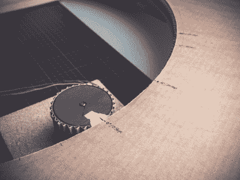

# 分拣员使用纸板来组织卡片堆

> 原文：<https://hackaday.com/2019/01/26/sorter-uses-cardboard-to-organize-card-hoard/>

如果你收集任何种类的交易卡，你知道储存很快成为一个问题。就问【theguymasamato】。他过去非常喜欢交换卡片，当他的孩子染上这种毛病后，他又重新开始了。现在，他坐在 10，000 多张卡片上，这些卡片除了少数做成袖珍本外，大部分都是杂乱无章的。他们试图通过手动，但最终只有沮丧和不知所措。然后，他发现了[【迈克尔·波特拉】的 Pi 动力乐高卡片分类器](https://hackaday.com/2018/05/17/automatic-mtg-card-sorter-separates-rags-from-riches/)，并全力以赴地建造了一个由三部分组成的系统，将卡片一张一张地放入，扫描它们，然后将它们分类到 22 个精心制作的纸板箱中的一个。

[【the guymasamato】的卡片分类器](https://www.instructables.com/id/Card-Sorter-for-a-Trading-Card-Machine/)是进给器将卡片从卡片堆中送入并且扫描仪对其进行扫描后，卡片的最后一站。分拣机在推力轴承上旋转，由连接到步进机的 3D 打印驱动轮驱动。步进器由 Arduino 控制。

这就是它变得疯狂的地方:驱动轮和同步带是由瓦楞纸板的瓦楞制成的。就像，他用中间的波浪形部分作为齿轮齿。每一个纸板牙齿都用木材胶加固，这是一个耗时的过程，他发誓永远不会重复。相反，[theguymasamato]建议使用垫片支撑它们[，就像他在卡片输送器](https://www.instructables.com/id/Card-Feeder-for-a-Trading-Card-Machine/)中所做的那样。整个东西原本是用纸板做的。事实证明，它太软，无法支撑推力轴承，所以[theguymasamato]改用 MDF。

目前，分拣机是通过按钮控制的，但未来该设备的计划包括一个红外光束开关。我们对扫描仪感到兴奋，迫不及待地想看到整个系统组装起来。当[theguymasamato]在做这件事的时候，请在休息时间之后观看构建视频。

 [https://www.youtube.com/embed/brFfwfrStQg?version=3&rel=1&showsearch=0&showinfo=1&iv_load_policy=1&fs=1&hl=en-US&autohide=2&wmode=transparent](https://www.youtube.com/embed/brFfwfrStQg?version=3&rel=1&showsearch=0&showinfo=1&iv_load_policy=1&fs=1&hl=en-US&autohide=2&wmode=transparent)

