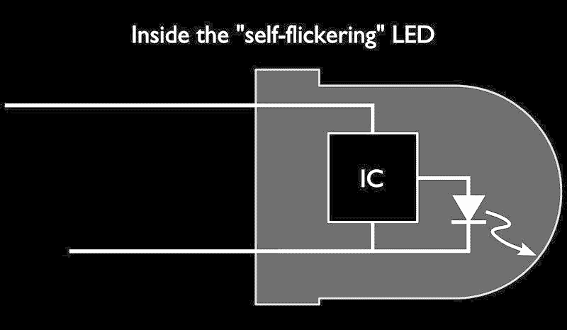

# 敲响谦卑的 LED

> 原文：<https://hackaday.com/2021/02/27/sounding-the-humble-led/>

在 Hackaday，我们对五颜六色的发光二极管并不陌生。但是如果表面之下有更多值得欣赏的东西呢？回到 2011 年，邪恶的疯狂科学家[Windell]研究了某种 LED，发现他们有一首歌要唱。

在过去的几十年里，你可能遇到过闪烁的“蜡烛火焰”LED。它们通常嵌入在小型塑料蜡烛拟像中，形状像典型的通孔“口香糖”式发光二极管，但带有一些额外的魔法，导致它们不稳定地闪烁。加上温暖的白色色温，这种效果与闪烁的蜡烛火焰并没有完全不同。

对于黑客读者(和[Windell])来说，闪烁的原因可能相当清楚，LED 的透镜中嵌入了一个 IC。见顶部的照片，这可能是如何看的例子，有益的放大了 LED 本身的镜头。透过镜头可以看到固定芯片，以及将其连接到引脚和发光二极管本身的焊线。[温德尔]的观察是，这种组合在一起构成了一种有点奇怪的电子元件；从电路的角度来看，它似乎随机地改变流过 LED 的电流。

他包括两个有趣的演示。一个是，通过将闪烁的 LED 连接到 BJT，他可以将它变成电流放大器，并成功地驱动功率更大的 1W LED，效果相同。另一个是，利用放大器的功率，同一个闪烁的 LED 也可以驱动蜂鸣器。这种效果出人意料地令人愉快，尽管我们不愿称之为音乐。

对于一个声音非常不同的类似现象的更近的例子，请查看[艾米丽·维拉斯科]的类似构造的 RGB 变色 LED 的回放，嵌入在下面。我们已经看到[光学工具用于解码 LED](https://hackaday.com/2018/06/10/joe-grand-is-hiding-data-in-plain-sight-leds-that-look-solid-but-send-a-message/) 闪烁成数据流，但不是用于音频播放！我们还介绍了一些 [LED 闪烁逆向工程](https://hackaday.com/2014/03/02/reverse-engineering-candle-flicker-leds-again/)，泄露了这些特殊二极管中更多的秘密。

 [https://www.youtube.com/embed/753-lkao8l0?version=3&rel=1&showsearch=0&showinfo=1&iv_load_policy=1&fs=1&hl=en-US&autohide=2&wmode=transparent](https://www.youtube.com/embed/753-lkao8l0?version=3&rel=1&showsearch=0&showinfo=1&iv_load_policy=1&fs=1&hl=en-US&autohide=2&wmode=transparent)

> 你有没有想过变色 RGB LED 听起来是什么样的？
> 
> 我在合成器里放了一个来寻找答案。[pic.twitter.com/mjyrQIs7kk](https://t.co/mjyrQIs7kk)
> 
> —艾米丽·维拉斯科(@ MLE _ Online)[2021 年 2 月 24 日](https://twitter.com/MLE_Online/status/1364379566626672642?ref_src=twsrc%5Etfw)