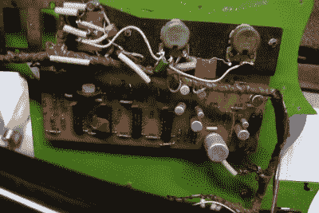

# 苏联斧头修复:替换还是修复？

> 原文：<https://hackaday.com/2021/04/07/soviet-axe-restoration-replace-or-repair/>

你会怎么处理一把看起来很酷、内置效果不好、设计有些不确定的吉他？你会试着修复它并保持它的原貌，还是把它掏空并用商店里的新零件来炫耀你的东西？这是[蒂姆·斯威] [发现自己在这首 70 年代末 80 年代初的苏联福尔曼塔独奏 II 中遇到的难题](https://www.youtube.com/watch?v=Q-tKIr9JY14)。(视频，嵌在下面。)

[Tim]喜欢它的很多东西(我们也喜欢)，尤其是酸绿色的拨片护板，闪闪发光的拾音器，以及让他可以在飞行中单独设置琴弦间距的结实的琴桥。它甚至有一个内置的相位器和失真，但这些都不起作用，可能永远不会工作得那么好。

The non-working effects guts.

正如你在下面的视频中看到的，[蒂姆]已经花了几个小时让它变得可玩，更可口，以便弄清楚如何利用它的电子功能。他首先把 9 V 的隔间做得足够大，实际上可以在里面放一块电池，并为新的调谐器钻了更大的孔。

有趣的是，这些吉他有一个 5 针 DIN 插座，而不是 1/4”插孔。[Tim]买了一个适配器以防万一，但一旦有人挖出一个原理图并送过来，他决定用 1/4 英寸重新布线。

对于它所有的优点，[蒂姆]不喜欢这个东西上的琴头，并发现琴颈对现代吉他手来说太粗了，所以他砍掉了琴头，剃掉了琴颈一点，并把它染成黑色。他还用看起来像紫檀木的东西做了一个新螺母。然后是更标准的东西——锉平品并抛光，给指板上油，清理琴身。

这个练习的目的是为现代音乐家制作一把有用的吉他。正如[蒂姆]所说，这不是一把特别有价值的吉他，也不罕见，而且一开始就没有做得那么好。其中一个问题是开关——它们有点轻和俗气的感觉，其中一个直接在弹拨路径上。[蒂姆]会改变这些，但修复原来的效果，还是他会完全自己做这个东西？我们屏息等待。

想摆弄廉价的旧吉他，却不知道从何下手？我们自己的[斯文·格雷戈里]用斧头砍伤了你的后背。

 [https://www.youtube.com/embed/Q-tKIr9JY14?version=3&rel=1&showsearch=0&showinfo=1&iv_load_policy=1&fs=1&hl=en-US&autohide=2&wmode=transparent](https://www.youtube.com/embed/Q-tKIr9JY14?version=3&rel=1&showsearch=0&showinfo=1&iv_load_policy=1&fs=1&hl=en-US&autohide=2&wmode=transparent)

通路〔t0〕adafruit〔t1〕