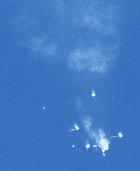
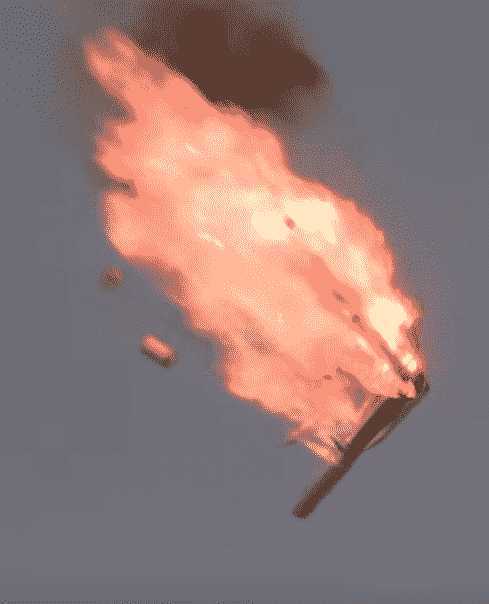

# 联盟号的失败留下了未解之谜

> 原文：<https://hackaday.com/2018/11/09/soyuz-failure-leaves-questions-unanswered/>

2018 年 10 月 11 日，联盟 MS-10 号在上升过程中失败，俄罗斯太空计划经历了 35 年来首次载人任务的严重事故。中止系统按设计运行，机组成员 Aleksey Ovchinin 和 Nick Hague 在距拜科努尔发射场约 430 公里处安全着陆。除了经受异常高的重力外，这两个人没有受伤，他们的任务将在未来的飞行中重复进行。

从中止的角度来看，事件进展得和预期的一样好。机组人员安然无恙地离开的事实证明了火箭和航天器上的应急系统，并提醒人们为什么这些功能被设计到载人火箭中，即使它们很少(如果有的话)被使用。考虑到联盟号的发射中止塔(设计用于将航天器从失败的助推火箭中分离的固体燃料火箭)在事件发生前已经被抛弃，这一成功尤其令人印象深刻。相反，飞船被二级中止推进器拉向安全地带，二级中止推进器在 1975 年作为一种应急措施被添加到飞行器的设计中，直到现在还从未在现实生活中使用过。

## 哪里出了问题？

然而，尽管全体船员的安全返回自然是所有相关机构的首要任务，但问题很快就转向了联盟号本身。是什么导致了火箭的丢失？这是目前正在建造的其他联盟号火箭可能存在的缺陷吗？也许最重要的是，联盟号什么时候能再次飞行？由于这是目前将人类送入太空的唯一方式，国际空间站完全依赖于定期的联盟号飞行，该计划的[延迟可能会危及轨道前哨](http://hackaday.com/2018/10/11/international-space-station-is-racing-the-clock-after-soyuz-failure/)。

现在，随着俄罗斯事件调查的初步结果公之于众，我们开始得到其中一些问题的答案。到目前为止，官方报告同意许多“纸上谈兵的宇航员”在观看发射现场直播时得出的结论，证据表明，核心问题与导致前几艘俄罗斯飞船毁灭的问题相同。

Soyuz failure as seen from the ground.

## MS-10 的故障

对于任何过去看过联盟号(或者更准确地说，联盟号的前身 R-7 系列火箭)发射的人来说，在观看 MS-10 上升的直播时，很明显有什么地方出了问题。四个侧面安装的助推器应该与主堆分离，并执行同步后空翻动作，[被称为“科洛列夫十字”](https://en.wikipedia.org/wiki/R-7_(rocket_family)#Korolev_Cross)，以纪念 R-7 的设计师谢尔盖·科洛列夫。但是在 10 月 11 日的发射中，联盟号火箭后面有一团碎片，而不是通常发生的小心翼翼的空中芭蕾，至少有一个侧助推器在空中不稳定地翻滚。

侧面助推器分离后，立即在乘员舱内观察到了剧烈的晃动，联盟号自动触发了发射中止系统，将飞船从助推火箭中拉出。即使是漫不经心的观察者也很清楚，侧助推器未能正确分离，这注定了火箭的失败；但是问题是为什么联盟号自从太空时代开始以来已经进行了数百次的助推器分离在这次失败了。

事实证明，答案比你想象的要容易找到。尽管助推器分离发生在 50 公里(31 英里)的高度，当火箭以超过 6500 公里/小时(4038 英里/小时)的速度飞行时，联盟号侧面的助推器基本上完好无损地撞上了地面。调查人员只需要追踪助推器在哈萨克斯坦沙漠的下落位置，并对其进行检查。有趣的是，在联盟号名义上发射后，助推器通常不会被回收，当地人把它们切碎当废品卖也不是没有过。

Intact wreckage of a Soyuz side booster.

在正常的分离过程中，推进剂罐中残留的液氧从助推器前端排出，将其推离火箭的中心，开始后空翻动作。这是一种简单而可靠的方法来确定侧助推器和上升火箭之间的距离，而不需要[依赖二级火箭发动机，如航天飞机的 SRBs](https://en.wikipedia.org/wiki/Booster_separation_motor) ，并利用助推器中的传感器打开最高连接点附近的喷嘴。但根据调查结果，传感器安装不当，未能触发氧气出口。

此外，联盟号上失败的助推器分离记录在 YouTube 上公开发布(失败发生在大约 1 点 24 分)。鉴于俄罗斯航天局相对保密的性质，官方发布这段视频被认为是不同寻常的，并被一些人视为在商业太空竞争加剧的时代安抚国际合作伙伴的一种方式。

 [https://www.youtube.com/embed/CrzlMTRVt_I?version=3&rel=1&showsearch=0&showinfo=1&iv_load_policy=1&fs=1&hl=en-US&autohide=2&wmode=transparent](https://www.youtube.com/embed/CrzlMTRVt_I?version=3&rel=1&showsearch=0&showinfo=1&iv_load_policy=1&fs=1&hl=en-US&autohide=2&wmode=transparent)

## 过去的回声

如果错误安装的传感器导致俄罗斯火箭失败听起来很耳熟，那是因为这不是第一次发生了。2013 年，一枚携带三颗 GLONASS 卫星的质子-M 火箭在飞行几秒钟后戏剧性地失败了。火箭在越过发射塔后不久就开始倾斜，尽管飞行器的自动系统明显试图通过引导发动机推力来纠正这种变化，火箭还是翻转了，并自己直接撞向地面。

Proton-M rocket disintegrating before impact.

调查确定故障原因是[多个角速度传感器](http://www.russianspaceweb.com/proton_glonass49.html)安装不当。尽管清楚地指出了传感器的正确方向，并且不正确地安装它们需要物理地弯曲它们所附着的板，但是初级和次级传感器都被颠倒安装。随着无效数据被输入飞行控制系统，自动试图纠正飞行器的轨迹，最终导致它反转。

由于组装过程中的人为失误，又损失了一枚火箭，这次火箭上有人丧生，这让人们对俄罗斯航天工业的生存能力产生了质疑。随着预算的减少和竞争的加剧，批评家指出这些失败证明了在质量控制中偷工减料以降低成本。

## 联盟号返回飞行

随着 MS-10 故障原因的明确，调查人员能够拆卸目前正在建造的火箭上的相关传感器，并验证传感器安装正确。虽然检查的所有其他传感器都处于工作状态，但调查人员尚未透露他们是否知道导致传感器在 MS-10 上安装不当的情况。

与此同时，另一枚联盟号火箭已经成功发射，在 12 月 3 日下一次预定的国际空间站载人任务之前，至少还有三枚火箭计划发射。如果一切按计划进行，救援人员应该在目前的居住者需要离开之前到达国际空间站，保持人类自 2000 年以来在太空中的不间断存在。