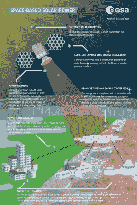
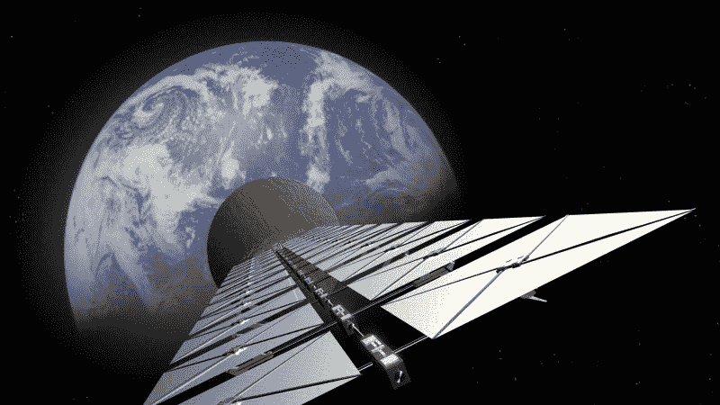
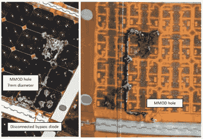
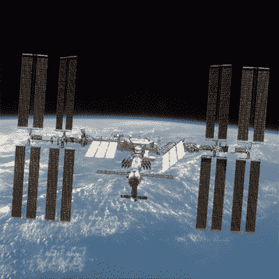

# 天基太阳能:愚蠢还是天才之举？

> 原文：<https://hackaday.com/2022/08/24/space-based-solar-power-folly-or-stroke-of-genius/>

太阳总是照耀太空，除非一颗讨厌的行星挡道。这或多或少是欧空局总干事约瑟夫·阿施巴赫[在推特](https://twitter.com/AschbacherJosef/status/1559553716738527232)上新提出的天基太阳能( [SBSP](https://en.wikipedia.org/wiki/Space-based_solar_power) )背后的基本思想。与其将光伏太阳能电池板放在地球表面，在通常被称为“夜晚”的时候，太阳能电池板会不断旋转远离太阳，这是一个恼人的特性，不如将太阳能电池板固定放在太空中，不受地球旋转和天气的影响。

虽然这是一个简单的想法，但它需要解决许多问题。显而易见的第一个问题是如何将这些电池板送到距离地球表面数百公里的太空中，以创建一个比国际空间站大很多倍的结构。下一个问题是如何将电力送回地球，接下来是安全、维护、传输损耗和不可避免的经济问题。

从美国宇航局到中国空间技术研究院(CAST)，再到美国机构和其他参与 SBSP 项目的组织，这些问题似乎至少被认为是可以解决的。这就提出了一个问题，欧空局的最新建议如何适应这种情况。欧洲将很快由轨道太阳能电池板阵列供电吗？

## 问正确的问题

Simplified summary of space-based solar power (SBSP). Credit: ESA.

ESA 的声明并非凭空而来，而是在今年年初委托完成的关于该主题的两项研究之后。根据这些研究，到 2040 年，有可能为欧洲家庭和企业提供价格有竞争力的电力，这将缓解对大规模电网公用事业存储解决方案的需求。

正如我们在之前的中提到的[，电网级存储将面临压力，以弥补太阳能发电产量的下降。然而，理想情况下，SBSP 卫星将 24/7 全天候向地球传送能量，使其性能与核电厂相似，产能系数超过 90%。SBSP 的欧空局](https://hackaday.com/2022/04/06/grid-level-energy-storage-and-the-challenge-of-storing-energy-efficiently/)[概览页面](https://www.esa.int/Enabling_Support/Space_Engineering_Technology/SOLARIS/SBSP_overview)上也提到了这一点，特别是他们提议的 [SOLARIS](https://www.esa.int/Enabling_Support/Space_Engineering_Technology/SOLARIS/SOLARIS2) 项目。

简而言之，大气层的缺乏使太空太阳能比地球太阳能效率高得多，一颗计划中的 SBSP 卫星需要大约 60 万块跨度超过一公里的电池板来产生大约 2 GW 的电力，类似于一个有两个反应堆的核电站。

对于地面接收站——从 SBSP 卫星发射的微波或激光辐射——需要十倍于此的覆盖区(约 10 公里)。虽然这将使地面足迹小于大约 600 万个光伏太阳能电池板加上产能过剩，但它将比类似的煤、天然气或核电厂占用更多的空间。

这里的问题似乎可以归结为两个主要问题，假设化石燃料不是一个选项:

*   SBSP 在运行良好的核电项目上有竞争力吗，比如南韩和中国？
*   SBSP 对完全由存储支持的 100%可再生电网有竞争力吗？

## 政治雷区

不幸的是，能源政策被严重政治化了。当谈到欧空局的 SOLARIS 项目时，这可以被视为为欧洲自己的重型火箭项目获得资金的一种方式，该项目可以与 SpaceX 的星际飞船相竞争。

这是埃里克·博格在他的分析中提出的一个观点，他还提到了埃隆·马斯克对 SBSP 的强烈驳斥，以及 SBSP 物理学家凯西·汉德默在 T2 2019 年的分析。Handmer 解决了传输效率和整体系统损耗方面的另一个问题。来自太阳能电池板的电力必须转换成微波才能传输，传输到地面站，地面站使用一个巨大的金属网状天线捕捉通过大气层的东西，在那里它必须再次转换成可用于电网的形式。

Artist impression of a solar power satellite. Credit: ESA.

假设光伏电到微波的转换效率高达 80%，这也需要卫星在散热困难的环境中处理 2 GW 阵列的 400 MW 废热。对于通过地球大气层的微波传输本身，水和其他元素的衰减和反射也会导致损耗( [Karmakar 等人，2010](https://www.researchgate.net/publication/267372257_Some_of_the_atmospheric_influences_on_microwave_propagation_through_atmosphere) )。

因此，地面最终接收到的功率绝不是恒定的，而是随着卫星和地面站天线之间的水汽量等因素而波动。在最初捕获的 2 GW 中，1.8 GW 将被转化为微波，根据 Handmer 博士的估计，不超过 40%，留给我们的是 720 MW，在进一步的地面站和传输损失后，根据天气情况，可能达到 500 MW-700 MW。

在这一点上，我们发现自己面临着一个令人不安的问题:将这些卫星送入太空的后勤工作，组装，最重要的是资金。

## 便宜到无法衡量

Damage observed to ISS solar array 3A, panel 58 (cell side on left, Kapton backside on right). Note by-pass
diode is disconnected due to MMOD impact. (Credit: Hyde et al., 2019)

自从像 SpaceX 这样的公司推出商业发射挑战以来，发射价格一直在快速下降，即使 SpaceX 的[星际飞船](https://en.wikipedia.org/wiki/SpaceX_Starship)定期飞行，将一公斤的任何东西送入轨道仍然是昂贵的。它的发射成本很可能[每次飞行大约 1000 万美元](https://www.science.org/content/article/spacex-now-dominates-rocket-flight-bringing-big-benefits-and-risks-nasa)，或者每公斤 100 美元。其中一颗卫星的重量将远远超过整个国际空间站，包括其光伏电池板、支撑结构、微波发生器和传输天线以及额外的控制和通信硬件。

这些卫星中的一颗加上地面站的成本将在数十亿的数量级，所有这些产生的能量相当于一个大型聚光太阳能电站(CSP)或小型核电厂今天所能产生的能量。即使假设发射成本下降到埃隆·马斯克建议的 10 美元/公斤，也无法解决热量问题和传输损耗。也不能解决组装和维护的未解决问题。

如果国际空间站今天由星际飞船发射，它仍然需要使用人类和/或机械臂在轨道上组装。组装人类历史上最大的在轨结构提出了许多悬而未决的问题。欧空局委托的 Frazer-Nash 报告指出，他们预计每颗卫星的在轨组装需要 4 到 6 年时间。

即使假设这是乐观的估计，这与观察到的核电厂五到六年的建设时间( [Lovering 等人，2016](https://www.sciencedirect.com/science/article/pii/S0301421516300106) )相比，例如，在法国 20 世纪 70 年代的扩建或今天中国的核电厂建设期间，即使是大规模延迟和超预算的 [Olkiluoto](https://en.wikipedia.org/wiki/Olkiluoto_Nuclear_Power_Plant) 3 EPR 反应堆，约为€85 亿，1.6 GW 的输出达到€30/MWh 的平准化电力成本。现代反应堆的额定寿命也超过 80 年，这进一步有助于摊销大量的前期成本。

 这就引出了下一点，即保养。虽然 SBSP 卫星和光电太阳能电池阵列安全地处于地球大气层及其天气的界限之外，但它们受到空间天气的影响，包括空间碎片和微陨石。国际空间站的中央结构和太阳能电池板都受到了损坏。加上太空中辐射暴露的增加，这意味着太空太阳能电池板的退化速度将比地面太阳能电池板快得多，并且可能因不幸击中卫星的关键部分而损坏。

这种卫星的预期寿命可以根据特别是从国际空间站收集的数据来估算。与地球上的太阳能电池阵列不同，航天器上的[阵列使用砷化镓而不是硅。这些在太空的恶劣环境中不会很快降解，即使它们仍然容易受到动能撞击。这种防辐射光伏太阳能电池板的必要性也意味着它们比地球上普遍使用的大规模生产的光伏太阳能电池板要昂贵得多。](https://en.wikipedia.org/wiki/Solar_panels_on_spacecraft)

随着这些 SBSP 卫星的在轨维修，我们也遇到了这样一个问题，即除了使用宇航员和机械臂在国际空间站等空间站进行维护工作以及哈勃太空望远镜的维修任务之外，还没有人尝试过这样的事情。这些都是英勇的努力。

## 难对付的人

作为 SBSP 的潜在廉价替代品，人们可以想象类似于太空镜的东西。这些不会像轨道光伏太阳能阵列向地面发射微波那样高科技，但可能像带有离子推进器以保持位置的自展开镜像卫星一样简单。例如，这些太阳能电池可以将太阳光反射到地球上的光伏太阳能电池阵列上，只需要花费很小一部分，而且使用的大多是成熟的技术。

早在 2019 年，中国曾[宣布](https://www.smh.com.au/world/asia/plans-for-first-chinese-solar-power-station-in-space-revealed-20190214-p50xtg.html)将“很可能”在 2021 年至 2025 年间发射自己的 SBSP 卫星进入轨道，并在 2030 年前发射一颗兆瓦级卫星。到目前为止，严重缺乏更新。这里明显的感觉是，也许 SBSP 更多的是一个国家声望的事情，甚至比空间站更多。从大规模轨道建设到一系列其他“前所未有”的项目，一个成功的 SBSP 项目可能会是可以想象的最大的国家权力弹性。

与此同时，为我们的社会提供动力的最佳策略似乎是在建设太阳能和风能的同时继续建设核电站，而这些都不需要我们从零开始发明全新的技术和产业。