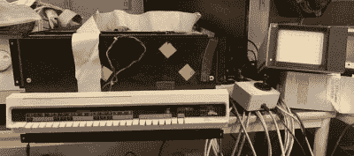

# 太空战！关于 PDP-11 恢复

> 原文：<https://hackaday.com/2021/05/14/spacewar-on-pdp-11-restoration/>

如果你想玩原版的太空战！但是你附近没有 PDP-1，那么你很幸运——假设你有 PDP-11。【Mattis Lind】已经[从源代码的 PDF 扫描中成功恢复了游戏](https://github.com/MattisLind/SPACEWAR)的一个 PDP-11 端口，这个端口被认为是丢到了 [DECUS](https://en.wikipedia.org/wiki/DECUS) (数字设备计算机用户协会)的垃圾桶里。幸运的是，[Mattis]了解到最初的作者之一[Bill Seiler]保存了一份汇编语言的打印输出。使用 OCR 和手动转录的组合来检索代码，【马蒂斯】深入研究了清除错误和解决大量系统库和链接问题。更困难的是，他的 PDP-11 与 1974 年编写此端口时使用的 PDP-11 略有不同。

这个项目并不全是软件——[ Mattis]还需要制作一对操纵杆，他用全球速卖通上的一些物品制作了这两个操纵杆。正如你在下面的视频中所看到的，他确实让一切正常工作。[Mattis]对 PDP-11 世界并不陌生。[我们曾在 2015 年](https://hackaday.com/2015/04/08/restoring-a-vintage-pdp-1104-computer/)报道过他的 PDP-11 修复项目，这项任务耗时超过 18 个月。

 [https://www.youtube.com/embed/fTiHRAKjyho?version=3&rel=1&showsearch=0&showinfo=1&iv_load_policy=1&fs=1&hl=en-US&autohide=2&wmode=transparent](https://www.youtube.com/embed/fTiHRAKjyho?version=3&rel=1&showsearch=0&showinfo=1&iv_load_policy=1&fs=1&hl=en-US&autohide=2&wmode=transparent)

